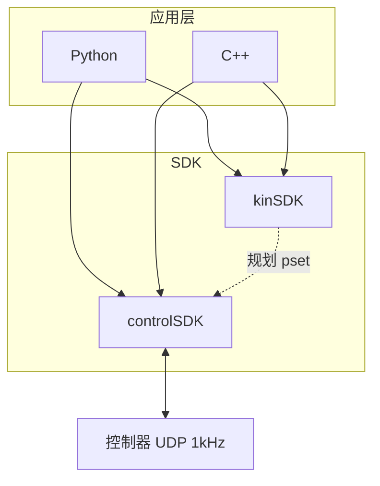

# controlSDK / kinSDK 接口参考（总览）

天机 MARVIN 双臂机器人 SDK 文档已按语言拆分：

| 文档 | 说明 |
|------|------|
| **[SDK_API_REFERENCE_PYTHON.md](SDK_API_REFERENCE_PYTHON.md)** | Python：`fx_robot.py`、`fx_kine.py` |
| **[SDK_API_REFERENCE_CPP.md](SDK_API_REFERENCE_CPP.md)** | C++：`MarvinSDK.h`、`FxRobot.h` |

---

## 源码与库

| SDK | 目录 / 头文件 | 动态库 |
|-----|---------------|--------|
| controlSDK | `TJ_SDK/TJ_FX_ROBOT_CONTRL_SDK/contrlSDK/MarvinSDK.h` | `libMarvinSDK.so` / `.dll` |
| kinSDK | `TJ_SDK/TJ_FX_ROBOT_CONTRL_SDK/kinematicsSDK/FxRobot.h` | `libKine.so` / `.dll` |

Python 封装：`TJ_SDK/TJ_FX_ROBOT_CONTRL_SDK/SDK_PYTHON/`。

---

## 架构

**联用**：运动学规划点集 → 控制 SDK 执行（Python：`run_pln_cart`；C++：`RunPlnCart`）。

---

## 官方长文档

| 语言 | 控制 | 运动学 |
|------|------|--------|
| Python | [python_doc_contrl.md](TJ_SDK/TJ_FX_ROBOT_CONTRL_SDK/python_doc_contrl.md) | [python_doc_kine.md](TJ_SDK/TJ_FX_ROBOT_CONTRL_SDK/python_doc_kine.md) |
| C++ | [c++_doc_contrl.md](TJ_SDK/TJ_FX_ROBOT_CONTRL_SDK/c++_doc_contrl.md) | [c++_doc_kine.md](TJ_SDK/TJ_FX_ROBOT_CONTRL_SDK/c++_doc_kine.md) |

DEMO：`DEMO_PYTHON/`、`DEMO_C++/`。
