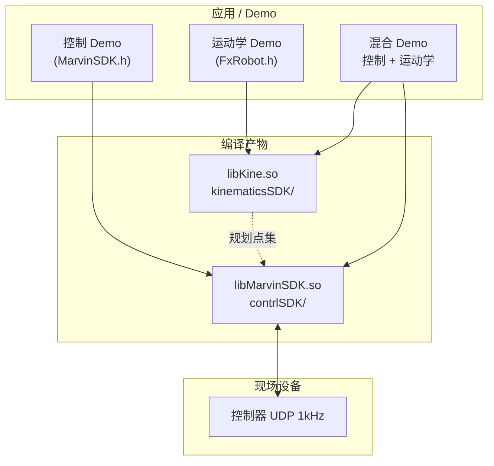

# MARVIN SDK C++ 编译与 Demo 说明

> 环境：Ubuntu x86_64 · 编译日期：2026-06-02  
> SDK 路径：`TJ_SDK/TJ_FX_ROBOT_CONTRL_SDK/`

---

## 架构



| 组件 | 源码目录 | 头文件 | 动态库 |
|------|----------|--------|--------|
| 控制 SDK | `contrlSDK/` | `MarvinSDK.h` | `libMarvinSDK.so` |
| 运动学 SDK | `kinematicsSDK/` | `FxRobot.h` | `libKine.so` |

---

## 安全审计

| 风险 | 说明 | 建议 |
|------|------|------|
| 真机运动 | 多数 Demo 连接 `192.168.1.190` 并驱动机械臂 | 先在无负载、低速度（10%）下测试 |
| 端口独占 | SDK 与 MARVIN_APP 不可同时连接 | 运行 Demo 前关闭上位机 |
| 抱闸/松闸 | `showcase_apply_brake_release_brake` 直接操作抱闸 | 确保机械臂有支撑、周围无人 |
| 协作释放 | 关节可自由拖动，无碰撞保护 | 仅紧急情况使用 |
| 参数写入 | `showcase_get_set_param_demo` 会写控制器配置 | 修改前备份 `robot.ini` |
| 预编译库过期 | 仓库内旧 `.so` 可能缺少新符号 | **必须重新编译**（见下文） |

---

## 一、编译 SDK 动态库

### 1.1 一键脚本（推荐）

```bash
cd TJ_SDK/TJ_FX_ROBOT_CONTRL_SDK
bash marvinSDK_ubuntu.sh
```

脚本会编译 `contrlSDK`、`kinematicsSDK`，并将 `.so` 复制到 `SDK_PYTHON/` 与 `DEMO_C++/`。

### 1.2 手动编译

```bash
# 控制 SDK
cd TJ_SDK/TJ_FX_ROBOT_CONTRL_SDK/contrlSDK
rm -f libMarvinSDK.so && make
# 等价：g++ *.cpp -Wall -O2 -fPIC -shared -o libMarvinSDK.so -lpthread -lrt -DCMPL_LIN

# 运动学 SDK
cd ../kinematicsSDK
rm -f libKine.so && make
# 等价：g++ *.cpp -Wall -O2 -fPIC -shared -o libKine.so -lpthread -lrt
```

> **重要**：仓库自带的预编译 `libMarvinSDK.so`（约 128 KB）为旧版本，缺少 `OnSetPlnJoint_A`、`OnSetSendWaitResponse`、`Connect` 等符号。必须 `rm -f` 后重新 `make`，新库约 **199 KB**。

### 1.3 本次编译结果

| 文件 | 大小 | 状态 |
|------|------|------|
| `contrlSDK/libMarvinSDK.so` | 199 KB | 成功 |
| `kinematicsSDK/libKine.so` | 289 KB | 成功 |
| 复制到 `DEMO_C++/`、`SDK_PYTHON/` | — | 成功 |

---

## 二、编译 Demo 可执行文件

```bash
cd TJ_SDK/TJ_FX_ROBOT_CONTRL_SDK/DEMO_C++
mkdir -p build

# 仅运动学
g++ -Wall -O2 showcase_kinematics_all_functions.cpp \
    -o build/showcase_kinematics_all_functions \
    -I../kinematicsSDK -L. -lKine -Wl,-rpath=.

# 控制 + 运动学
g++ -Wall -O2 showcase_position_two_arms.cpp \
    -o build/showcase_position_two_arms \
    -I../contrlSDK -I../kinematicsSDK -L. \
    -lKine -lMarvinSDK -Wl,-rpath=. -lpthread -lrt
```

### 2.1 批量编译结果（2026-06-02）

| 状态 | 数量 |
|------|------|
| 编译成功 | **26 / 30** |
| 编译失败 | **4**（源码与头文件版本不一致，见 §2.2） |

可执行文件输出目录：`DEMO_C++/build/`

### 2.2 编译失败的 Demo

| 文件 | 失败原因 | 修复建议 |
|------|----------|----------|
| `showcase_servo_reset.cpp` | `DEMO_C++/MarvinSDK.h` 过旧，缺少 `OnServoReset_A` | 改用 `../contrlSDK/MarvinSDK.h`，或调用 `ServoReset('A', axis)` |
| `showcase_new_control_sdk_usage.cpp` | 本地头文件中 `SetImpCartMode` 仅 5 参数，源码传 7 参数 | 同步 `DEMO_C++/MarvinSDK.h` 到 `contrlSDK` 版本 |
| `showcase_offline_movl_execution.cpp` | `OnSetCartKD_A` 少传 `type` 参数 | 按新签名补第 3 个参数 `int type` |
| `showcase_pln_jointCmd_PositionMode.cpp` | 调用不存在的 `OnSetPln_A` | 改为 `OnSetPlnJoint_A` |

> 根因：`DEMO_C++/MarvinSDK.h` 与 `contrlSDK/MarvinSDK.h` 不同步；`#include "MarvinSDK.h"` 会优先使用 Demo 目录下的旧头文件。

---

## 三、C++ 控制 Demo 说明

| # | 源文件 | 作用 | 需连接机器人 |
|---|--------|------|:------------:|
| 1 | `showcase_link_check.cpp` | 连接检查：UDP 连接、帧序列刷新验证 | 是 |
| 2 | `showcase_position_two_arms.cpp` | 双臂关节位置跟随：设置位置模式、下发关节角、订阅到位 | 是 |
| 3 | `showcase_pvt.cpp` | PVT 轨迹：上传轨迹、采集数据、执行离线轨迹 | 是 |
| 4 | `showcase_get_set_param_demo.cpp` | 读写控制器参数（`OnGet/SetIntPara` 等）并保存 | 是 |
| 5 | `showcase_cmd_delay.cpp` | 测量指令下发到控制器响应的延迟（ms） | 是 |
| 6 | `showcase_servo_reset.cpp` | 指定手臂指定轴伺服软复位 | 是 |
| 7 | `showcase_apply_brake_release_brake.cpp` | 强制松闸 / 抱闸（撞机后调整姿态） | 是 |
| 8 | `showcase_collaborative_release.cpp` | 协作释放模式：重力补偿、可手扭关节 | 是 |
| 9 | `showcase_drag_joint.cpp` | 关节拖动：进拖动 → 操作 → 退出拖动 | 是 |
| 10 | `showcase_drag_JointImpedance_save_data.cpp` | 关节阻抗拖动并采集轨迹保存到文件 | 是 |
| 11 | `showcase_drag_CartImpedance_save_data.cpp` | 笛卡尔 Y 方向拖动并采集轨迹保存 | 是 |
| 12 | `showcase_eef_485.cpp` | 末端模组 RS485（COM1）HEX 收发 | 是 |
| 13 | `showcase_eef_CAN.cpp` | 末端模组 CAN/CANFD HEX 收发 | 是 |
| 14 | `torque_eef_cart_impedance_demo.cpp` | 设置笛卡尔阻抗/力控参数，切换扭矩模式并读回校验 | 是 |
| 15 | `showcase_pln_jointSpace_PositionMode.cpp` | 位置模式 + 关节空间规划（50 Hz），消除指令抖动 | 是 |
| 16 | `showcase_pln_jointSpace_PositionMode_with_break.cpp` | 关节空间规划运行中中断（`OnStopPlnJoint_A`） | 是 |
| 17 | `showcase_pln_cartSpace_PositionMode.cpp` | 位置模式 + 笛卡尔规划，YZ 平面矩形轨迹 | 是 |
| 18 | `showcase_pln_cartSpace_PositionMode_with_break.cpp` | 笛卡尔规划运行中中断 | 是 |
| 19 | `showcase_pln_jointCmd_PositionMode.cpp` | 规划 + 位置指令混合下发（**当前无法编译**） | 是 |
| 20 | `showcase_JointTorque2EETorque.cpp` | 订阅关节力矩，计算末端六维力/力矩 | 是 |
| 21 | `showcase_new_control_sdk_usage.cpp` | **简明式 API** 合集（Connect/SetJointMode/RunPln 等，需逐段取消注释运行） | 是 |

### 简明式 API Demo 子功能（`showcase_new_control_sdk_usage.cpp`）

| 函数 | 功能 |
|------|------|
| `link()` | 连接机器人 |
| `position()` | 位置模式运动到目标关节角 |
| `joint_impedance()` | 关节阻抗模式运动 |
| `cart_impedance()` | 笛卡尔阻抗模式运动 |
| `force_impedance()` | 力控模式（指定方向力与行程） |
| `joint_drag()` | 关节拖动 |
| `cart_z_drag_and_save_data()` | 笛卡尔 Z 拖动并保存数据 |
| `run_pln_joint_space()` | 关节空间规划 + 中断 |
| `run_pln_cart_space()` | 笛卡尔空间矩形规划 |
| `set_tool()` | 设置末端工具运动学/动力学参数 |
| `eef_hands_cmd()` | 末端串口通信示例 |

---

## 四、C++ 运动学 Demo 说明

| # | 源文件 | 作用 | 需连接机器人 |
|---|--------|------|:------------:|
| 1 | `showcase_kinematics_all_functions.cpp` | **全功能演示**：加载配置 → 正/逆解 → 雅可比 → MOVL/MOVLA/MOVL_KeepJ/MOVL_KeepJA → 工具动力学辨识 | 否 |
| 2 | `showcase_ik_failed_conclusion.cpp` | 逆解失败场景总结（极限/奇异构型） | 否 |
| 3 | `showcase_kine_two_arms.cpp` | 双臂独立初始化与逆解计算 | 否 |
| 4 | `showcase_ik_nsp_two_arms.cpp` | 双臂逆解 + 零空间（臂角）约束 | 否 |
| 5 | `showcase_online_and_offline_pln_all_function.cpp` | 左臂离/在线规划接口：MOVL、MOVLA、MOVL_KeepJ、MOVL_KeepJA | 否* |

\* 仅做规划计算；不连接控制器。

### `showcase_kinematics_all_functions.cpp` 覆盖模块

1. 导入运动学配置（`LOADMvCfg`）
2. 初始化类型 / DH / 限位
3. 工具坐标系设置
4. 正运动学 FK
5. 4×4 矩阵 ↔ XYZABC
6. 雅可比矩阵
7. 逆运动学 IK
8. 零空间 IK（臂角调节）
9. 离线直线规划 MOVL
10. 在线直线规划 MOVLA
11. 约束构型 MOVL_KeepJ
12. 在线约束构型 MOVL_KeepJA
13. 工具动力学参数辨识

---

## 五、C++ 控制 + 运动学混合 Demo

| # | 源文件 | 作用 | 控制模式 |
|---|--------|------|----------|
| 1 | `showcase_offline_movl_execution.cpp` | 笛卡尔阻抗 50 Hz 执行**离线** MOVL 规划点 | 扭矩/笛卡尔阻抗 |
| 2 | `showcase_offline_movl_keepj_execution.cpp` | 关节阻抗 50 Hz 执行**离线** MOVL_KeepJ | 扭矩/关节阻抗 |
| 3 | `showcase_online_movla_execution.cpp` | 笛卡尔阻抗 50 Hz **在线** MOVLA 逐点执行 | 扭矩/笛卡尔阻抗 |
| 4 | `showcase_online_movl_keepja_execution.cpp` | 关节阻抗 50 Hz **在线** MOVL_KeepJA 逐点执行 | 扭矩/关节阻抗 |

> `showcase_offline_movl_execution.cpp` 当前因 API 签名变更无法编译，修复后可联用。

---

## 六、运行 Demo

```bash
cd TJ_SDK/TJ_FX_ROBOT_CONTRL_SDK/DEMO_C++

# 纯运动学（无需机器人）
./build/showcase_kinematics_all_functions

# 需要机器人（修改源码中的 IP 后编译）
./build/showcase_link_check
./build/showcase_position_two_arms
```

运行前确认：

1. 控制器 IP 与 Demo 内一致（默认 `192.168.1.190`）
2. 本机网段与控制器相同
3. 已关闭 MARVIN_APP / 其他占用端口的程序
4. 速度/加速度百分比 Demo 中多为 **10%**，测试通过后再提高

---

## 七、Python Demo 对照索引

Python Demo 位于 `DEMO_PYTHON/`，与 C++ 功能基本一一对应，详见 `DEMO_PYTHON/readme.md`。例如：

| Python | 对应 C++ |
|--------|----------|
| `showcase_position.py` | `showcase_position_two_arms.cpp` |
| `showcase_motor_encoder_clear.py` | （C++ 无对应，编码器清零仅 Python） |
| `showcase_online_pln_movl.py` | `showcase_online_movla_execution.cpp` |
| `showcases_new_control_sdk.py` | `showcase_new_control_sdk_usage.cpp` |

---

## 八、相关文档

| 文档 | 路径 |
|------|------|
| SDK 总览 | [SDK_API_REFERENCE.md](SDK_API_REFERENCE.md) |
| C++ 控制 API | [TJ_SDK/.../c++_doc_contrl.md](TJ_SDK/TJ_FX_ROBOT_CONTRL_SDK/c++_doc_contrl.md) |
| C++ 运动学 API | [TJ_SDK/.../c++_doc_kine.md](TJ_SDK/TJ_FX_ROBOT_CONTRL_SDK/c++_doc_kine.md) |
| Demo 目录说明 | [TJ_SDK/.../DEMO_C++/readme.md](TJ_SDK/TJ_FX_ROBOT_CONTRL_SDK/DEMO_C++/readme.md) |
