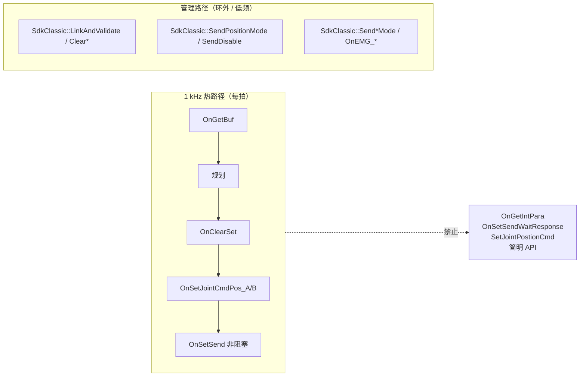
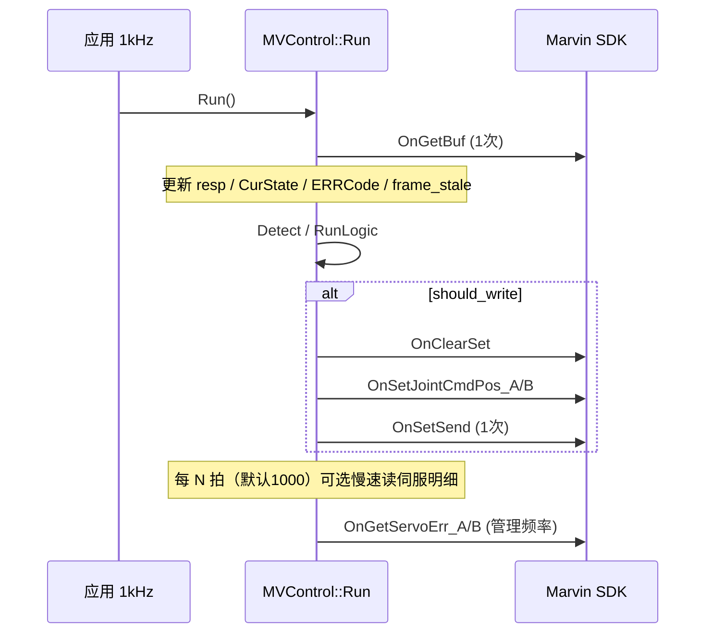

# mv_control 实机 1 kHz SDK 调用规范

> **版本**: v1.0  
> **状态**: v1.0 已实施（P0/P1 代码完成；P2 待实机验收）  
> **关联**: [DESIGN.md](./DESIGN.md)、[API_SDK_ALIGNMENT.md](./API_SDK_ALIGNMENT.md)  
> **根因**: 实机 `Run()` ~55 ms/拍，无法达到 1 kHz；SIM 正常（1000 µs/拍）

---

## 1. 目标与验收

| 项 | 指标 |
|----|------|
| 控制频率 | 应用层 `PeriodicLoop` 1 ms/拍；实机 `Run()` 耗时 **< 500 µs**（留 500 µs 给 Record/调度） |
| period 中位数 | **950 ~ 1050 µs**（`test_enable` / 实机 1 kHz 主循环） |
| SDK 热路径 | 每拍 **仅 1 次 `OnGetBuf` + 至多 1 次 `OnSetSend`**（写门控满足时） |
| 禁止 | 1 kHz 环内 **`OnGetIntPara` / `OnSetSendWaitResponse` / `SetJointPostionCmd`** |

**实机验收命令**（必须通过）：

```bash
export LD_LIBRARY_PATH=$TJ_SDK/contrlSDK:/opt/ros/humble/lib:$LD_LIBRARY_PATH
cmake --build build --target test_enable -j
./build/tj_test/test_enable data/test_enable --cpu=2
# timing.csv: run_us 中位数 < 500；period_us 中位数 950~1050
```

---

## 2. 背景：SDK 两套 API

Marvin SDK 存在 **经典 API（1 kHz 流控）** 与 **简明 API（管理/点位）**，不可混用于热路径。



### 2.1 SDK 文档依据

- `TJ_SDK/.../c++_doc_contrl.md` §10：**指令发送可以以 1000 Hz 发送**
- 标准写法：`OnClearSet()` → `OnSetJointCmdPos_*()` → **`OnSetSend()`**（非阻塞）
- **`OnSetSendWaitResponse()`**：阻塞等待 ACK（内部 `sleep(1ms)` 轮询，典型 **~50 ms**），**禁止**用于 1 kHz 环
- **`SetJointPostionCmd` / 简明 API**（`Connect`/`SetJointMode`/`Disable` 等）：内部常用 `OnSetSendWaitResponse`；**mv_control 已迁移为经典 `SdkClassic` 非阻塞批发送**（见 [CLASSIC_API_MIGRATION.md](./CLASSIC_API_MIGRATION.md)）

### 2.2 实机 ~55 ms 根因（已定位）

`mv_control.cpp::_ReadHwToRobots()` 每拍调用 **14 次 `OnGetIntPara("SERVO*ERR*")`**。  
每次 `OnGetIntPara` = `OnSetSend` + 轮询等待（`SLEEP(2)` × 最多 50）≈ **2~4 ms/次** → 14 × 4 ms ≈ **56 ms**，与实机 profiling 一致。

`OnGetBuf` 本身为共享内存 `memcpy`，**微秒级**，不是瓶颈。

---

## 3. 架构（改造后）



---

## 4. 安全审计

| 风险 | 缓解（本文强制） |
|------|------------------|
| 去掉每拍 `SERVO*ERR*` 后漏检伺服故障 | 热路径用 `m_ERRCode == 2`（`ARM_ERR_ServoError`）报 `HardwareError`；明细由慢速轮询 / `ClearError` 补全 |
| 1 kHz 环误用阻塞 API | §5 Must Not 清单 + Code Review 对照 |
| 使能未完成就写关节 | 现有写门控 `enable_state_ == Enabled` 保持不变 |
| 帧 stale 未检测 | 继续用 `m_OutFrameSerial` + `kSdkFrameStaleRunCycles` |
| 日志拖慢热路径 | `config.connect.log_switch: 0`（默认已关） |

---

## 5. 改造原则

### 5.1 Must（必须）

1. **`Run()` 热路径**每拍全工程 **仅 1 次 `OnGetBuf`**（双臂共享，在 `MVControl` 层）。
2. **写路径**保持：`OnClearSet` → `OnSetJointCmdPos_A/B` → **`OnSetSend()`**（已有，不改语义）。
3. **故障检测（热路径）**仅依赖 `OnGetBuf` 字段：`m_CurState`、`m_ERRCode`、`m_OutFrameSerial`、`m_FB_Joint_*`。
4. **`m_ERRCode == 2`** 视为伺服故障，映射 `HardwareError`（不依赖每拍 `servo_err[]`）。
5. **使能/下使能**保持非阻塞：环外或环内首拍 `SetEnable`，状态由 `Run()` 推进（已实现，不改语义）。
6. **伺服错误明细**（`servo_err[7]`）仅在 **Init / ClearError / 慢速轮询** 更新，使用 SDK **`OnGetServoErr_A/B`**（禁止在热路径手写 14 次 `OnGetIntPara`）。

### 5.2 Must Not（禁止）

| 禁止项 | 适用范围 |
|--------|----------|
| `OnGetIntPara` | `Run()` → `_ReadHwToRobots`、`_RefreshSdkDetailFromHw` 热路径 |
| `OnSetSendWaitResponse` | 任何 1 kHz 环 |
| `SetJointPostionCmd` | 任何 1 kHz 环（流式用 `OnSetJointCmdPos_*`） |
| `Robot` 内单独 `OnGetBuf` 做周期刷新 | 除 §5.3 允许的管理 API 外 |
| 每拍 `CheckServoError()` | 含 14× `OnGetIntPara`，仅 Init/ClearError |

### 5.3 允许阻塞/SDK 管理 API 的场合

| 场合 | 允许 API |
|------|----------|
| `Init` | `SdkClassic::LinkAndValidate`（`OnLinkTo` + 清错 + 帧校验） |
| `SetEnable` / 下使能 | `SdkClassic::SendPositionMode` / `SendDisable`（非阻塞 + Run 轮询） |
| `SetControlMode` | `SdkClassic::Send*Mode` + `_PollControlModeSync` |
| `ClearError` | `SdkClassic::ClearArmError` / `ClearServoError`（按臂）、`OnGetServoErr_*` |
| 慢速轮询（§6.2） | `OnGetServoErr_A/B` |

---

## 6. 文件级改动清单

> 实施顺序见 §8。每项完成后在 §8 清单打勾。

### 6.1 `mv_control/src/mv_control.cpp`

#### 6.1.1 修改 `_ReadHwToRobots()`

**删除**以下整块（约 L225–L235）：

```cpp
for (int i = 0; i < DOF; ++i) {
    OnGetIntPara("SERVO0ERR%d", ...);
    OnGetIntPara("SERVO1ERR%d", ...);
}
```

**保留**：

- 单次 `OnGetBuf(&dcss)`
- `BuildRespState` / `arm_state` / `arm_err_code` / `imp_type`
- `m_OutFrameSerial` → `frame_stale_cycles`

#### 6.1.2 新增慢速伺服错误轮询

在 `MVControl` 中新增（`#ifndef MV_CONTROL_SIM`）：

```cpp
void MVControl::_PollServoErrSlowIfDue();
int run_cycle_count_ = 0;  // 成员，见 §6.2
```

在 `Run()` 末尾（`_WriteRobotsToHw` 之后）调用 `_PollServoErrSlowIfDue()`。

逻辑：

```
run_cycle_count_++
if (run_cycle_count_ % connect_.servo_err_poll_cycles != 0) return
OnGetServoErr_A(left.servo_err)   // SDK 封装，仅慢速路径
OnGetServoErr_B(right.servo_err)
left/right.sdk_detail_.servo_err_fresh = true
```

**不得**在 `_PollServoErrSlowIfDue` 之外于 `Run()` 路径调用 `OnGetServoErr_*`。

---

### 6.2 `mv_control/include/mv_control.hpp`

新增 private 成员：

```cpp
int run_cycle_count_ = 0;
ConnectConfig connect_;  // 或在 Init 时缓存 servo_err_poll_cycles
void _PollServoErrSlowIfDue();
```

---

### 6.3 `mv_control/include/common.hpp`

在 `SdkErrorDetail` 增加：

```cpp
bool servo_err_fresh = false;  // 慢速轮询后为 true；热路径 Detect 不依赖
```

---

### 6.4 `mv_control/include/config.hpp` + `config.cpp` + `config.yaml`

`ConnectConfig` 新增：

```cpp
int servo_err_poll_cycles = 1000;  // 1kHz 下默认 1 Hz 读一次明细；0 = 仅 Init/ClearError
```

`config.yaml` `connect:` 下新增：

```yaml
  servo_err_poll_cycles: 1000   # 0=Run 内不轮询；1000=约1Hz
```

---

### 6.5 `mv_control/src/internal/error_map.cpp`

修改 `MapSdkToError()` 热路径逻辑：

**原**（依赖每拍 `HasServoErr`）：

```cpp
if (sdk.arm_state == 100 || IsHardwareArmErr(sdk.arm_err_code) || HasServoErr(sdk))
```

**改为**：

```cpp
if (sdk.arm_state == 100 || IsHardwareArmErr(sdk.arm_err_code) ||
    sdk.arm_err_code == 2) {  // ARM_ERR_ServoError，来自 OnGetBuf
    out = HardwareError;
}
// 可选：若 servo_err_fresh && HasServoErr(sdk)，同样报 HardwareError（明细确认）
if (sdk.servo_err_fresh && HasServoErr(sdk)) {
    out = PickHigherPriorityError(out, ErrorCode::HardwareError);
}
```

`HasServoErr` **不得**作为唯一伺服故障判据（无 fresh 时 `servo_err[]` 可能 stale）。

---

### 6.6 `mv_control/src/robot.cpp`

#### 6.6.1 修改 `_RefreshSdkDetailFromHw()`

**删除** 循环内 `OnGetIntPara`。  
**仅保留** `OnGetBuf` + 更新 `arm_state` / `arm_err_code` / `imp_type`。

> 本函数用于 `SetControlMode` 轮询、`EStop` 等**管理路径**，仍禁止 `OnGetIntPara`。

#### 6.6.2 修改 `ClearError()`

清错成功后刷新伺服明细时：

- **改用** `OnGetServoErr_A` / `OnGetServoErr_B`（按 `arm_serial_` 选一侧），**禁止** 7 次手写 `OnGetIntPara`
- 设置 `servo_err_fresh = true`

#### 6.6.3 不改动

- `SetEnable` 非阻塞语义（已实现）
- `_WriteRobotsToHw` 写门控
- `RunLogic` / `Detect` 结构

---

### 6.7 `mv_control/src/internal/in_data.hpp`

无需改 `kControlDt`；可选增加注释指向本文。

---

### 6.8 文档交叉引用

| 文件 | 改动 |
|------|------|
| `API_SDK_ALIGNMENT.md` §5.1 | 删除「Run 内 OnGetIntPara」；改为慢速 `OnGetServoErr`；标记 G11 已整改 |
| `DESIGN.md` §5 / Run 流程 | 增加链接：`[1KHZ_SDK_SPEC.md](./1KHZ_SDK_SPEC.md)` |

---

### 6.9 测试（`tj_test/test_enable.cpp`）

**不强制改逻辑**；验收以 timing 为准。  
可选：在 `RecordSnapshot` 的 meta 行增加 `run_cycle_count`（非必须）。

---

## 7. 写路径门控（保持不变）

```cpp
should_write =
    enable_state_ == Enabled &&
    control_mode_actual_ == Position &&
    error_code_ == Normal &&
    status_code_ ∈ { Running, Stopping };
```

说明：`test_enable` 使能后若 status 为 `Ready`（无运动），**不写 SDK** 属预期；此时 `Run()` 应仍 < 500 µs（仅 `OnGetBuf`）。

若需在使能后每拍保持通信心跳，**不在本次范围**（需另开需求：空载 `OnSetSend` 或 hold 当前关节）。

---

## 8. 实施顺序 Checklist

按序执行，每项完成后打 `[x]`：

- [x] **P0-1** `mv_control.cpp`：删除 `_ReadHwToRobots` 内 14× `OnGetIntPara`
- [x] **P0-2** `error_map.cpp`：`MapSdkToError` 改用 `arm_err_code==2` + `servo_err_fresh`
- [x] **P0-3** `robot.cpp`：`_RefreshSdkDetailFromHw` 去掉 `OnGetIntPara`
- [x] **P0-4** `common.hpp`：新增 `servo_err_fresh`
- [x] **P0-5** SIM 编译 + `build_sim` 跑 `test_enable`（period ~1000 µs，无回归）
- [x] **P1-1** `config`：`servo_err_poll_cycles` 三处（hpp/cpp/yaml）
- [x] **P1-2** `mv_control.hpp/cpp`：`_PollServoErrSlowIfDue` + `run_cycle_count_`
- [x] **P1-3** `robot.cpp`：`ClearError` 改用 `OnGetServoErr_*`
- [x] **P1-4** 更新 `API_SDK_ALIGNMENT.md`、`DESIGN.md` 交叉引用
- [ ] **P2-1** 实机 `build` + `test_enable --cpu=2`：验收 §1 指标
- [ ] **P2-2** 实机 `test_connect` + 短使能 Run：无 EnableError / 通信异常

---

## 9. 预期效果

| 场景 | 改造前 | 改造后（预期） |
|------|--------|----------------|
| 实机 `Run()` | ~55 ms | **< 0.5 ms**（仅 OnGetBuf + 逻辑） |
| 实机 period | ~58 ms (~17 Hz) | **~1 ms (~1000 Hz)** |
| SIM | 正常 | 不变 |
| 伺服故障检测 | 每拍 14 参数查询 | 每拍 `m_ERRCode`；明细 ~1 Hz |

---

## 10. 不在本次范围

- `SetControlMode` 改非阻塞（P2 扩展）
- 使能后 `Ready` 态是否每拍 `OnSetSend` 保活
- `examples/test_SetvoPByPico.cpp` 接入 `PeriodicLoop`（可后续复用 `tj_test/periodic_loop.hpp`）
- Marvin 控制器侧周期（文档称上位机发令后控制器 1 kHz 上行；本次只改上位机调用）

---

## 11. 修订记录

| 版本 | 日期 | 说明 |
|------|------|------|
| v1.0 | 2026-06-13 | 初版：根因 14× OnGetIntPara；热路径仅 OnGetBuf+OnSetSend |
