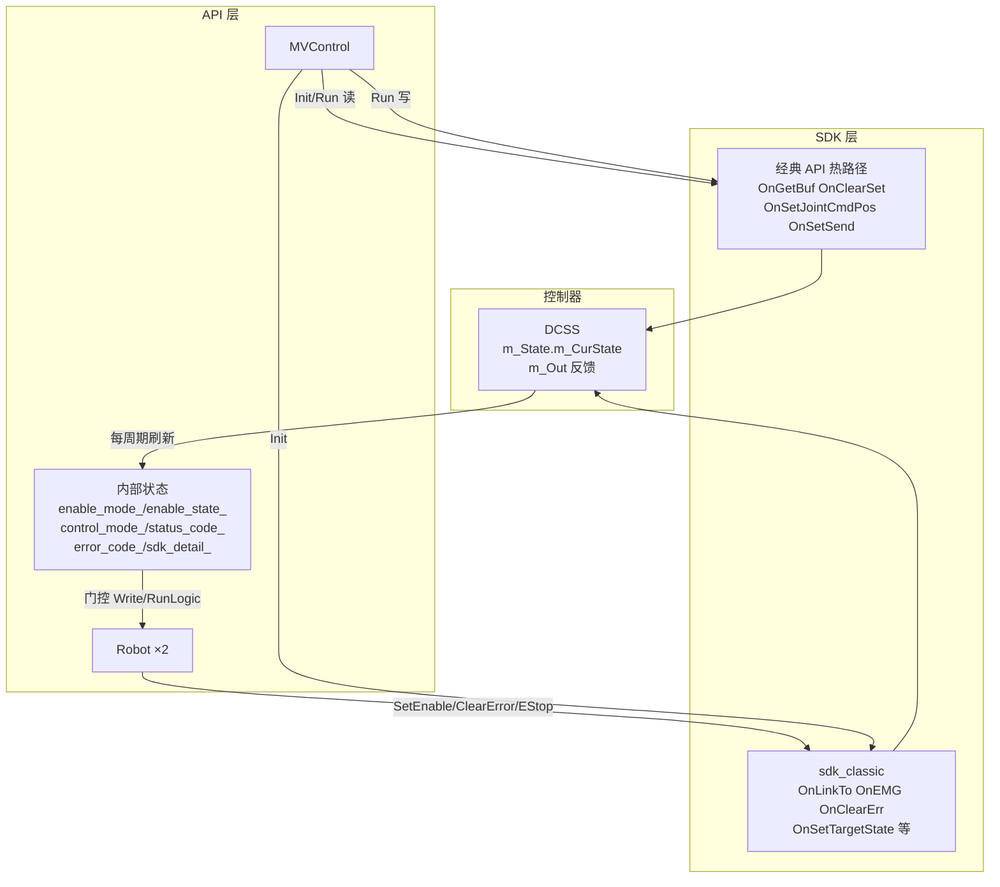

# mv_control API 层与 SDK 层对齐规范

> **版本**：v1.1  
> **状态**：P0/P1 已实现（P2 不在范围）  
> **约束**：凡涉及 `mv_control` 与 Marvin **controlSDK**（`libMarvinSDK`）边界、状态同步、读写路径的改动，**必须先符合本文档**；若需偏离，须先修订本文档再改代码。  
> **关联文档**：[DESIGN.md](./DESIGN.md)（封装层总体设计）

---

## 1. 文档目的

本文档专门描述 **API 层**（`MVControl` / `Robot` 公共接口及内部状态）与 **SDK 层**（`MarvinSDK.h` 简明 API + 经典 `OnGetBuf`/`OnSet*` 批量 API）之间的：

1. 当前对齐情况（已对齐 / 未对齐 / 有意不对齐）
2. SDK 原始字段与 API 枚举/状态的映射规则
3. 未对齐项的分阶段改动方案与验收标准

**不在本文档范围内**（保持 [DESIGN.md](./DESIGN.md) 原约定）：

- kinSDK 集成；笛卡尔位姿由 URDF + KDL 推算（不用 SDK 运动学）
- 内部 Ruckig/样条规划替代 SDK `RunPlnJoint` / `RunPlnCart`
- Python 绑定

---

## 2. 架构与数据流



### 2.1 三层概念（禁止混用）

| 概念 | API 字段/接口 | SDK 来源 | 说明 |
|------|---------------|----------|------|
| **使能意图** | `enable_mode_` / `GetEnableMode()` | — | 应用请求上/下使能 |
| **使能实际** | `enable_state_` / `GetEnableState()` | `m_CurState` 0/1/101~109 | **必须从 SDK 同步** |
| **控制模式** | `control_mode_target_`（内部，`SetControlMode` 设置） | `GetControlMode()` → `control_mode_actual_` | `m_CurState` + `m_In.m_ImpType` | **actual 必须从 SDK 同步** |
| **规划状态** | `status_code_` / `GetStatusCode()` | 无直接 SDK 字段 | 纯 API 规划层状态机 |
| **故障** | `error_code_` / `GetErrorCode()` | `m_ERRCode` + `servo_err` + 帧 stale | 经 `MapSdkToError` 映射 |

---

## 3. SDK 状态对照表

### 3.1 `ArmState`（`m_CurState`）

| SDK 值 | 枚举名 | 含义 |
|--------|--------|------|
| 0 | `ARM_STATE_IDLE` | 下伺服 |
| 1 | `ARM_STATE_POSITION` | 位置跟随 |
| 2 | `ARM_STATE_PVT` | PVT 轨迹 |
| 3 | `ARM_STATE_TORQ` | 扭矩/阻抗 |
| 4 | `ARM_STATE_RELEASE` | 协作释放 |
| 100 | `ARM_STATE_ERROR` | 故障 |
| 101 | `ARM_STATE_TRANS_TO_POSITION` | 切位置中 |
| 102 | `ARM_STATE_TRANS_TO_PVT` | 切 PVT 中 |
| 103 | `ARM_STATE_TRANS_TO_TORQ` | 切扭矩中 |
| 104 | `ARM_STATE_TRANS_TO_RELEASE` | 切释放中 |
| 109 | `ARM_STATE_TRANS_TO_IDLE` | 切下伺服中 |

### 3.2 API `ControlMode` 与 SDK 映射（规范定义）

| API `ControlMode` | SDK `m_CurState` | 附加条件 |
|-------------------|------------------|----------|
| `Position` | 1 | — |
| `JointImp` | 3 | `m_In[i].m_ImpType == 1` |
| `CartImp` | 3 | `m_In[i].m_ImpType == 2` |
| `Force` | 3 | `m_In[i].m_ImpType == 3` |
| （未定义） | 2 | PVT，API 暂不暴露 |
| （未定义） | 4 | RELEASE，API 暂不暴露 |

> **注意**：API 枚举值（0~3）与 SDK `ArmState` 数值**不可直接比较**，必须通过上表映射。

### 3.3 API `EnableState` 与 SDK 映射（规范定义）

| API `EnableState` | SDK 条件 |
|-------------------|----------|
| `Disabled` | `m_CurState == 0` |
| `Enabled` | `m_CurState == 1` 且 `control_mode_actual_ == Position` |
| `Enabling` | `m_CurState ∈ {101,102,103,104}` 且 `enable_mode_ == Enable`；或 `109` 且上一目标为 Enable |
| `Disabling` | `m_CurState == 109` 且 `enable_mode_ == Disable`；或 `101~104` 且目标为 Disable |

**规范补充**（待实现）：当 `enable_mode_ == Enable` 但 `m_CurState ∈ {2,3,4}` 时，`enable_state_` 不得为 `Enabled`，应置 `ModeError` 或保持 `Disabled` 并上报 `ModeError`。

---

## 4. 接口对齐清单

### 4.1 已对齐 ✅

| API | SDK | 同步方式 | 实现位置 |
|-----|-----|----------|----------|
| `Init` / `InitFromConfig` | `SdkClassic::LinkAndValidate`（`OnLinkTo` + 清错 + 帧校验） | 连接时一次性 | `sdk_classic.cpp` |
| `~MVControl` | `OnRelease` | 析构 | `mv_control.cpp` |
| `SetEnable(Enable)` | `SdkClassic::SendPositionMode` | 非阻塞批发送；Run 内 `_UpdateEnableState` 推进 | `robot.cpp::SetEnable` |
| `SetEnable(Disable)` | `SdkClassic::SendDisable` | 非阻塞；Run 内推进至 `CurState==0` | `robot.cpp::SetEnable` |
| `SetControlMode` | `SdkClassic::Send*Mode` | 非阻塞 + `_PollControlModeSync` | `robot.cpp::_CallSdkControlMode` |
| `SetEnableAll` | 双臂依次上述 | 同上 | `mv_control.cpp` |
| `EStop` / `EStopAll` | `OnEMG_A/B/AB` | 立即调用 | `sdk_classic.cpp` |
| `ClearError`（硬件类） | `SdkClassic::ClearArmError` + `ClearServoError`（按臂）+ `OnGetBuf` | 清错后重读 | `robot.cpp::ClearError` |
| `Run()` 读 | `OnGetBuf` | 每周期一次，双臂共享 | `mv_control.cpp::_ReadHwToRobots` |
| `Run()` 写 | `OnClearSet` → `OnSetJointCmdPos_A/B` → `OnSetSend` | 门控后批量 | `mv_control.cpp::_WriteRobotsToHw` |
| 关节反馈 `resp` | `m_Out.m_FB_Joint_Pos/Vel/SToq` | deg→rad | `BuildRespState` |
| 使能运行时同步 | `m_State.m_CurState` | `_UpdateEnableState()` 每 `RunLogic` | `robot.cpp` |
| 错误映射 | `m_ERRCode` + 慢速 `servo_err` + stale | `MapSdkToError` | `error_map.cpp` + `Detect` |
| 单位 | 内部 rad，SDK deg | `V7dToSdkDeg` / `× D2R` | `common.hpp` |

### 4.2 未对齐 ❌（须按 §6 整改）

| # | 问题 | 现状 | 风险 |
|---|------|------|------|
| G1 | **控制模式未同步** | `control_mode_` 默认 `Position`，仅本地赋值；`SetControlMode` 不调 SDK | API 认为在位置模式，SDK 可能处于扭矩/PVT |
| G2 | **Init 不校验 SDK 模式** | Init 只读关节，不检查 `m_CurState` | 连接后 SDK 非 0/1 时 API/SDK 认知不一致 |
| G3 | **使能与位置模式耦合但未显式建模** | `SetEnable(Enable)` 固定调 `SetJointMode`（位置） | 正确但缺少 `control_mode_actual_` 反馈 |
| G4 | **`EnableState` 对 CurState 2/3/4 无定义** | `_UpdateEnableState` 不处理 2/3/4，状态可能滞留 | 中间态/异常态不可观测 |
| G5 | **`ClearError` 后未立即刷新使能/模式** | 重读 `sdk_detail_` 但未调 `_UpdateEnableState` | 清错后 `GetEnableState` 可能短暂不准 |
| G6 | **`EStop` 后未同步 SDK 状态** | 本地设 `HardwareError`，不刷新 `enable_state_` | 急停后使能态与 SDK 可能不一致 |
| G7 | **缺少 `GetControlMode()`** | 应用无法查询模式意图/实际 | 调试与上层逻辑困难 |
| G8 | **速度/加速度比未读回** | `vel_ratio_`/`acc_ratio_` 仅配置写入 `SetJointMode` | SDK 被外部修改时 API 不知 |
| G9 | **工具参数 `SetTool` 未封装** | TCP 仅 URDF/KDL | 实机 TCP 与 SDK 工具系可能不一致 |
| G10 | **`m_LowSpdFlag` 未使用** | 到位判断靠内部规划 `IsDone` | 功能可用，但与 SDK 停止标志不对齐 |
| G11 | **伺服错误读取路径** | ~~Run 内 `OnGetIntPara`~~ → 热路径 `m_ERRCode==2`；慢速 `OnGetServoErr_*` | 已整改，见 [1KHZ_SDK_SPEC.md](./1KHZ_SDK_SPEC.md) |
| G12 | **`StatusCode` 不含 Enabling/Disabling** | 过渡态只体现在 `EnableState` | 有意设计，但文档需明确 |

### 4.3 有意不对齐（保持现状，文档化即可）

| 项 | API | SDK | 原因 |
|----|-----|-----|------|
| 轨迹规划 | 内部 `Motion`（Ruckig/样条） | `RunPlnJoint` / `RunPlnCart` | 1kHz 流式 + 不阻塞 |
| 笛卡尔位姿 | KDL FK/IK | kinSDK | 项目统一 URDF |
| 规划急停 | `Stop()` → `MotionStop` | 无 | 软减速，保持使能 |
| PVT/拖动/力控模式 | 未暴露 | `SetImp*` / `RunPVT` / `Set*Drag` | P2 扩展 |
| 参数/日志/升级 | 未暴露 | `OnSet*Para` / `OnDownloadLog` 等 | 运维工具，非控制环 |

---

## 5. 读写路径规范

### 5.1 读路径（每 `Run()` 周期）

```
OnGetBuf(dcss)  // 全工程唯一，MVControl 层（1 kHz 热路径仅此读 SDK）
  → resp: m_Out[i].m_FB_Joint_*
  → sdk_detail_: m_State[i].m_CurState, m_ERRCode
  → frame_stale: m_Out[i].m_OutFrameSerial
  → control_mode_actual_: MapSdkToControlMode(CurState, m_In[i].m_ImpType)
  → Robot::_UpdateEnableState()
  → Robot::_UpdateControlModeFromSdk()
  → Robot::Detect()

Run 末尾（可选，默认 1000 拍一次）：
  → OnGetServoErr_A/B → sdk_detail_.servo_err[]（禁止每拍 OnGetIntPara）
```

**禁止**：在 `Run()` 热路径调用 `OnGetIntPara` / `OnSetSendWaitResponse` / `SetJointPostionCmd`（见 [1KHZ_SDK_SPEC.md](./1KHZ_SDK_SPEC.md)）。

### 5.2 写路径（每 `Run()` 周期）

```
should_write =
    enable_state_ == Enabled
    AND control_mode_actual_ == Position   // 待从 control_mode_ 改为 actual
    AND error_code_ == Normal
    AND status_code_ ∈ { Running, Stopping }

OnClearSet()
OnSetJointCmdPos_A/B(deg)
OnSetSend()  // 双臂合并，每周期最多一次
```

**禁止**：在 1kHz 循环中使用阻塞式 `SetJointPostionCmd` / 简明 API / `OnSetSendWaitResponse`。

### 5.3 管理路径（应用线程，非 Run 环）

| 操作 | SDK（经典） | 完成后必须 |
|------|-------------|------------|
| Init | `SdkClassic::LinkAndValidate` | 帧 serial 更新 |
| 上使能 | `SdkClassic::SendPositionMode` | 轮询至 `CurState==1`，刷新 `enable_state_`、`control_mode_actual_` |
| 下使能 | `SdkClassic::SendDisable` | 轮询至 `CurState==0` |
| 切换控制模式 | `SdkClassic::Send*Mode` | 轮询至目标 `CurState`+`ImpType` |
| 清错 | `SdkClassic::ClearArmError` + `ClearServoError`（按臂） | `OnGetBuf` + `_UpdateEnableState` + `_UpdateControlModeFromSdk` |

---

## 6. 改动方案（分阶段）

> 实施任一项前：更新本文档对应条目状态 → 改代码 → 补测试 → 在 §8 验收表打勾。

### 6.1 P0 — 状态同步基础（优先）

#### P0-1：控制模式双字段 + SDK 同步

**改动**：

```cpp
// common.hpp / Robot 成员（示意）
ControlMode control_mode_target_ = ControlMode::Position;  // SetControlMode 设置
ControlMode control_mode_actual_ = ControlMode::Position; // SDK 驱动

ControlMode MapSdkToControlMode(int cur_state, int imp_type);
void Robot::_UpdateControlModeFromSdk();
ControlMode GetControlMode() const;  // 返回 control_mode_actual_（SDK 同步）
```

**规则**：

- `RunLogic` 开头：`_UpdateEnableState()` → `_UpdateControlModeFromSdk()`
- `_WriteRobotsToHw` 门控改用 `control_mode_actual_ == Position`
- `SetControlMode(mode)` 在 P0 仅更新 `control_mode_target_`；若与 actual 不一致且已使能，返回 false 或排队到 P1

**文件**：`common.hpp`、`mv_control.hpp`、`robot.cpp`、`mv_control.cpp`

#### P0-2：Init 后 SDK 状态校验

**改动**：`_LoadRespAtInit` 成功后，每臂检查：

- 允许：`m_CurState ∈ {0, 1}` → 继续
- 警告/失败（可配置 `connect.strict_init_state`）：
  - `100` → `InitError`
  - `2/3/4` → `InitError` 或 `ModeError` + 日志提示先手动 `Disable`

**文件**：`config.hpp`、`config.yaml`、`mv_control.cpp`

#### P0-3：完善 `_UpdateEnableState` 边界

**改动**：

- `m_CurState == 100`：不改变 enable 乐观值，由 `Detect`/`MapSdkToError` 报 `HardwareError`
- `m_CurState ∈ {2,3,4}` 且 `enable_mode_==Enable`：`enable_state_ != Enabled`；`Detect` 报 `ModeError`

**文件**：`robot.cpp`、`error_map.cpp`（可选增 `CurState` 直接映射）

#### P0-4：`ClearError` / `EStop` 后刷新

**改动**：

- `ClearError` 成功分支末尾：`_UpdateEnableState()` + `_UpdateControlModeFromSdk()`
- `EStop` 后下一次 `Run` 已会刷新；可选在 `EStop` 内调 `_RefreshSdkDetailFromHw` + 更新状态

**文件**：`robot.cpp`

---

### 6.2 P1 — 控制模式切换接线

#### P1-1：`SetControlMode` 接 SDK

| target `ControlMode` | SDK 简明 API |
|----------------------|--------------|
| `Position` | `SetJointMode(arm, vel_ratio_, acc_ratio_)` |
| `JointImp` | `SetImpJointMode(arm, vel, acc, K, D)` |
| `CartImp` | `SetImpCartMode(arm, vel, acc, K, D, RotType, para)` |
| `Force` | `SetImpForceMode` + 周期 `SetForceCmd` |

**流程**（与 `SetEnable` 同构）：

1. 校验 `enable_state_` / 静止（`m_LowSpdFlag`）
2. 调 SDK
3. 轮询 `MapSdkToControlMode` 直至 `control_mode_actual_ == target` 或超时 → `ModeError`
4. 失败不得仅改本地变量

**配置扩展**：`config.yaml` 增加阻抗 K/D、力控参数段。

#### P1-2：解耦「上使能」与「设模式」（可选）

若应用需要先上伺服再切阻抗：

- `SetEnable(Enable)` 仅保证 `CurState==1`（位置） **或**
- 增 `SetEnable(Enable, ControlMode mode)` 一步到位

**默认保持现状**：`SetEnable(Enable)` = 位置跟随，与 [DESIGN.md](./DESIGN.md) 一致；模式切换走 `SetControlMode`。

---

### 6.3 P2 — 扩展与运维

| 项 | API 建议 | SDK |
|----|----------|-----|
| 工具 TCP | `SetTool(kine, dyn)` | `SetTool` |
| 伺服复位 | `ServoReset(axis)` | `ServoReset` |
| 到位查询 | `IsStationary()` | `m_Out.m_LowSpdFlag` |
| 伺服错误 | 统一读路径 | `OnGetServoErr_A/B` |
| 数据采集 | `StartCollectData` 封装 | SDK 简明 API |

---

## 7. 安全审计

| 项 | 要求 |
|----|------|
| Init 默认不下使能、不自动 `SetJointMode` | **必须**；仅 `SetEnable` 可上使能 |
| Write 门控 | **必须**同时满足 actual 使能 + actual 位置模式 + 无故障 |
| 模式切换须轮询确认 | **禁止**乐观设置 `control_mode_actual_` |
| 阻塞 SDK 调用 | 仅允许在 Init / SetEnable / SetControlMode / ClearError，**禁止**在 `Run()` 热路径 |
| 超时 | 统一使用 `connect.mode_transition_timeout_ms` |
| 急停 | `EStop` 必须可达；急停后 Write 必须停止 |
| 清错 | **禁止** `ClearError` 内自动 `SetEnable(Enable)` |
| 外部 SDK 状态 | Init 须检测非预期 `CurState`，避免误写 |
| 双臂 | `SetEnableAll` / `ClearErrorAll` 失败不回滚成功臂（应用补偿） |

---

## 8. 验收标准

| ID | 场景 | 预期 |
|----|------|------|
| A1 | Init 后（未 SetEnable） | `GetEnableState()==Disabled`；SDK `CurState==0`；`control_mode_actual_` 与 SDK 一致 |
| A2 | `SetEnable(Enable)` 成功 | `GetEnableState()==Enabled`；SDK `CurState==1`；`control_mode_actual_==Position` |
| A3 | `SetEnable(Disable)` 成功 | `GetEnableState()==Disabled`；SDK `CurState==0` |
| A4 | 切换中 | `GetEnableState()` 为 Enabling/Disabling；Write 不下发 |
| A5 | SDK `CurState==3` 且 API 未切模式 | `GetEnableState()!=Enabled`；`Detect` 报 `ModeError` |
| A6 | `ClearError` 后 | `GetEnableState`/`GetControlMode` 与 SDK 一致 |
| A7 | `Run()` | 每周期恰好 1 次 `OnGetBuf`、至多 1 次 `OnSetSend` |
| A8 | `EStop` 后 | Write 停止；清错 + 重新 `SetEnable` 可恢复 |

**测试建议**：

- 扩展 `tj_test/test_connect.cpp` 或新增 `test_enable.cpp` 覆盖 A1~A4
- 实机记录 `sdk_state` / `enable_state` / `control_mode_actual` 时间序列

---

## 9. 代码改动索引（实施时对照）

| 文件 | P0 | P1 |
|------|----|----|
| `include/common.hpp` | `MapSdkToControlMode` 声明 | — |
| `include/mv_control.hpp` | `GetControlMode*`、新成员 | `SetControlMode` 签名扩展 |
| `include/config.hpp` | `strict_init_state` | 阻抗/力控配置 |
| `src/robot.cpp` | P0-1/3/4 | P1-1 |
| `src/mv_control.cpp` | P0-2、读路径增模式同步 | Write 门控 |
| `src/internal/error_map.cpp` | CurState 2/3/4 映射 | — |
| `config/config.yaml` | strict_init_state | 阻抗参数 |
| `tj_test/` | 验收 A1~A6 | 模式切换测试 |

---

## 10. 修订记录

| 版本 | 日期 | 说明 |
|------|------|------|
| v1.0 | 2026-06-13 | 首版：对齐清单、映射表、P0/P1/P2 改动方案 |
| v1.1 | 2026-06-13 | P0/P1 代码落地：控制模式双字段、Init 校验、SetControlMode 接 SDK |
