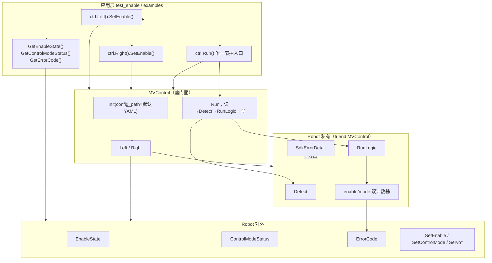

# mv_control 对外 API 精简方案（评估稿）

> **状态**：**P0 已实施**（2025-06）；P2 双臂同批发送待做  
> **动机**：`test_enable` 真机验证暴露——上层不应依赖 `TransitionKind` / `SdkErrorDetail` / 双臂便捷接口 / `Detect`/`RunLogic`；使能/切模式/周期超时应用 **Robot 单臂语义 + 少量聚合查询 + 唯一 `Run()` 入口** 即可表达。  
> **关联**：`DESIGN.md`、`API_SDK_ALIGNMENT.md`、`1KHZ_SDK_SPEC.md`

---

## 1. 需求摘要

| # | 需求 | 意图 |
|---|------|------|
| R1 | 删除 `MVControl::SetEnableAll` / `EStopAll` / `ClearErrorAll` | 双臂操作在 **具体 `Robot`** 上调用；`MVControl` 只保留 Init / Run / Left / Right |
| R2 | 删除对外 `TransitionKind` | 过渡类型是 **内部实现细节**，对外用 `EnableState` + `ControlModeStatus` + `ErrorCode` 即可 |
| R3 | 不对外暴露 `SdkErrorDetail` | SDK 原始字段仅供 `Detect` / 清错 / 慢速轮询；应用读 **ErrorCode** |
| R4 | 新增 `ControlModeStatus` + `Robot::GetControlModeStatus()` | 合并「实际模式 + 是否在切换」为 **单一查询** |
| R5 | 删除 `GetControlMode()` / `IsTransitioning()` / `GetTransitionKind()` / `GetTransitionCycles()` | 避免应用层组合四个字段判断「是否到位」 |
| R6 | 周期/过渡超时报错 **保持简洁** | `RunLogic` 内双计数器；超时只反映到 `ErrorCode`，不暴露 cycle 计数 |
| R7 | 不对外暴露 `RunLogic()` / `Detect()` | 1 kHz 热路径 **仅** `MVControl::Run()` 驱动；应用禁止绕过 `Run()` 单步推进状态机 |
| R8 | 删除 `InitFromConfig`；`Init` 唯一入口 + 默认配置路径 | 连接/阻抗/超时等 **一律从 YAML 加载**；不再保留 IP 直连接口 |

---

## 2. 目标架构



---

## 3. 对外 API 变更对照

### 3.1 `mv_control.hpp`

**删除**

```cpp
bool Init(uint8_t ip1, ...);   // IP 直连入口
bool InitFromConfig(const char* yaml_path);
bool SetEnableAll(EnableMode mode);
void EStopAll();
bool ClearErrorAll();
```

**保留 / 变更**

```cpp
// config.hpp — 编译期可 -DMV_CONTROL_CONFIG_DEFAULT=... 覆盖
#ifndef MV_CONTROL_CONFIG_DEFAULT
#define MV_CONTROL_CONFIG_DEFAULT "mv_control/config/config.yaml"
#endif

bool Init(const char* config_path = MV_CONTROL_CONFIG_DEFAULT);
void Run();
Robot& Left();
Robot& Right();
```

**`Init` 语义**

| 步骤 | 行为 |
|------|------|
| 1 | `LoadMvConfig(config_path)` → `MvConfig` |
| 2 | 双臂 `_ApplyArmConfig` / `_ApplyServoConfig` / `_ApplyConnectConfig` / `_ApplyImpConfig` |
| 3 | `servo_err_poll_cycles_` ← `connect.servo_err_poll_cycles` |
| 4 | URDF + SDK 连接 + `_LoadRespAtInit` + `_SyncRefFromResp`（与原 `Init(ip…)` 后半相同） |
| 5 | `connected_` 已 true 时 **幂等** 直接返回 true |

**默认路径约定**

- 库内宏：`mv_control/config/config.yaml`（相对 **进程 cwd** 为仓库根时的路径，与现有 `tj_test` CMake `TJ_CONFIG_DEFAULT` 一致）。
- 测试/安装包在 CMake 中 `-DMV_CONTROL_CONFIG_DEFAULT="${CMAKE_SOURCE_DIR}/mv_control/config/config.yaml"` 写绝对路径，避免 cwd 依赖。
- 应用可显式传参：`ctrl.Init("path/to/custom.yaml")`。

**双臂调用约定（应用层）**

```cpp
const bool ok = ctrl.Left().SetEnable(EnableMode::Enable)
             && ctrl.Right().SetEnable(EnableMode::Enable);

ctrl.Left().EStop();
ctrl.Right().EStop();

const bool cleared = ctrl.Left().ClearError() && ctrl.Right().ClearError();
```

> 真机曾出现「连续两次 OnSetSend 冲突」，后续可在 **SdkClassic 层** 增加双臂同批发送，仍不恢复 `SetEnableAll` 门面。

### 3.2 `common.hpp`

**删除（对外）**

- `enum class TransitionKind` → 移至 `src/internal/`
- `struct SdkErrorDetail` → 移至 `src/internal/sdk_detail.hpp`

**新增 / 保留**

```cpp
enum class ControlModeStatus {
    Position = 0,
    JointImp = 1,
    CartImp = 2,
    Force = 3,
    Translating = 4,   // 建议拼写修正：Transilating → Translating
};
```

| 概念 | 类型 | 用途 |
|------|------|------|
| 命令 | `ControlMode` | `SetControlMode(mode)` 入参 |
| 观测 | `ControlModeStatus` | `GetControlModeStatus()` 返回值 |

### 3.3 `robot.hpp`

**删除（public → private，`friend class MVControl` 保留）**

```cpp
ControlMode GetControlMode() const;
bool IsTransitioning() const;
TransitionKind GetTransitionKind() const;
int GetTransitionCycles() const;
SdkErrorDetail GetSdkErrorDetail() const;
void RunLogic();   // 仅 MVControl::Run() 调用
bool Detect();     // 仅 MVControl::Run() 调用
```

**保留（public）**

```cpp
ControlModeStatus GetControlModeStatus() const;
EnableState GetEnableState() const;
ErrorCode GetErrorCode() const;
StatusCode GetStatusCode() const;
// SetEnable / SetControlMode / Servo* / ClearError / EStop …
```

**示意**

```cpp
class Robot {
    friend class MVControl;
public:
    // 命令 + 状态查询
private:
    bool Detect();    // 故障检测、过渡超时 → ErrorCode
    void RunLogic();  // 队列/规划/状态更新
};
```

**调用约束**

| 调用方 | 允许 | 禁止 |
|--------|------|------|
| 应用 / test | `MVControl::Run()` | `robot.Detect()` / `robot.RunLogic()` |
| `MVControl::Run()` | 双臂 `Detect()` → `RunLogic()` → 写 SDK | — |

---

## 4. `ControlModeStatus` 语义

### 4.1 映射规则（`GetControlModeStatus()`）

| 条件 | 返回值 |
|------|--------|
| SDK `CurState ∈ {101..109}` | `Translating` |
| 已使能且 `control_mode_target_ != control_mode_actual_` | `Translating` |
| SDK `CurState == 1` | `Position` |
| SDK `CurState == 3` 且 `ImpType == 1/2/3` | `JointImp` / `CartImp` / `Force` |

**与 `EnableState` 分工**

- 使能过渡：只看 `GetEnableState()`（`Enabling` / `Enabled` / …）
- 模式过渡：`GetControlModeStatus() == Translating`

### 4.2 下使能 / 故障

- 下使能 (`CurState==0`)：建议固定返回 `Position`
- 故障：以 `GetErrorCode()` 为准

---

## 5. 周期超时与报错

> **原则**：两个私有计数器，逻辑全在 `RunLogic`；`Detect` 只管连接/SDK/超速。

### 5.1 实现（`Robot::Impl` 私有成员）

```cpp
int enable_transition_cycles_ = 0;  // Enabling / Disabling
int mode_transition_cycles_ = 0;    // 控制模式切换
int mode_transition_timeout_cycles_ = 1000;  // 来自 YAML mode_transition_timeout_ms
```

**每周期 `RunLogic` 开头（`_SyncStateFromSdkDetail` 之后）**

```cpp
void Robot::_TickTransitionTimeouts() {
    if (error_code_ != Normal) return;

    const bool enable_switching = (enable_state == Enabling || enable_state == Disabling);
    if (enable_switching) {
        if (++enable_transition_cycles_ >= limit) { error_code_ = EnableError; _EnterStopOnFault(); return; }
    } else {
        enable_transition_cycles_ = 0;
    }

    const bool mode_switching = IsModeTransitionState(sdk) || (target != actual);
    if (mode_switching) {
        if (++mode_transition_cycles_ >= limit) { error_code_ = ModeError; _EnterStopOnFault(); }
    } else {
        mode_transition_cycles_ = 0;
    }
}
```

| 模块 | 职责 |
|------|------|
| `SetEnable` / `SetControlMode` | 发令；前置失败立即写 ErrCode |
| `RunLogic` | 切换中 +1，否则清零；超限写 ErrCode |
| `Detect` | 连接、SDK 故障、关节超速（**不含**过渡超时） |

**不引入** 额外类；`TransitionKind` 已删除。

### 5.2 应用层判断

| 场景 | 如何判断 |
|------|----------|
| 发令被拒 | `SetEnable()` / `SetControlMode()` 返回 `false` |
| 使能等待中 | `EnableState==Enabling` → **正常** |
| 使能超时 | `GetErrorCode()==EnableError` |
| 切模式等待中 | `ControlModeStatus==Translating` → **正常** |
| 切模式超时 | `GetErrorCode()==ModeError` |

**原则**：`Enabling` / `Translating` 不是失败；失败看 `ErrorCode` 或发令返回值。

```cpp
bool EnableSettled(const Robot& arm) {
    return arm.GetEnableState() == EnableState::Enabled
        && arm.GetErrorCode() == ErrorCode::Normal;
}

bool ModeSettled(const Robot& arm, ControlMode target) {
    return EnableSettled(arm)
        && arm.GetControlModeStatus() == ToStatus(target);
}
```

### 5.3 发令与等待（test_enable 教训）

1. 等 `LowSpdFlag`（前置，非使能失败）
2. `SetEnable` **各发一次**
3. `Run()` 轮询直到 `EnableSettled`
4. `SetControlMode` **各发一次**
5. `Run()` 轮询直到 `ModeSettled`

---

## 6. 改动清单

| 模块 | 改动 |
|------|------|
| `config.hpp` | 增加 `MV_CONTROL_CONFIG_DEFAULT` 宏 |
| `common.hpp` | 移除对外 `TransitionKind`、`SdkErrorDetail` |
| `src/internal/robot_impl.hpp` | `enable_transition_cycles_` / `mode_transition_cycles_` |
| `robot.cpp` | `_TickTransitionTimeouts()` 在 `RunLogic`；`Detect` 不含超时 |
| `mv_control.hpp/cpp` | 单一 `Init(config_path=默认)`；删 `InitFromConfig`、IP 版 `Init`、`SetEnableAll` 等 |
| `tj_test/`、`examples/` | `ctrl.Init()` 或 `ctrl.Init(path)`；去掉 `TJ_CONFIG_DEFAULT` 宏（可选保留作显式路径） |

---

## 7. 安全审计

| 风险 | 缓解 |
|------|------|
| 应用绕过 `Run()` 调 `Detect` | 改 private，编译期禁止 |
| 去掉 `EStopAll` 漏停一臂 | 双臂各调 `EStop()` |
| 隐藏 `SdkErrorDetail` | `ErrorCode` + 可选 DEBUG 编译 |

---

## 8. 实施顺序

1. ~~**P0** 双计数器 + `RunLogic` 超时~~
2. ~~**P0** 单一 `Init(config_path)`~~
3. ~~**P0** `GetControlModeStatus()` + `RunLogic`/`Detect` private~~
4. ~~**P0** 删 `MVControl` 三接口与旧 getter~~
5. ~~**P1** `test_enable` / `test_connect` 适配~~
6. **P2** SdkClassic 双臂同批发送；更新 DESIGN / API_SDK_ALIGNMENT

---

## 9. 开放问题

1. ~~`Transilating` → `Translating`~~（已修正）
2. 下使能时 `GetControlModeStatus()` 固定 `Position` 还是保留上次模式？
3. 双臂同批发送放 SdkClassic 还是 Robot 内协调？

---

## 10. 结论

- `MVControl` 只做 Init / Run / 取臂；双臂命令在 `Robot` 上分别调用。
- **`Run()` 是唯一 1 kHz 入口**；`Detect` / `RunLogic` 不对外。
- 应用读 **`EnableState` + `ControlModeStatus` + `ErrorCode`** 即可；中间态不是失败。
