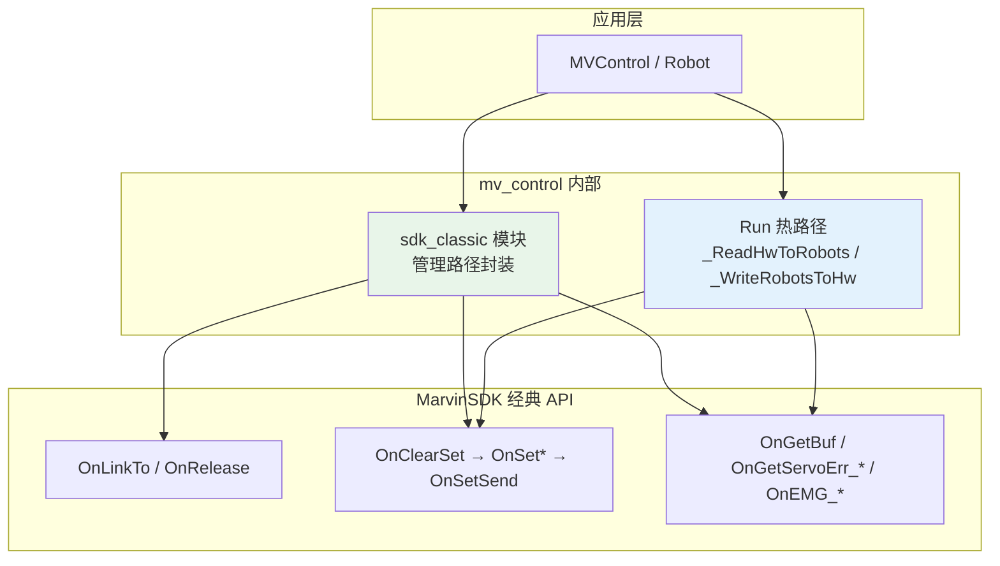

# mv_control 简明 API → 经典 API 迁移规范

> **版本**：v1.0  
> **状态**：已实施（v1.0）  
> **约束**：`mv_control` 实机路径**禁止**调用 MarvinSDK 简明 API；管理路径统一走经典 `On*` 批指令，1 kHz 热路径保持不变。  
> **关联**：[API_SDK_ALIGNMENT.md](./API_SDK_ALIGNMENT.md)、[1KHZ_SDK_SPEC.md](./1KHZ_SDK_SPEC.md)

---

## 1. 文档目的

审计 `mv_control` 对 Marvin controlSDK **简明 API** 的依赖，评估替换为**经典 API** 的改动范围，并作为唯一实施依据。

---

## 2. 架构（迁移后）



### 2.1 路径划分

| 路径 | 允许 SDK 调用 | 发送方式 |
|------|---------------|----------|
| **1 kHz 热路径**（`Run`） | `OnGetBuf`、`OnClearSet`、`OnSetJointCmdPos_*`、`OnSetSend` | **非阻塞** `OnSetSend` |
| **管理路径**（Init / SetEnable / SetControlMode / ClearError / EStop） | 经典 `On*` 全家桶 | **非阻塞** `OnSetSend` + Run 内轮询确认 |
| **Init 连接** | `OnLinkTo`、清错、`OnGetBuf` 帧校验、`OnLogOn/Off` | 可阻塞 sleep，仅 Init 一次 |

> **设计变更**：原简明 API（`SetJointMode` 等）内部使用 `OnSetSendWaitResponse`（~50 ms 阻塞）。迁移后管理路径改为**非阻塞批发送**，模式/使能到位由现有 `_PollControlModeSync` / `_UpdateEnableState` 在 Run 环确认，与 1 kHz 架构一致。

---

## 3. 简明 API 使用审计

| # | 简明 API | 调用位置 | 用途 |
|---|----------|----------|------|
| C1 | `Connect` | `mv_control.cpp::Init` | UDP 连接 + 清错 + 帧校验 + 日志 |
| C2 | `SetJointMode` | `robot.cpp::SetEnable(Enable)` | 上使能 → 位置模式 |
| C2 | `SetJointMode` | `robot.cpp::_CallSdkControlMode(Position)` | 切位置模式 |
| C3 | `Disable` | `robot.cpp::SetEnable(Disable)` | 下使能 |
| C4 | `SetImpJointMode` | `robot.cpp::_CallSdkControlMode(JointImp)` | 关节阻抗 |
| C5 | `SetImpCartMode` | `robot.cpp::_CallSdkControlMode(CartImp)` | 笛卡尔阻抗 |
| C6 | `SetImpForceMode` | `robot.cpp::_CallSdkControlMode(Force)` | 力控 |
| C7 | `CheckArmError` | `robot.cpp::ClearError` | 清臂错误（**双臂**，粒度不当） |
| C8 | `CheckServoError` | `robot.cpp::ClearError` | 清伺服错误（**双臂**） |
| C9 | `EStop` | `robot.cpp::EStop`、`mv_control.cpp::EStopAll` | 软急停 |

### 3.1 已是经典 API（保持不变）

| API | 位置 |
|-----|------|
| `OnRelease` | `MVControl::~MVControl` |
| `OnGetBuf` | `_ReadHwToRobots`、`_RefreshSdkDetailFromHw` |
| `OnClearSet` / `OnSetJointCmdPos_*` / `OnSetSend` | `_WriteRobotsToHw` |
| `OnGetServoErr_A/B` | `_PollServoErrSlowIfDue`、`ClearError` |

---

## 4. 经典 API 替换映射

### 4.1 Init 连接（C1 → `SdkClassic::LinkAndValidate`）

```
OnLinkTo(ip1..ip4)
→ 双臂 OnGetBuf 检查 m_ERRCode / m_CurState==100
→ 若有错：OnClearSet + OnClearErr_A/B + OnSetSend + sleep(10ms)
→ OnGetServoErr_A/B，若有非零：同上清对应臂
→ 轮询 m_Out[0].m_OutFrameSerial 变化（最多 5 次，间隔 1ms）
→ log_switch==0: OnLogOff+OnLocalLogOff；否则 OnLogOn+OnLocalLogOn
```

### 4.2 上使能 / 位置模式（C2 → `SdkClassic::SendPositionMode`）

```
OnClearSet()
OnSetJointLmt_A/B(vel, acc)          // 先设参数
OnSetTargetState_A/B(1)              // ARM_STATE_POSITION（若当前已是 1 可省略 state）
OnSetSend()                          // 非阻塞
→ Run 内 _UpdateEnableState 轮询 CurState==1
```

### 4.3 下使能（C3 → `SdkClassic::SendDisable`）

```
OnClearSet()
OnSetTargetState_A/B(0)              // ARM_STATE_IDLE
OnSetSend()
→ Run 内轮询 CurState==0
```

### 4.4 关节阻抗（C4 → `SdkClassic::SendJointImpMode`）

```
OnClearSet()
OnSetJointLmt_A/B(vel, acc)
OnSetJointKD_A/B(K, D)
OnSetTargetState_A/B(3)              // ARM_STATE_TORQ
OnSetImpType_A/B(1)                  // ARM_IMP_JOINT
OnSetSend()
→ _PollControlModeSync(JointImp)
```

若已在 `(CurState==3 && ImpType==1)`，仅发 Lmt+KD 批。

### 4.5 笛卡尔阻抗（C5 → `SdkClassic::SendCartImpMode`）

```
OnClearSet()
OnSetJointLmt_A/B(vel, acc)
OnSetCartKD_A/B(K, D, 2)
OnSetTargetState_A/B(3)
OnSetImpType_A/B(2)                  // ARM_IMP_CART
OnSetSend()
→ 若 rot_type!=0：再发 OnSetEefRot_A/B(rot_type, cart_ctrl_para)
→ _PollControlModeSync(CartImp)
```

### 4.6 力控（C6 → `SdkClassic::SendForceMode`）

```
OnClearSet()
OnSetForceCtrPara_A/B(0, fxDir, fcCtrlPara{0}, fcAdjLmt)
OnSetTargetState_A/B(3)
OnSetImpType_A/B(3)                  // ARM_IMP_FORCE
OnSetSend()
→ _PollControlModeSync(Force)
```

### 4.7 清错（C7/C8 → 按臂 `SdkClassic::ClearArmError` + `ClearServoError`）

- **改进**：`Robot::ClearError` 仅清**本臂**（`arm_serial_` 0→A，1→B），不再调用清双臂的 `CheckArmError/CheckServoError`。
- 流程：`OnClearSet + OnClearErr_A/B + OnSetSend` → 重读 `OnGetBuf` / `OnGetServoErr_*`。

### 4.8 急停（C9 → 经典 `OnEMG_*`）

| 原调用 | 经典替换 |
|--------|----------|
| `EStop("A")` | `OnEMG_A()` |
| `EStop("B")` | `OnEMG_B()` |
| `EStop("AB")` | `OnEMG_AB()` |

---

## 5. 代码改动清单

| 步骤 | 文件 | 操作 |
|------|------|------|
| S1 | `src/internal/sdk_classic.hpp` | **新建** 经典 API 管理路径声明 |
| S2 | `src/internal/sdk_classic.cpp` | **新建** 实现 Link/Clear/Mode/EStop |
| S3 | `CMakeLists.txt` | 加入 `sdk_classic.cpp` |
| S4 | `src/mv_control.cpp` | `Connect` → `SdkClassic::LinkAndValidate`；`EStopAll` → `OnEMG_AB` |
| S5 | `src/robot.cpp` | 移除全部简明 API；改调 `SdkClassic::*` |
| S6 | `API_SDK_ALIGNMENT.md` | §4.1 对照表更新为经典 API |
| S7 | `1KHZ_SDK_SPEC.md` | §2 管理路径示例更新 |

### 5.1 禁止项（迁移后 grep 验收）

`mv_control/` 下不得再出现以下符号（`MV_CONTROL_SIM` 块除外无 SDK 调用）：

```
Connect(
SetJointMode
Disable(
SetImpJointMode
SetImpCartMode
SetImpForceMode
CheckArmError
CheckServoError
::EStop(
LogSwitch(
```

---

## 6. 安全审计

| 项 | 迁移前 | 迁移后 | 风险 |
|----|--------|--------|------|
| 热路径阻塞 | 已合规 | 不变 | 低 |
| 管理路径阻塞 | 简明 API 内 `OnSetSendWaitResponse` ~50ms | 非阻塞 + Run 轮询 | **降低** Init 外阻塞 |
| 清错粒度 | 单臂 ClearError 清双臂 | 按臂清错 | **降低** 误清对臂 |
| 模式切换确认 | `_PollControlModeSync` | 保持 | 低 |
| 急停 | `EStop`→`OnEMG_*` | 等价 | 低 |
| 静止检查 | 简明 API 查 `m_LowSpdFlag` | `SdkClassic` 切换前检查 | 保持 |
| vel/acc 限幅 | 简明 API 1~100 | `SdkClassic` 同等限幅 | 低 |
| Init 自动上使能 | 无 | 无 | 低 |
| UDP 无鉴权 | 有 | 有 | 网络隔离仍必须 |

---

## 7. 行为差异与验收

| ID | 场景 | 预期 |
|----|------|------|
| M1 | `Init` 成功 | `OnLinkTo` 成功；帧 serial 更新；无简明 API |
| M2 | `SetEnable(Enable)` | 非阻塞返回 `Enabling`；Run 内 `CurState→1` |
| M3 | `SetEnable(Disable)` | 非阻塞返回 `Disabling`；Run 内 `CurState→0` |
| M4 | `SetControlMode(JointImp/CartImp/Force)` | 经典批指令发出；`_PollControlModeSync` 成功 |
| M5 | `ClearError` 左臂 | 仅 A 臂清错，B 臂不受影响 |
| M6 | `EStopAll` | `OnEMG_AB()` 调用 |
| M7 | `Run()` 热路径 | 仍仅 `OnGetBuf` + 至多 1 次 `OnSetSend` |
| M8 | grep 验收 | §5.1 禁止项零匹配 |

**测试命令**：

```bash
cmake --build build --target mv_control test_enable -j
./build/tj_test/test_enable data/test_enable --cpu=2   # 实机
rg 'Connect\(|SetJointMode|Disable\(|CheckArmError|::EStop\(' mv_control/
```

---

## 8. 修订记录

| 版本 | 日期 | 说明 |
|------|------|------|
| v1.0 | 2026-06-13 | 首版：审计、映射、改动清单、安全审计 |
| v1.0 | 2026-06-13 | 代码落地：`sdk_classic` 模块 + robot/mv_control 替换 |
