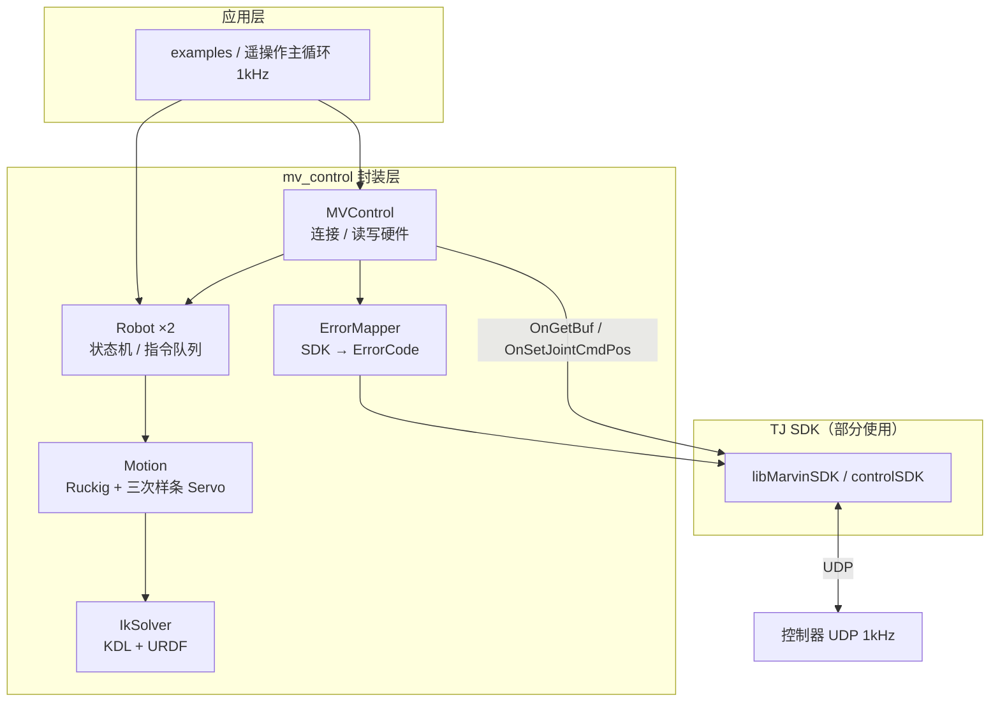
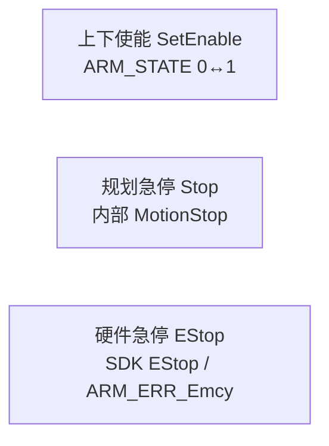
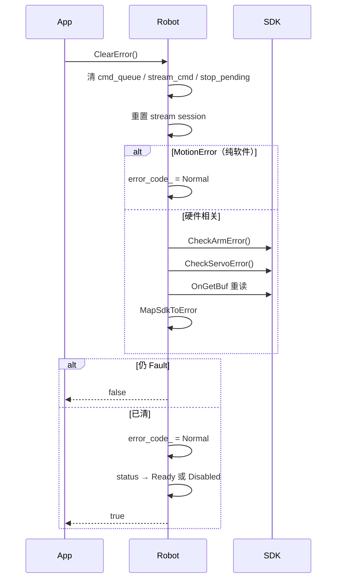
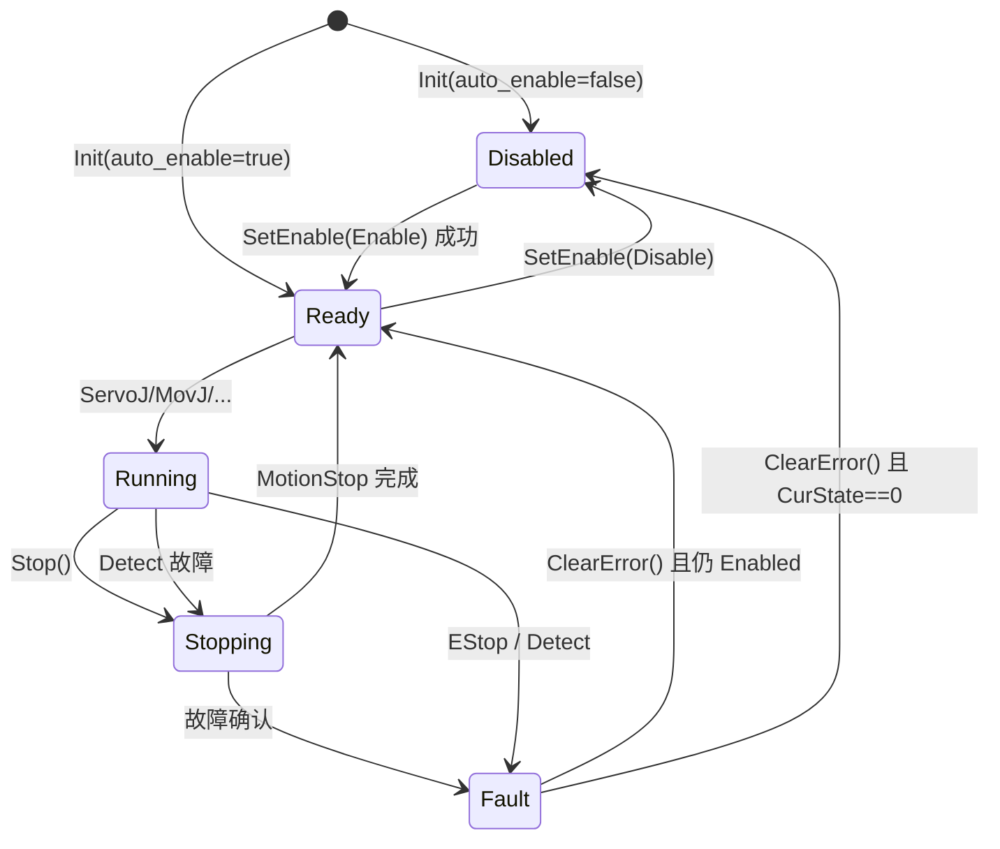

# mv_control 封装层设计规范

> **版本**：v1.1  
> **状态**：已实现（v1.1）
> **约束**：后续所有对 `mv_control` 的修改必须严格遵循本文档；若需偏离，须先更新本文档再改代码。  
> **API/SDK 对齐**：涉及与 Marvin SDK 的状态同步、读写边界、使能/控制模式映射时，须同时遵循 [API_SDK_ALIGNMENT.md](./API_SDK_ALIGNMENT.md)。  
> **实机 1 kHz SDK 调用**：须严格遵循 [1KHZ_SDK_SPEC.md](./1KHZ_SDK_SPEC.md)。

---

## 1. 文档目的

本文档定义 `mv_control` 对天机 Marvin **controlSDK**（`libMarvinSDK`）的封装边界、公共接口、错误码映射、`Run()` 主循环流程，以及上下使能 / 急停 / 清错语义。

**不在本文档范围内**（暂不实现）：

- kinSDK（`libKine`）集成
- 阻抗 / 力控 / 拖动模式（`SetImpJointMode` 等）的具体接线
- Python 绑定

---

## 2. 架构总览



### 2.1 职责划分

| 模块 | 职责 |
|------|------|
| `MVControl` | UDP 连接生命周期；每周期一次 `OnGetBuf` / 双臂批量 `OnSetSend` |
| `Robot` | 单臂状态机；指令队列与流式 Servo；规划急停 |
| `Motion` | 轨迹生成（MovJ/MovL/Servo/Stop），输出 `ref_rs_` |
| `IkSolver` | URDF + KDL 正逆解（替代 kinSDK） |
| `ErrorMapper` | SDK 原始错误 → 上层 `ErrorCode`（可内联于 `robot.cpp`） |

### 2.2 SDK 使用原则

| 场景 | API 类型 | 说明 |
|------|----------|------|
| 连接 / 清错 / 使能 / 急停 | **简明 API** | `Connect`、`CheckArmError`、`CheckServoError`、`SetJointMode`、`Disable`、`EStop` |
| 1kHz 关节位置流式下发 | **经典 API 批量** | `OnClearSet` → `OnSetJointCmdPos_A/B` → `OnSetSend`（禁止在循环内用 `SetJointPostionCmd`，因其阻塞） |
| 运动学 | **不用 kinSDK** | 使用项目 URDF + KDL |

---

## 3. 三个独立概念（禁止混用）



| 概念 | 封装接口 | SDK | 使能状态 | 说明 |
|------|----------|-----|----------|------|
| **上下使能** | `SetEnable(EnableMode)` | `SetJointMode` / `Disable` | 0↔1 | **单一接口**切换上/下使能 |
| **规划急停** | `Stop()` | 无 | **保持使能** | 内部 `MotionStop` 软减速 |
| **硬件急停** | `EStop()` | `EStop("A"/"B"/"AB")` | 通常仍使能但锁死 | 立即触发控制器急停 |

---

## 4. 公共接口规范

### 4.1 MVControl

```cpp
class MVControl {
public:
    bool Init(uint8_t ip1, uint8_t ip2, uint8_t ip3, uint8_t ip4,
              int log_switch = 0, const char* urdf_path = nullptr);
    bool InitFromConfig(const char* yaml_path);
    void Run();  // 1kHz 主循环，见 §7

    Robot& Left();
    Robot& Right();

    // 双臂便捷接口
    bool SetEnableAll(EnableMode mode);
    void EStopAll();  // EStop("AB")
};
```

**Init 语义**：

1. 加载 URDF → `IkSolver::InitFromUrdf`
2. 硬件模式：`Connect(ip, log_switch)`（替代裸 `OnLinkTo` + 手工清错）
3. `_LoadRespAtInit` → `_SyncRefFromResp`
4. 若 `config.connect.auto_enable == true`，调用 `SetEnableAll(EnableMode::Enable)`；**默认 `false`**，保持下使能

**析构**：已连接时调用 `OnRelease()`。

**SetEnableAll 语义**：对左/右臂依次调用 `SetEnable(mode)`，**双臂均成功**才返回 `true`；任一侧失败则返回 `false` 且不自动回滚已成功侧（由应用决定是否补偿）。

### 4.2 Robot（新增 / 变更接口）

```cpp
// common.hpp — 上下使能唯一入参枚举
enum class EnableMode {
    Disable = 0,  // 下使能
    Enable  = 1,  // 上使能
};

class Robot {
public:
    // --- 上下使能（单一接口）---
    bool SetEnable(EnableMode mode);
    EnableMode GetEnableMode() const;

    // --- 急停 ---
    void Stop();         // 规划急停（已有，语义不变）
    void EStop();        // 硬件急停 + 清队列

    // --- 错误 ---
    bool ClearError();   // 上下层联动清错，见 §6
    ErrorCode GetErrorCode() const;
    SdkErrorDetail GetSdkErrorDetail() const;  // 调试，见 §5.3

    // --- 状态 ---
    StatusCode GetStatusCode() const;
    EnableState GetEnableState() const;

    // --- 运动（已有，故障/下使能时拒绝）---
    void ServoJ(const V7d& q);
    void ServoP(const Pose& pose);
    void ServoPByPico(const Pose& pose, bool is_run);
    void GoWork();
    void GoHome();
    void MovJ(const V7d& q);
    void MovL(const Pose& pose);
    bool SetControlMode(ControlMode mode);  // 接 SDK 并轮询确认
    ControlMode GetControlMode() const;     // SDK 反馈的实际控制模式

    const RobotState& GetRefState() const;
    const RobotState& GetRespState() const;
};
```

### 4.3 与 SDK 接口对照表

| 封装层 | SDK（简明） | SDK（经典，仅 1kHz 写路径） |
|--------|-------------|----------------------------|
| `Init` | `Connect` | — |
| `~MVControl` | `OnRelease` | — |
| `SetEnable(Enable)` | `SetJointMode(arm, vel, acc)` | — |
| `SetEnable(Disable)` | `Disable(arm)` | — |
| `SetEnableAll(mode)` | 依次对 A/B 调用上述 | — |
| `EStop()` | `EStop("A"/"B")` | — |
| `ClearError()` | `CheckArmError`, `CheckServoError` | — |
| `Run()` 读 | — | `OnGetBuf` |
| `Run()` 写 | — | `OnClearSet`, `OnSetJointCmdPos_A/B`, `OnSetSend` |

---

## 5. 状态与错误码

### 5.1 StatusCode（替换现有定义）

```cpp
enum class StatusCode {
    Disabled  = 0,  // 下使能（CurState == 0）
    Ready     = 1,  // 已使能、无运动
    Running   = 2,  // 运动中（含 Servo 流）
    Stopping  = 3,  // 规划急停中（MotionStop 未完成）
    Fault     = 4,  // 故障停（ErrorCode != Normal）
};
```

**迁移说明**：删除现有 `StatusCode::Error` 与 `StatusCode::Stop`；原 `Stop` 对应新 `Stopping`，原错误态对应 `Fault`。

### 5.2 EnableMode 与 EnableState

**EnableMode**（`SetEnable` 入参，应用层使用）：

```cpp
enum class EnableMode {
    Disable = 0,  // 请求下使能
    Enable  = 1,  // 请求上使能（位置模式）
};
```

**EnableState**（内部运行时态，由 SDK 反馈驱动）：

```cpp
enum class EnableState {
    Disabled   = 0,
    Enabling   = 1,  // 切换中（CurState ∈ {101,109,...}）
    Enabled    = 2,  // CurState == 1（POSITION）
    Disabling  = 3,
};
```

- `SetEnable(EnableMode)` 发起请求；`GetEnableMode()` 返回**目标**使能意图（非实时 CurState）。
- `GetEnableState()` 返回**实际**运行时态（每周期由 `UpdateEnableState()` 根据 `m_CurState` 更新）。

### 5.2.1 SetEnable 语义

```cpp
bool Robot::SetEnable(EnableMode mode);
```

| 入参 | SDK 调用 | 附加动作 |
|------|----------|----------|
| `EnableMode::Enable` | `SetJointMode(arm, vel_ratio, acc_ratio)` | 无 |
| `EnableMode::Disable` | `Disable(arm)` | 清 `cmd_queue` / `stream_cmd`；重置 stream session |

- 返回 `true`：SDK 调用成功且 `enable_state_` 进入目标态（或已处于目标态）。
- 返回 `false`：SDK 失败或切换超时 → `error_code_ = EnableError`。
- **禁止**提供独立的 `Enable()` / `Disable()` 公共接口。

### 5.3 ErrorCode（替换现有定义）

```cpp
enum class ErrorCode {
    Normal         = 0,
    ConnectError   = 1,  // 通信 / 订阅 / 帧 stale
    InitError      = 2,  // Init / URDF / 首次 SetEnable(Enable) 超时
    HardwareError  = 3,  // 伺服 / 总线 / 急停 / state==100
    ModeError      = 4,  // 模式切换 / PVT / 进位置或扭矩失败
    EnableError    = 5,  // 上/下使能失败
    ConfigError    = 6,  // 配置 / 工具参数
    MotionError    = 7,  // 规划层：超速 / IK / Size / 轨迹无效
};
```

**迁移说明**：

| 旧 ErrorCode | 新 ErrorCode |
|--------------|--------------|
| `ServoError` | `HardwareError` |
| `VelError` | `MotionError` |
| `IKError` | `MotionError` |
| `SizeError` | `MotionError` |
| `ConnectError` | `ConnectError`（保留） |
| `InitError` | `InitError`（保留） |

### 5.4 SdkErrorDetail（调试结构体）

```cpp
struct SdkErrorDetail {
    int arm_state = 0;              // dcss.m_State[i].m_CurState
    int arm_err_code = 0;           // dcss.m_State[i].m_ERRCode
    std::array<long, 7> servo_err{}; // SERVO{i}ERR0..6
    int frame_stale_cycles = 0;
};
```

### 5.5 SDK → 上层错误映射（全覆盖，1 对多）

映射函数签名：

```cpp
ErrorCode MapSdkToError(int arm_idx, const SdkErrorDetail& sdk,
                        ErrorCode internal_hint = ErrorCode::Normal);
```

**优先级**（取最高）：`HardwareError` > `ConnectError` > `ModeError` > `EnableError` > `ConfigError` > `MotionError` > `Normal`

| 上层 ErrorCode | 覆盖的 SDK / 内部源 |
|----------------|---------------------|
| **ConnectError** | `OnGetBuf` 失败；`m_OutFrameSerial` 连续 stale ≥ `kSdkFrameStaleRunCycles`；`Connect`/`OnLinkTo` 失败 |
| **InitError** | URDF/KDL 初始化失败；Init 帧校验失败；首次 `SetEnable(Enable)` 超时 |
| **HardwareError** | `m_ERRCode ∈ {1, 2, 12, 13}`（BusPhysicAbnoraml, ServoError, InvalidSubState, Emcy）；`m_CurState == 100`；任意 `servo_err[i] != 0` |
| **ModeError** | `m_ERRCode ∈ {3, 4, 5, 6, 7}`（InvalidPVT, Request/PositionModeOK, Request/SensorModeOK）；`m_CurState ∈ {101,102,103,104,109}` 持续超过 `mode_transition_timeout_ms` |
| **EnableError** | `m_ERRCode ∈ {8, 9, 10, 11}`；`SetEnable()` 返回 false |
| **ConfigError** | `m_ERRCode == 14`（DYNA_FLOAT_NO_GYRO）；工具/参数设置失败（后续扩展） |
| **MotionError** | 关节超速（`joint_limit_.max_v`）；IK 失败；轨迹规划失败；原 `SizeError` |

**SDK ArmError 枚举参照**（`FxRtCSDef.h`）：

```
1  BusPhysicAbnoraml    2  ServoError           3  InvalidPVT
4  RequestPositionMode  5  PositionModeOK       6  RequestSensorMode
7  SensorModeOK         8  RequestEnableServo   9  EnableServoOK
10 RequestDisableServo  11 DisableServoOK       12 InvalidSubState
13 Emcy                 14 DYNA_FLOAT_NO_GYRO
```

---

## 6. ClearError 规范

### 6.1 签名与返回值

```cpp
bool Robot::ClearError();  // true：上下层均已清除；false：仍有故障
```

### 6.2 流程



### 6.3 规则

1. **ConnectError**：帧未恢复前必须返回 `false`。
2. **HardwareError 含 Emcy(13)**：清错成功后若 `CurState == 0`，状态为 `Disabled`，须再 `SetEnable(Enable)` 才能运动。
3. **MotionError**：仅清软件标志，不调 SDK。
4. **禁止**在 `ClearError` 内自动 `SetEnable(Enable)`；由应用显式调用。
5. `MVControl` 可提供 `ClearErrorAll()`：双臂均成功才返回 `true`。

---

## 7. Run() 主循环

### 7.1 MVControl::Run() 四阶段

```cpp
void MVControl::Run() {
    if (!connected_) return;

    // Phase 1 — 读（每周期一次 OnGetBuf，双臂共享）
    ReadHwToRobots();  // 更新 resp_rs_, SdkErrorDetail, frame_stale

    // Phase 2 — 检测（先硬件后软件，顺序不可调换）
    left_.Detect();
    right_.Detect();

    // Phase 3 — 逻辑（与读写解耦）
    left_.RunLogic();
    right_.RunLogic();

    // Phase 4 — 写（每周期一次，双臂合并 OnClearSet/OnSetSend）
    WriteRobotsToHw();
}
```

SIM 模式：Phase 1 用 `resp ← ref`；Phase 4 跳过 SDK 写。

### 7.2 Robot::Detect()

```cpp
bool Robot::Detect() {
    // 1. MapSdkToError → 可能设置 error_code_
    // 2. 关节超速检测 → MotionError
    // 3. 模式切换超时检测 → ModeError
    if (error_code_ != ErrorCode::Normal) {
        _EnterStopOnFault();
        return false;
    }
    return true;
}
```

### 7.3 Robot::RunLogic()（由原 _Run 重命名 / 拆分）

```cpp
void Robot::RunLogic() {
    UpdateEnableState();

    if (error_code_ != ErrorCode::Normal) {
        RunActiveMotionIfStopping();  // 仅完成进行中的 Stop 规划
        UpdateStatus();
        return;
    }

    if (enable_state_ != EnableState::Enabled) {
        UpdateStatus();
        return;  // 下使能：不处理新指令
    }

    if (!_CanAcceptCmd()) {
        UpdateStatus();
        return;
    }

    _ProcessCmdQueue();
    _ApplyStreamCmd();
    _RunActiveMotion();
    UpdateStatus();
}
```

### 7.4 WriteRobotsToHw() 下发条件

**当且仅当以下全部满足时**，向 SDK 写入关节位置：

```
enable_state_ == EnableState::Enabled
AND control_mode_actual_ == ControlMode::Position
AND status_code_ ∈ { Running, Stopping }
AND error_code_ == ErrorCode::Normal
```

写入方式不变：

```cpp
OnClearSet();
OnSetJointCmdPos_A/B(joints_deg);
OnSetSend();
```

`Ready` / `Disabled` / `Fault` 状态**不下发**新指令。

---

## 8. Init 流程

```
InitFromConfig(yaml):
  1. LoadMvConfig(yaml)
  2. left/right._ApplyArmConfig / _ApplyServoConfig
  3. IkSolver::InitFromUrdf(urdf_path)
  4. Connect(ip, log_switch)           // 含 CheckArmError, CheckServoError, 帧校验
  5. _LoadRespAtInit → _SyncRefFromResp
  6. if auto_enable: SetEnableAll(EnableMode::Enable)
  7. connected_ = true
```

失败时：`OnRelease()`，`connected_ = false`，对应臂 `error_code_ = InitError`。

---

## 9. Stop / EStop / SetEnable 协作

| 操作 | 规划层 | SDK | 使能 | 后续 |
|------|--------|-----|------|------|
| `Stop()` | `MotionStop` 软减速 | 无 | 保持 | 完成后 → `Ready` |
| `EStop()` | 清队列 | `EStop(arm)` | 保持 | → `Fault` + `HardwareError` |
| `SetEnable(Disable)` | 清队列，停规划 | `Disable(arm)` | 下 | → `Disabled` |
| `SetEnable(Enable)` | 无 | `SetJointMode` | 上 | → `Ready` |
| `Detect` 故障 | `_EnterStopOnFault` | 不写 | 保持 | → `Fault` |

**推荐调用顺序**：

```
正常停机:  Stop() → 等 Stopping→Ready → SetEnable(Disable)
紧急:      EStop() → ClearError() → SetEnable(Disable) → SetEnable(Enable)（恢复）
```

### 9.1 _CanAcceptCmd()

```cpp
bool Robot::_CanAcceptCmd() const {
    return error_code_ == ErrorCode::Normal
        && enable_state_ == EnableState::Enabled
        && status_code_ != StatusCode::Fault;
}
```

---

## 10. 状态转移



---

## 11. config.yaml 扩展

在现有 `connect` 节点下新增：

```yaml
connect:
  ip: [192, 168, 1, 190]
  log_switch: 0
  auto_enable: false       # Init 后是否自动 SetEnableAll(Enable)
  vel_ratio: 10            # SetEnable(Enable) 时 SetJointMode 速度百分比 1~100
  acc_ratio: 10            # SetEnable(Enable) 时 SetJointMode 加速度百分比 1~100
  mode_transition_timeout_ms: 500  # CurState 101~109 超时阈值 → ModeError
```

对应 `MvConfig` 新增字段：

```cpp
struct ConnectConfig {
    std::array<uint8_t, 4> ip{{192, 168, 1, 190}};
    int log_switch = 0;
    bool auto_enable = false;
    int vel_ratio = 10;
    int acc_ratio = 10;
    int mode_transition_timeout_ms = 500;
};
```

---

## 12. 文件修改清单

实现时必须按下列文件逐项修改：

| 文件 | 修改内容 |
|------|----------|
| `include/common.hpp` | 替换 `StatusCode`、`ErrorCode`；保留并规范 `EnableMode`；新增 `EnableState`、`SdkErrorDetail` |
| `include/config.hpp` | 新增 `ConnectConfig` |
| `include/mv_control.hpp` | 新增 Robot/MVControl 公共接口；私有方法重命名 `_Run`→`RunLogic` 等 |
| `src/config.cpp` | 解析 connect 新字段 |
| `config/config.yaml` | 补充 connect 新字段 |
| `src/mv_control.cpp` | Init 改用 `Connect`；Run 四阶段；`SetEnableAll`/`EStopAll`；Write 门控 |
| `src/robot.cpp` | `SetEnable`/EStop/ClearError/Detect/RunLogic/UpdateEnableState |
| `src/internal/in_data.hpp` | 如有需要，补充 mode transition 计数常量 |
| 新增 `src/internal/error_map.hpp/.cpp`（可选） | `MapSdkToError` 实现 |
| `CMakeLists.txt` | SDK 头文件改为 `PRIVATE` include（可选，建议） |
| `examples/*.cpp` | 适配新 StatusCode/ErrorCode；Init 后显式 `SetEnableAll(EnableMode::Enable)` |

---

## 13. 实现优先级

| 优先级 | 任务 |
|--------|------|
| **P0** | `SetEnable(EnableMode)`/`GetEnableMode`；Init 改用 `Connect`；Write 使能门控 |
| **P0** | `ErrorCode` 重定义 + `MapSdkToError` + `ClearError` 联动 SDK |
| **P1** | `EStop`；`StatusCode` 迁移（Disabled/Stopping/Fault） |
| **P1** | `Run()` 四阶段拆分；`Detect` 先于 `RunLogic` |
| **P1** | config.yaml 扩展 + `ConnectConfig` |
| **P2** | `GetSdkErrorDetail`；`SetControlMode` 接阻抗 API |
| **P2** | CMake SDK include 私有化 |

---

## 14. 安全要求

| 项 | 要求 |
|----|------|
| 网络 | UDP 无加密；控制器须在隔离网段 |
| 急停 | 应用层必须能调用 `EStop()` / `EStopAll()` |
| 超速 | 触发 `MotionError` 后 `_EnterStopOnFault`，停止下发 |
| 使能 | 默认 `auto_enable: false`；运动前显式 `SetEnable(EnableMode::Enable)` |
| 清错 | 禁止仅清软件标志；硬件故障必须走 SDK 清错 |

---

## 15. 验收标准

1. Init 后默认 `StatusCode::Disabled`（`auto_enable=false` 时）。
2. `SetEnable(EnableMode::Enable)` 成功后 `CurState==1`，`StatusCode::Ready`。
3. SDK 每种 `ArmError(1~14)` 均能被映射到某个上层 `ErrorCode`。
4. `ClearError()` 在硬件故障恢复后返回 `true`，且 `GetSdkErrorDetail()` 无残留错误。
5. `Stop()` 期间 `enable_state_` 保持 `Enabled`，且 Write 路径仍下发直至 `Stopping` 完成。
6. `EStop()` 后 `error_code_==HardwareError`，Write 路径停止下发。
7. `Run()` 每周期仅调用一次 `OnGetBuf` 和一次 `OnSetSend`（双臂合并）。

---

## 附录 A：当前代码与目标差异摘要

| 项目 | 当前 | 目标（本文档） |
|------|------|----------------|
| 使能接口 | 无 | `SetEnable(EnableMode)` / `GetEnableMode`（单一接口） |
| Init | `OnLinkTo` + 手工清错 | `Connect` |
| Init 模式 | 未 `SetJointMode` | `SetEnable(Enable)` 时设置 |
| ClearError | 仅清 `error_code_` | + SDK CheckArmError/CheckServoError |
| ErrorCode | 7 类旧枚举 | 7 类新枚举（语义重定义） |
| StatusCode | Error/Stop 混用 | Disabled/Ready/Running/Stopping/Fault |
| Run | 读→Detect→Run→写（结构已有） | 正式拆 RunLogic + Write 门控 |
| EStop | 无 | 新增 |

---

## 附录 B：参考 SDK 路径

- 头文件：`TJ_SDK/TJ_FX_ROBOT_CONTRL_SDK/contrlSDK/MarvinSDK.h`
- 状态定义：`TJ_SDK/TJ_FX_ROBOT_CONTRL_SDK/contrlSDK/FxRtCSDef.h`
- 官方文档：`SDK_API_REFERENCE_CPP.md`
