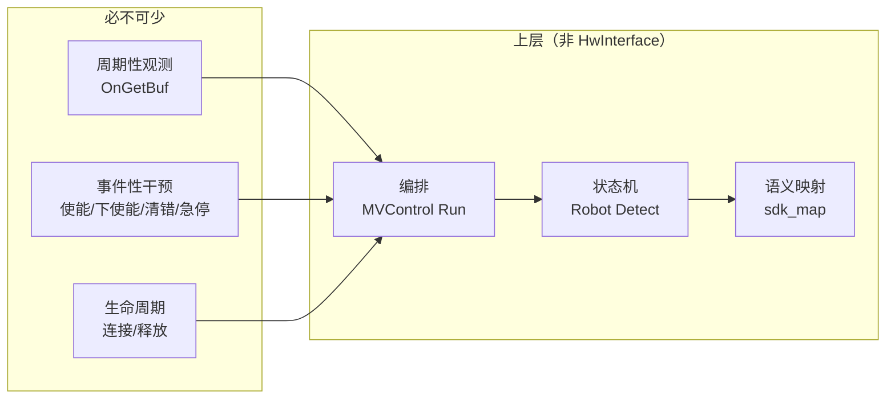
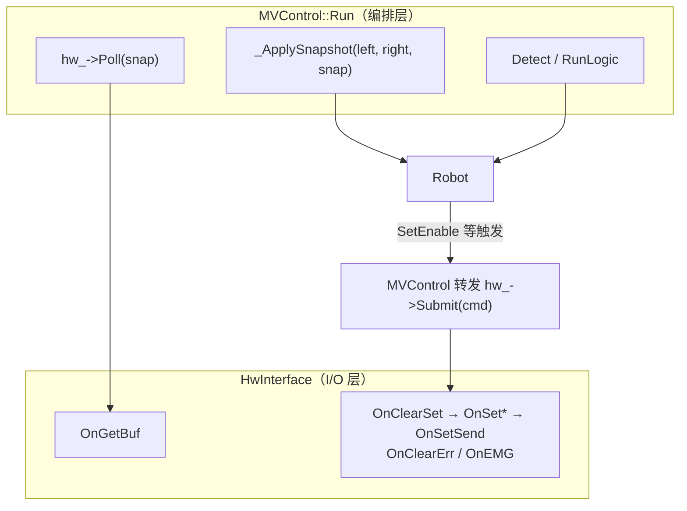
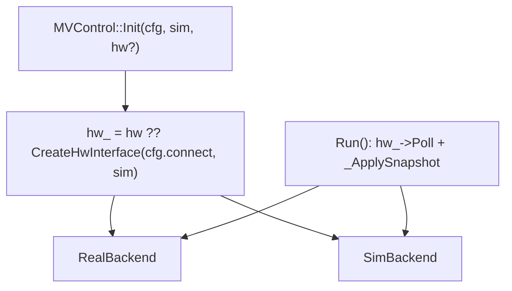
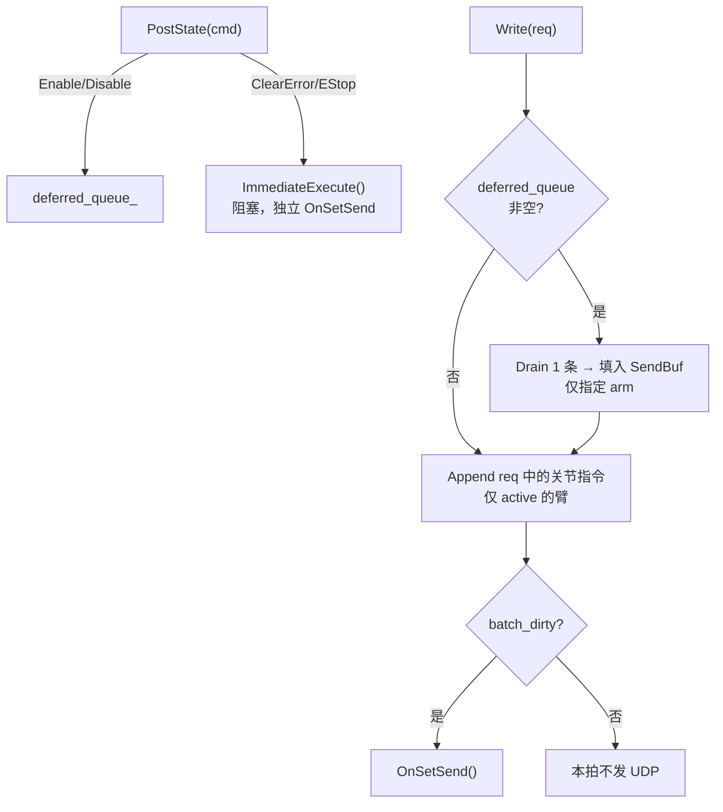
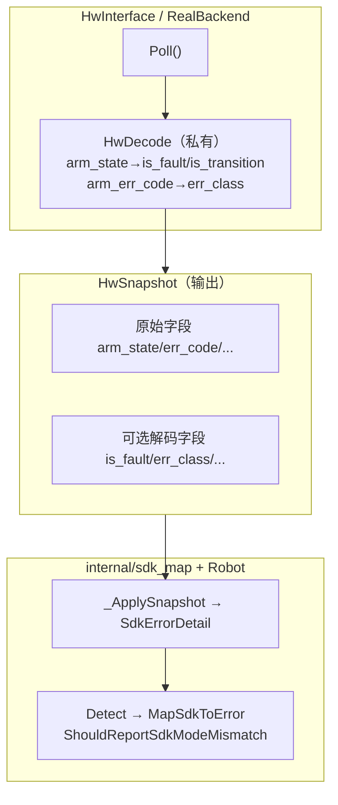
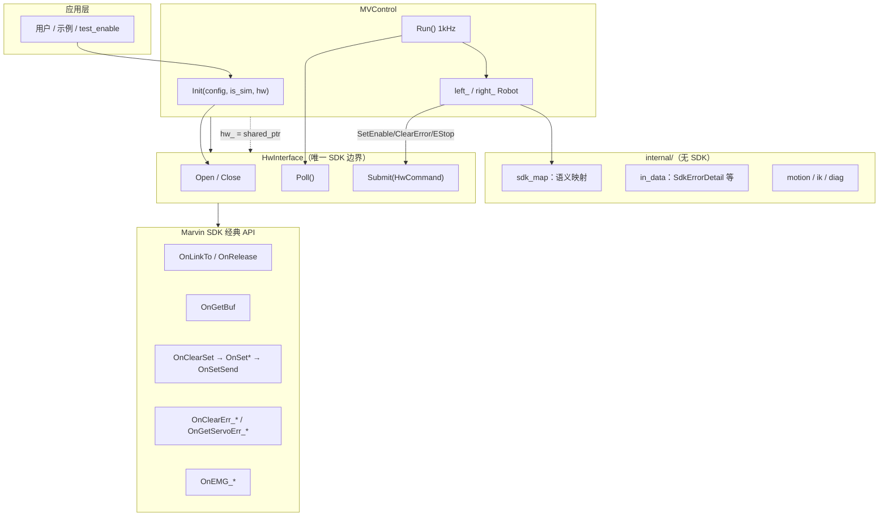
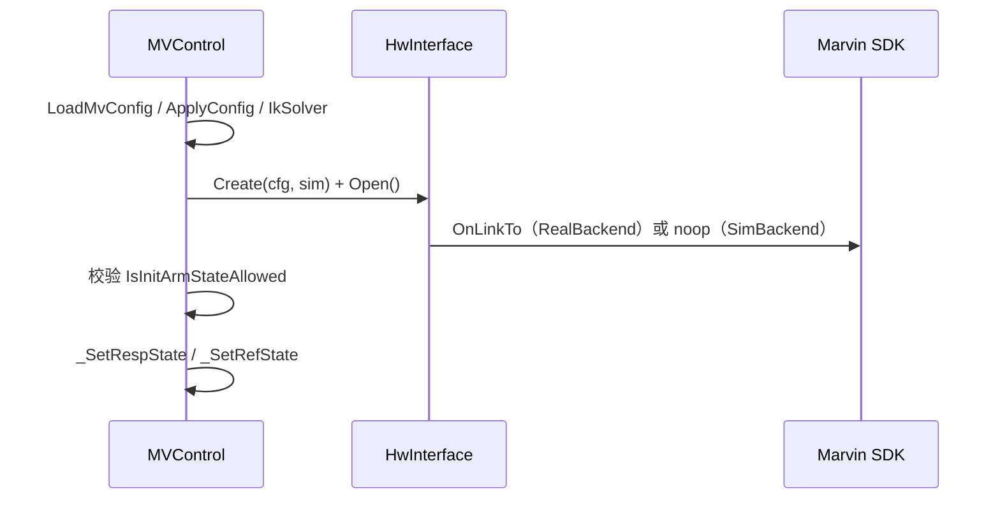
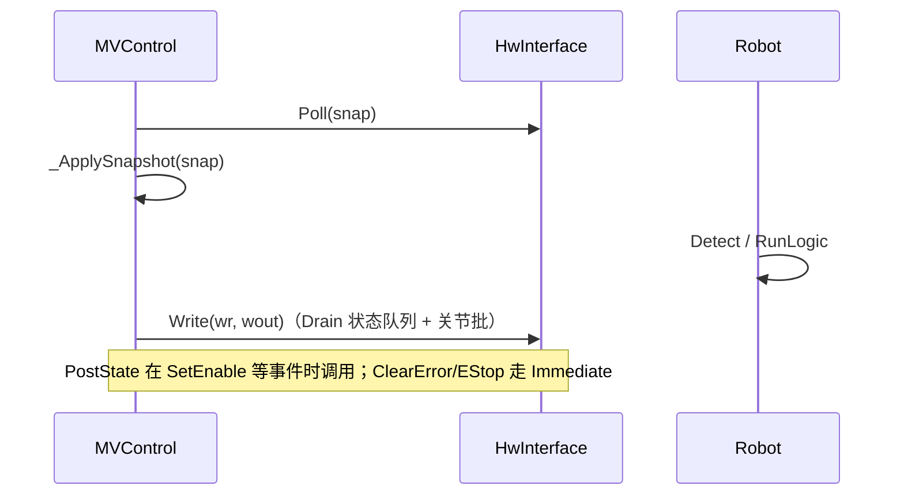
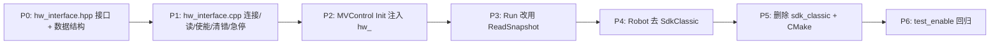

# HwInterface 硬件状态读写封装方案

> **状态**：设计稿（待实现）  
> **范围**：仅硬件**状态读写**——连接/断开、使能/下使能、读错误码、清错、急停、状态快照；**不含** 1 kHz 关节指令流、阻抗/力控模式切换、PVT/规划等运动控制 API。  
> **约束**：只使用 Marvin SDK **经典 API**（`On*` 前缀）；不参考现有 `internal/sdk_classic` 实现；删除 `internal/` 中所有 SDK 相关代码。

---

## 1. 需求摘要

| # | 需求 | 说明 |
|---|------|------|
| R1 | 新建 `HwInterface` 类 | 在 `include/hw_interface.hpp` / `src/hw_interface.cpp` 实现，作为**唯一** SDK 调用边界 |
| R2 | 共享指针注入 `Init` | `MVControl::Init(..., std::shared_ptr<HwInterface> hw)`；`MVControl` 私有成员 `hw_` |
| R3 | 删除 `internal` 中 SDK 代码 | 移除 `sdk_classic.hpp/.cpp` 及任何 `#include "MarvinSDK.h"` |
| R4 | 仅经典 API | 禁止使用简明 API（`Connect`/`Disable`/`SetJointMode` 等，内部大量 `OnSetSendWaitResponse`） |
| R5 | 阻塞性分析 | 热路径（1 kHz `Run`）只用非阻塞读；管理路径（Init/清错/急停）允许短阻塞，并文档化 |

---

## 2. 第一性原理：必不可少 vs 不必需

### 2.1 问题的本质

控制系统与物理机之间只存在两类交互：

1. **观测（Read）**：控制器当前处于什么状态？（关节反馈、使能态、错误码）
2. **干预（Write）**：要求控制器进入什么状态？（上/下使能、清错、急停）

SDK 是传输层细节；`MVControl`/`Robot` 是语义层。  
**第一性原理**：`HwInterface` 只负责「观测 + 干预」的物理实现；「这些观测意味着什么、何时该干预」属于上层。



### 2.2 必不可少（Must Have）

| 能力 | 物理含义 | 最小 SDK 原语 | 调用时机 |
|------|----------|---------------|----------|
| 生命周期 | 建立/拆除与控制器的数据通道 | `OnLinkTo` / `OnRelease` | Init / 析构 |
| 周期性观测 | 1 kHz 获取整机快照 | `OnGetBuf` | 每拍 `Run` |
| 使能干预 | 切到位置跟随（上伺服） | `OnClearSet` → `OnSetJointLmt_*` → `OnSetTargetState_*(1)` → `OnSetSend` | `SetEnable(Enable)` |
| 下使能干预 | 切到下伺服 | `OnClearSet` → `OnSetTargetState_*(0)` → `OnSetSend` | `SetEnable(Disable)` |
| 清错干预 | 清除臂级故障 | `OnClearSet` → `OnClearErr_*` → `OnSetSend` | Init / `ClearError` |
| 急停干预 | 强制下伺服 | `OnEMG_*` | `EStop` |

以上 6 项覆盖「状态读写」的全部物理需求；**缺一不可**。

### 2.3 不必需（可合并、内聚或推迟）

| 原方案中的接口/概念 | 为何不必独立存在 | 处理方式 |
|--------------------|------------------|----------|
| `ReadServoError` | 伺服码是观测的扩展，非独立物理动作 | 内聚到 `Poll`：每 N 拍在内部调 `OnGetServoErr_*` |
| `WaitFirstValidFrame` | 是 Connect 的验收步骤，非独立能力 | 内聚到 `Open` |
| `RequestEnable` / `RequestDisable` | 同为「写目标状态」，仅参数不同 | 合并为 `Submit(HwCommand)` |
| `ClearArmError` / `EStopArm` / `EStopBoth` | 同为「干预命令」 | 合并为 `Submit`，用 `arm` 字段区分 0/1/2(双臂) |
| `IsConnected` | 可由 `Open` 返回值 + 内部 flag 表达 | 不暴露；`MVControl` 用 `connected_` |
| `SimHwInterface` 子类 | SIM 只是 backend 不同，接口应相同 | 工厂 `CreateHw(config)` 选 backend |
| `is_sim_` 分支散落在 Run | SIM 是 backend 特性，不是编排逻辑 | Run 内**零** `if (is_sim_)` HW 分支 |
| `OnGetSDKVersion` | 调试信息 | 可选，不进入公共 API |
| `OnLocalLogOn/Off` | Connect 配置项 | 内聚到 `Open`，不单独暴露 |
| 1 kHz 关节写 | 属运动控制，非状态读写 | 本方案范围外 |
| 阻抗/力控/PVT/PLN | 模式与轨迹，非状态读写 | 本方案范围外 |

### 2.4 读/写应放在哪一层？

**原则**：谁了解 SDK，谁做 I/O；谁了解 Robot，谁做映射。

| 层次 | 放什么 | 不放什么 |
|------|--------|----------|
| **`HwInterface`** | SDK 调用；`HwSnapshot` 填充；`HwCommand` 编码与发送 | `RobotState`、FK、`ErrorCode` 映射、`Detect` |
| **`MVControl`** | 每拍调用 `hw_->Poll`；快照 → `_SetRespState` + `sdk_detail_`；转发 `Submit`；Init 编排 | `OnGetBuf`、MarvinSDK.h |
| **`Robot`** | 读 `sdk_detail_` 做 `Detect`；状态机决定**何时**发起 `Submit` | 任何 HW 调用 |



**结论**：

- **读**：`HwInterface::Poll` 做物理读；`MVControl::_ApplySnapshot` 做逻辑写（Robot 域）。不在 `HwInterface` 里调 `_SetRespState`。
- **写**：`HwInterface::Submit` 做物理写；由 `Robot` 决策、`MVControl` 转发（Robot 不持有 `hw_`）。不在 `MVControl` 里直接写 SDK。
- **不要**在 `MVControl` 保留 `_ReadHwToRobots` / `_WriteRobotsToHw` 这种「半映射半 I/O」混合名；改为 `_ApplySnapshot`（纯映射）+ `hw_->Poll/Submit`（纯 I/O）。

### 2.5 SIM 的简洁统一处理

**第一性原理**：SIM 不是「另一套 Run 逻辑」，而是「没有真实传输层的 backend」。

| 反模式 | 问题 |
|--------|------|
| `Run` 内 `if (is_sim_) { ref→resp } else { OnGetBuf }` | 编排层泄漏 backend 细节 |
| `is_sim_` 同时存在于 `MVControl` 和 `Robot` 和 `HwInterface` | 三处分支，易不一致 |
| 独立 `SimHwInterface` 公共 API 不同 | 测试注入困难 |

**推荐：Backend 策略 + 统一接口**

```cpp
// 工厂：唯一 SIM 决策点
std::shared_ptr<HwInterface> CreateHwInterface(const ConnectConfig& cfg, bool sim);

// RealBackend：Poll → OnGetBuf；Submit → SDK 批发送
// SimBackend：  Poll → 返回 mirror_（或零位）；Submit → 更新 mirror_ 状态，不调 SDK
```



**Run 统一伪代码（状态层 — 本方案 `HwInterface` 范围）**：

```cpp
void MVControl::Run() {
    HwSnapshot snap{};
    hw_->Poll(snap);              // 读：SIM/真机同一调用
    _ApplySnapshot(snap);         // 映射 → Robot resp / sdk_detail_
    left_.Detect();  right_.Detect();
    left_.RunLogic(); right_.RunLogic();
    // 状态写（使能/清错/急停）不在 Run 内 — 见 §2.5.1
}
```

**SIM 观测源**：`SimBackend` 维护 `mirror_`（上次 `Submit(Enable/Disable/EStop)` 更新的 `arm_state`）；关节反馈默认零位，或由 `SimBackend::Poll` 内 ref→resp 镜像（实现「完美跟随」），**仍不污染 Run 主流程**。

**`is_sim_` 保留一处即可**：`Robot::_Init(is_sim)` 用于运动学/规划差异（若需要）；**HW 路径不再读 `is_sim_`**。

#### 2.5.1 Run 里要不要写硬件？——两类写，分开看

硬件写分两种，**不能混为一谈**：

| 类型 | 内容 | 触发方式 | 是否在 Run 每拍执行 |
|------|------|----------|---------------------|
| **状态写** | 使能、下使能、清错、急停 | 用户调 `SetEnable` / `ClearError` / `EStop` → `hw_->Submit(cmd)` | **否**（事件驱动，与 1 kHz 不同步） |
| **运动写** | 1 kHz 关节位置指令 `OnSetJointCmdPos_*` | 规划结果在 `RunLogic` 产出 `ref` | **是**（真机每拍 RunLogic 之后） |

因此：

- 文档里的短伪代码**只覆盖状态层**，所以看起来「只有读没有写」——这对**状态写**是对的：使能/清错/急停**本来就不在 Run 里**。
- 现有 `mv_control` 的 `_WriteRobotsToHw()` 属于**运动写**；真机要跑轨迹就**必须在 Run 里写**，但属于另一 API 面（§2.5.2），不要塞进 `Submit`。

**状态写时序（Run 外）**：

```cpp
robot.SetEnable(EnableMode::Enable);
  → MVControl 转发 hw_->Submit({Enable, arm, vel, acc});  // 非阻塞
// 后续每拍 Run 的 Poll 看到 arm_state→1，Robot::_UpdateEnableState 推进
```

#### 2.5.2 完整 Run 伪代码（状态 + 运动，对齐现有产品行为）

```cpp
void MVControl::Run() {
    HwSnapshot snap{};
    hw_->Poll(snap);
    _ApplySnapshot(snap);

    left_.Detect();  right_.Detect();
    left_.RunLogic(); right_.RunLogic();

    hw_->CommitMotion(left_, right_);   // 运动写：真机必需；SimBackend 空实现
}
```

| Backend | 运动写 |
|---------|--------|
| **RealBackend** | `OnClearSet` → `OnSetJointCmdPos_A/B`（`_ShouldWriteHw` 门控）→ `OnSetSend` |
| **SimBackend** | no-op；`Poll` 内 ref→resp 镜像 |

运动写**不要**走 `Submit`（每 ms 一次会污染事件语义）。扩展 **`CommitMotion`** 专管 1 kHz 关节批发送；若本阶段只做状态层，运动写可暂留旧路径过渡。

运动写与状态写合并进统一的 **`Write`**，见 §2.10（取代 `Submit` + `CommitMotion` 拆分）。

### 2.6 周期接口：仅 `Poll` + `Write`（2 个）

Run 热路径对硬件**只调用两个方法**；生命周期 `Open`/`Close`/`Create` 仅在 Init/析构。

```cpp
struct HwWriteRequest {
    // 运动写：由 MVControl 根据 _ShouldWriteHw 填充；不写的臂 active=false
    struct ArmMotion {
        bool active = false;
        double q_deg[7]{};
    };
    ArmMotion left;
    ArmMotion right;
};

struct HwWriteResult {
    bool ok = true;
    bool udp_sent = false;          // 本拍是否 OnSetSend
    bool had_state = false;         // 本拍是否含状态写（从队列取出并并入批）
    bool had_motion = false;        // 本拍是否含关节写
};

class HwInterface {
public:
    static std::shared_ptr<HwInterface> Create(const ConnectConfig& cfg, bool sim);
    bool Open();
    void Close();

    bool Poll(HwSnapshot& snap);                        // 读硬件
    bool Write(const HwWriteRequest& req, HwWriteResult& out);  // 写硬件

    // 事件入队（SetEnable/ClearError/EStop 时调用，不属于 Run 周期两接口）
    void PostState(HwCommand cmd);
};
```

| 方法 | 调用时机 | 说明 |
|------|----------|------|
| `Poll` | Run 开头 | 仅 `OnGetBuf` + 内部慢速 servo 采样 |
| `Write` | RunLogic 之后 | 合并「状态队列 + 本拍运动」→ 至多一次 `OnSetSend` |
| `PostState` | Run 外事件 | 入队；**不**直接发 UDP（阻塞类除外，见 §2.10.3） |

**`MVControl::Run` 统一伪代码**：

```cpp
void MVControl::Run() {
    HwSnapshot snap{};
    hw_->Poll(snap);
    _ApplySnapshot(snap);

    left_.Detect();  right_.Detect();
    left_.RunLogic(); right_.RunLogic();

    HwWriteRequest wr{};
    if (left_._ShouldWriteHw())  { wr.left.active = true;  /* fill q_deg */ }
    if (right_._ShouldWriteHw()) { wr.right.active = true; /* fill q_deg */ }

    HwWriteResult wout{};
    hw_->Write(wr, wout);   // 内部按需从状态队列取命令，与 wr 合并
}
```

`SetEnable` 等仍走 `PostState`，**不在 Run 里直接 Write 状态**。

### 2.7 `Poll` 与 `Write` 的时序约定

| 场景 | 调用方 | 约定 |
|------|--------|------|
| 1 kHz 读 | `Run` → `Poll` | 仅 `OnGetBuf` |
| 1 kHz 写 | `Run` → `Write(req)` | 合并状态队列 + 运动；至多一次 `OnSetSend` |
| 使能/下使能 | `SetEnable` → `PostState` | 入队；**下拍** `Write` Drain 进批（NB） |
| 清错/急停 | `ClearError`/`EStop` → `PostState` | **Immediate 路径**：`PostState` 内同步执行，**不**进队列（B） |
| Init 清错 | `Open` 内 | 直接 Immediate，与 Run 无关 |

### 2.10 读写两接口：状态 vs 运动、队列、单臂写

#### 2.10.1 `Write` 内如何区分「本拍有没有状态写」

**不要**让 MVControl 猜测；由 **`HwWriteResult`** 回报，或由 **`Write` 内部**从队列 Drain 后设置：

| 信号 | 含义 | 谁设置 |
|------|------|--------|
| `req.left/right.active` | 本拍是否要发关节指令 | MVControl（`_ShouldWriteHw`） |
| `out.had_state` | 本拍 UDP 批内是否含 `OnSetTargetState_*` 等 | `Write` 内部（Drain 队列后） |
| `out.had_motion` | 本拍是否含 `OnSetJointCmdPos_*` | `Write` 内部 |
| `out.udp_sent` | 是否调用 `OnSetSend` | `Write` 内部 |

MVControl **无需**在 `HwWriteRequest` 里再传「是否写状态」——状态来自 **`PostState` 入队的内部队列**，`Write` 每拍最多合并 **一条** Deferred 状态命令。

#### 2.10.2 是否需要状态命令队列？——要，分两条路径

SDK 约束：**同一时刻仅一个发送批**（`m_SendTag==100` 时 `OnClearSet` 失败）；使能/下使能与关节指令**可以**在同一批内（现有 `SdkClassic::DrainDeferredIntoBatch` + `AppendJointCmdPos` + `CommitRunCycle` 已证明）。

| 命令类型 | 是否入队 | 何时执行 | 能否与运动同批 |
|----------|----------|----------|----------------|
| `Enable` / `Disable` | **Deferred 队列** | 下一拍 `Write` 开头 Drain | **能**（`OnSetTargetState_A` + `OnSetJointCmdPos_B` 等同批） |
| `ClearError` / `EStop` | **不入队** | `PostState` 内 **Immediate** 同步执行 | **不能**（内部 `OnSetIntPara`/`OnEMG` 自带独立 `OnSetSend`+sleep） |



**每周期是否必须从队列取状态命令？**

- **不强制每拍都有**：队列空则 `out.had_state=false`，只发运动（若有）。
- **每拍最多 Drain 1 条 Deferred**：避免多状态命令挤占同一批、也便于调试；双臂同时使能则入队两条，两拍发完（或扩展为「同 Op 合并」，一般不需要）。
- **Immediate 命令**在 `PostState` 当下执行，**本拍 `Write` 应跳过运动批**（可选优化：Immediate 后 `m_SendTag` 可能占用 1ms，需 `WaitAndClearSet`）。

#### 2.10.3 `Write` 内部算法（RealBackend）

```cpp
bool RealBackend::Write(const HwWriteRequest& req, HwWriteResult& out) {
    out = {};
    // 1. 若刚执行过 Immediate，或 SendTag 未释放 → WaitAndClearSet（≤500µs）

    // 2. Deferred：最多 1 条
    std::optional<HwCommand> st = PopDeferred();  // Enable/Disable
    if (st) {
        if (!OnClearSet()) return false;
        ApplyDeferredToBatch(*st);   // 仅 st->arm 对应 A 或 B
        out.had_state = true;
    } else if (req.left.active || req.right.active) {
        if (!OnClearSet()) return false;
    } else {
        return true;  // 无状态无运动
    }

    // 3. 运动：仅 active 的臂
    if (req.left.active)  { OnSetJointCmdPos_A(...); out.had_motion = true; }
    if (req.right.active) { OnSetJointCmdPos_B(...); out.had_motion = true; }

    // 4. 发送
    if (out.had_state || out.had_motion) {
        out.udp_sent = OnSetSend();
    }
    return out.udp_sent || (!out.had_state && !out.had_motion);
}
```

#### 2.10.4 SDK 是否支持只给一条臂做状态写？——**支持**

经典 API 左/右臂**独立**，批内可只写一侧：

| API | 单臂 | 说明 |
|-----|------|------|
| `OnSetTargetState_A/B` | ✅ | 只调 A 不影响 B |
| `OnSetJointLmt_A/B` | ✅ | Enable 时仅对目标臂设 Lmt |
| `OnSetJointCmdPos_A/B` | ✅ | 现有 `_WriteRobotsToHw` 已按臂门控 |
| `OnClearErr_A/B` | ✅ | 清错按臂 |
| `OnEMG_A` / `OnEMG_B` / `OnEMG_AB` | ✅ | 单臂或双臂 |

`HwCommand.arm`：`0`=左，`1`=右，`2`=双臂（仅 `EStop`/`ClearError` 的 Immediate 路径）。

**同一批示例**（仅左臂使能 + 右臂发关节）：

```
OnClearSet()
OnSetJointLmt_A(vel, acc)
OnSetTargetState_A(1)      // 仅左臂状态
OnSetJointCmdPos_B(q)       // 仅右臂运动
OnSetSend()
```

#### 2.10.5 SimBackend 的 `Write`

- `had_state`：更新 `mirror_.arm_state`（Enable→1, Disable→0）
- `had_motion`：no-op（关节跟随在 `Poll` 镜像 ref）
- `out.udp_sent = false`（无 UDP）

#### 2.10.6 与旧 `Submit`/`CommitMotion` 的关系

| 旧 | 新 |
|----|-----|
| `Submit(Enable)` | `PostState` + 下拍 `Write` |
| `Submit(ClearError/EStop)` | `PostState` Immediate |
| `CommitMotion` | `Write(req)` 的 motion 部分 |

### 2.8 决策小结

| 问题 | 决策 |
|------|------|
| 哪些必不可少？ | 生命周期 + `Poll` + `Write` + `PostState`（事件半部） |
| 读放哪？ | `Poll` + `_ApplySnapshot` |
| 写放哪？ | 运动 → `Write(req)`；状态 → `PostState` → 队列/Immediate → `Write` 合并 |
| 本拍是否写了状态？ | 看 `HwWriteResult.had_state`，**不**在 req 里手工区分 |
| 状态队列？ | **要**；Enable/Disable Deferred，每拍 Drain ≤1；ClearError/EStop Immediate |
| 单臂状态写？ | **SDK 支持**；`HwCommand.arm` 0/1 |
| 最少 Run 内接口？ | **`Poll` + `Write` 两个** |
| map 放哪？ | **整包 sdk_map 不放 hw_interface**；仅可选 **HwDecode** 内聚在 backend；**DomainMap** 留 `internal/` |

### 2.9 `sdk_map` 是否应放入 `HwInterface`？

**结论：不应整包迁入；按「硬件解码 vs 控制语义」拆两层。**

#### 2.9.1 第一性原理：map 在回答两个问题

| 问题 | 性质 | 依赖 |
|------|------|------|
| SDK 原始整数代表什么物理含义？ | **硬件解码**（DCSS 字段 → 分类） | 仅 `arm_state`、`arm_err_code`、`imp_type` |
| 对控制系统意味着什么、该怎么反应？ | **控制语义**（→ `ErrorCode` / 是否报 `ModeError`） | Robot 状态机上下文 |

`sdk_map` 当前**混合**了这两类逻辑，因此不能整体等同于 `HwInterface` 职责。

#### 2.9.2 现有 `sdk_map` 函数归属分析

| 函数 | 依赖 | 建议归属 | 理由 |
|------|------|----------|------|
| `MapSdkToControlMode` | 仅 `cur_state` + `imp_type` | **可选**内聚到 `Poll`（写入 `HwArmSnapshot` 解码字段） | 纯 SDK 手册映射，无 Robot 上下文 |
| `IsModeTransitionState` | 仅 `arm_state` | **HwDecode**（`hw_interface.cpp` 匿名命名空间） | 101–109 是 SDK 常量 |
| `IsInitArmStateAllowed` | `cur_state` + 配置 | **`Open` 内部校验** 或留 MVC Init | 属「连接后验收」，可内聚到 `RealBackend::Open` |
| `HasServoErr` | `servo_err[]` | **HwDecode** 或 `_ApplySnapshot` | 纯数组判断 |
| `ErrorPriority` / `PickHigherPriorityError` | 仅 `ErrorCode` | **`internal/sdk_map`** | 控制域优先级，与 SDK 无关 |
| `MapSdkToError` | `SdkErrorDetail` + **`internal_hint`** + **`frame_stale_cycles`** | **`internal/sdk_map` + `Robot::Detect`** | 需合并 `MotionError` 等软件错误 |
| `ShouldReportSdkModeMismatch` | SDK 值 + **`EnableMode`** + **`ControlMode` target** | **`Robot::Detect`** | 比较「期望模式 vs 实际模式」，是控制策略 |

**关键反例**：若把 `MapSdkToError` 放进 `HwInterface`，则要么：
- `Poll` 需要传入 `internal_hint` / `enable_mode`（接口膨胀，HW 层反向依赖 Robot），要么
- HW 层擅自决定 `ErrorCode`（Robot 状态机被绕过）。

两种都违反 §2.4 分层原则。

#### 2.9.3 推荐分层



| 层 | 位置 | 内容 |
|----|------|------|
| **HwDecode** | `hw_interface.cpp` 内部（不导出） | SDK 常量：`100`=故障、`101–109`=过渡、`arm_err_code` 区间分类 |
| **HwSnapshot** | `hw_interface.hpp` | 原始值 + **可选**解码字段（减少上层重复查表） |
| **DomainMap** | `internal/sdk_map.hpp/.cpp` **保留** | `MapSdkToError`、`ErrorPriority`、`ShouldReportSdkModeMismatch` |
| **帧 stale 计数** | **`RealBackend::Poll` 内部** 或 **`_ApplySnapshot`** | 跨周期比较 `out_frame_serial`；计数值写入 `SdkErrorDetail.frame_stale_cycles`；**语义判定**（→ `ConnectError`）仍在 `MapSdkToError` |

#### 2.9.4 何时才考虑把 map 移入 `hw_interface`？

仅当满足**全部**条件时方可合并：
1. 去掉 `MapSdkToError` 的 `internal_hint` 参数；
2. `ShouldReportSdkModeMismatch` 下沉到 Robot 或删除；
3. 接受 `hw_interface.hpp` 依赖 `common.hpp` 中的 `ErrorCode`/`ControlMode`（HW 层与控制域耦合）。

当前需求下**不满足**，故不建议。

#### 2.9.5 实施建议（最小改动）

1. **`sdk_map` 留在 `internal/`**，文件路径可改为 `mv_control/src/hw_map.cpp`（语义：硬件值→控制域），但**不**放进 `HwInterface` 类。
2. **`Poll` 可选增强**：在 `HwArmSnapshot` 增加 `bool is_fault`、`bool is_transition`，由 `RealBackend` 填充，**不**直接输出 `ErrorCode`。
3. **`IsInitArmStateAllowed`**：移入 `RealBackend::Open` 末尾自检；`MVControl::Init` 不再直接调用。
4. **`_ApplySnapshot`**：raw/decoded → `SdkErrorDetail`；**不**在此调 `MapSdkToError`（仍由 `Detect` 负责）。

```cpp
// hw_interface.hpp — 只到硬件分类，不到 ErrorCode
struct HwArmSnapshot {
    int arm_state = 0;
    int arm_err_code = 0;
    // 解码字段（Poll 内填，替代部分 MapSdk 查表）
    bool is_fault = false;
    bool is_transition = false;
    enum class ErrClass { None, Hardware, Mode, Enable, Config, Servo } err_class;
    // ...
};

// internal/sdk_map.hpp — 控制语义，保留
ErrorCode MapSdkToError(const SdkErrorDetail& sdk, ErrorCode internal_hint);
bool ShouldReportSdkModeMismatch(..., EnableMode, ControlMode target);
```

---

## 3. 目标架构



### 3.1 职责边界

| 模块 | 职责 | 禁止 |
|------|------|------|
| `HwInterface` | `Open/Close/Poll/Submit`；SDK 调用；`HwSnapshot` 填充 | `RobotState`、FK、错误语义映射 |
| `MVControl` | 每拍 `Poll` + `_ApplySnapshot`；转发 `Submit`；Init 编排 | 直接 `#include "MarvinSDK.h"` |
| `Robot` | `Detect` / 使能状态机 / `MapSdkToError`（经 `sdk_map`） | 任何 SDK 头文件或调用 |
| `internal/sdk_map` | SDK 值 → `ErrorCode`/`ControlMode` 的**控制语义**映射 | SDK I/O；**不**迁入 `HwInterface`（见 §2.9） |
| `internal/sdk_classic` | — | **整文件删除** |

### 3.2 与运动控制的分界（本方案不覆盖）

以下能力**不在**本 `HwInterface` 范围内，后续可另建 `HwMotionInterface` 或扩展接口：

- `OnSetJointCmdPos_A/B` + 1 kHz 批发送
- `OnSetImpType_*` / `OnSetJointKD_*` / `OnSetCartKD_*` / 力控参数
- PVT、PLN、文件传输、参数保存等运维 API

---

## 4. 安全审计

| 维度 | 风险 | 对策 |
|------|------|------|
| **网络** | UDP 4729/4730 无加密，同网段可抢连 | 机器人专网隔离；`Connect` 失败即 `Disconnect`；文档禁止公网暴露 |
| **端口独占** | 重复 `OnLinkTo` 返回 false | `HwInterface::Connect` 幂等：已连接先 `Disconnect` |
| **实时性** | `OnGetIntPara`/`OnClearErr`/`OnEMG` 阻塞可达 ~100 ms | **禁止**在 1 kHz 热路径调用；`Run` 仅用 `OnGetBuf` |
| **状态撕裂** | 清错/急停后多处各自 `OnGetBuf` | 管理操作后由 `MVControl::Run` 下一拍统一 `ReadSnapshot`；Robot 不二次读 HW |
| **发送槽竞态** | `m_SendTag==100` 时 `OnClearSet` 失败 | 管理命令入队，在独立「管理周期」或 Init 路径执行；热路径不写 |
| **急停语义** | `OnEMG_*` 阻塞且立即下伺服 | `EStop*` 仅管理线程/非实时上下文调用；调用后 `Robot` 置 `HardwareError` |
| **敏感信息** | IP 来自 YAML | 日志脱敏可选；不在 `HwInterface` 持久化凭据 |
| **依赖注入** | 空 `shared_ptr` 或未 Connect 即 Run | `Init` 校验：`!is_sim && !hw_` → 失败；`Run` 检查 `hw_->IsConnected()` |

**结论**：将 SDK 收敛到单类后，阻塞 API 的使用面可控；关键是 **Run 热路径只调 `Poll`（底层仅 `OnGetBuf`）**。

---

## 5. SDK 经典 API 阻塞性分析

图例：**NB** = 非阻塞；**SB** = 短阻塞（通常 &lt; 20 ms）；**B** = 阻塞（20 ms–数秒）。

### 5.1 本方案使用的 API

| API | 用途 | 阻塞性 | 典型耗时 | 可用上下文 |
|-----|------|--------|----------|------------|
| `OnLinkTo` | UDP 连接 + 启动 1 ms 定时器 | **NB** | &lt; 1 ms | Init |
| `OnRelease` | 释放连接 | **SB** | ~10 ms（`SLEEP(10)`） | 析构 / Disconnect |
| `OnGetSDKVersion` | 版本查询 | **NB** | µs | Init（可选） |
| `OnGetBuf` | 拷贝 `DCSS` 整机快照 | **NB** | µs 级 memcpy | **Run 热路径** |
| `OnClearSet` | 清空发送批缓冲 | **NB** | µs；上一批未发完返回 false | 管理写 |
| `OnSetJointLmt_A/B` | 速度/加速度百分比 | **NB** | 写 SendBuf | 使能前 |
| `OnSetTargetState_A/B` | 使能(1)/下使能(0) 等 | **NB** | 写 SendBuf | 管理写 |
| `OnSetSend` | 提交批指令（定时器发 UDP） | **NB** | 实际发送 ~1 ms 内 | 管理写 |
| `OnClearErr_A/B` | 清臂级错误 | **B** | A: 3×(`OnSetIntPara`+2ms)≈6ms+；B: 10 次≈20ms+ | Init / ClearError |
| `OnGetServoErr_A/B` | 七轴伺服错误码 | **B** | 7×`OnGetIntPara`，单次 Para 最多 50×2ms≈100ms | 慢速轮询（非每拍） |
| `OnEMG_A/B/AB` | 软急停 | **B** | 3×(`OnSetIntPara`+2ms)+批发送 | EStop（非热路径） |
| `OnLocalLogOn/Off` | 本地 printf 日志 | **NB** | — | Init（可选） |

**使能/下使能标准序列（均为 NB 写 + NB 发送）**：

```
OnClearSet()
→ OnSetJointLmt_*(vel, acc)      // 仅使能时需要
→ OnSetTargetState_*(1 或 0)
→ OnSetSend()                     // 非阻塞；控制器约 1ms 内收到
```

到位/使能完成：**不**调用 `OnSetSendWaitResponse`；由上层轮询 `OnGetBuf` → `m_CurState`、`m_LowSpdFlag`。

**清错标准序列**：

```
OnClearSet()
→ OnClearErr_*()                  // 内部阻塞
→ OnSetSend()
→ sleep ≥10ms（Init 建议 ≥200ms 保守）
→ OnGetBuf() 验证 m_ERRCode==0 && m_CurState!=100
```

### 5.2 本方案明确禁止使用的 API

| API | 禁止原因 |
|-----|----------|
| `OnSetSendWaitResponse` | 强制 `SLEEP(1)` 轮询，最少 20 ms |
| `OnSetIntPara` / `OnGetIntPara`（直接调用） | 单次最多 ~100 ms；仅通过 `OnClearErr`/`OnGetServoErr`/`OnEMG` 间接使用 |
| 简明 API（`Connect`/`Disable`/…） | 内部 WaitResponse + sleep |
| `OnSetJointCmdPos_*` | 属运动控制，非本方案范围 |
| 文件/升级/采集/PLN 等 | 运维与运动，非状态读写 |

### 5.3 `OnGetIntPara` 阻塞机理（间接 API 的共同根因）

每次参数读写：`OnClearSet` → 组包 → `OnSetSend` → 循环最多 50 次 `SLEEP(2)` 等待 `m_ParaRetSerial` ACK。  
因此 `OnGetServoErr_*`（7 次）、`OnClearErr_B`（10 次）、`OnEMG_*`（3 次）均为**管理路径专用**。

---

## 6. `HwInterface` 类设计

> **接口以 §2.6 最小 4 方法为准**；下列 §6.3 保留数据结构细节，原 11 方法清单视为已废弃的展开版。

### 6.1 头文件位置

- 声明：`mv_control/include/hw_interface.hpp`
- 实现：`mv_control/src/hw_interface.cpp`（**唯一** `#include "MarvinSDK.h"` 的 translation unit）

### 6.2 数据结构

```cpp
// 单臂硬件快照（由 OnGetBuf 填充，与 DCSS 解耦）
struct HwArmSnapshot {
    int arm_state = 0;           // m_State[].m_CurState
    int arm_err_code = 0;        // m_State[].m_ERRCode
    int imp_type = 0;            // m_In[].m_ImpType
    int out_frame_serial = 0;    // m_Out[].m_OutFrameSerial
    bool low_spd_flag = false;   // m_Out[].m_LowSpdFlag
    double joint_pos_deg[7]{};   // m_Out[].m_FB_Joint_Pos（度）
    double joint_vel_deg[7]{};   // m_Out[].m_FB_Joint_Vel
    std::array<long, 7> servo_err{};
    bool servo_err_fresh = false;
};

struct HwSnapshot {
    HwArmSnapshot left;   // arm index 0
    HwArmSnapshot right;  // arm index 1
    bool read_ok = false;
    uint64_t read_stamp_us = 0;
};

struct ConnectOptions {
    uint8_t ip[4]{192, 168, 1, 190};
    int log_switch = 0;
    int servo_err_poll_cycles = 1000;  // Poll 内部慢速采 servo_err 周期
    bool clear_err_on_open = true;
};
```

`ConnectOptions` 由 `ConnectConfig` 填充，**仅 `Open` 使用**，不对外暴露多个连接阶段 API。

`HwArmSnapshot` 字段与现有 `SdkErrorDetail` 对齐，便于 `Robot::Detect` 继续使用 `sdk_map`，无需在 Robot 层暴露 `DCSS`。

### 6.3 公共接口（Poll + Write，见 §2.6 / §2.10）

```cpp
struct HwCommand {
    enum class Op { Enable, Disable, ClearError, EStop };
    enum class Path { Deferred, Immediate };  // 实现内部分类，PostState 自动选择
    Op op = Op::Disable;
    int arm = 0;           // 0=左(A), 1=右(B), 2=双臂(EStop/ClearError)
    int vel_percent = 10;
    int acc_percent = 10;
};

class HwInterface {
public:
    static std::shared_ptr<HwInterface> Create(const ConnectConfig& cfg, bool sim);
    bool Open();
    void Close();

    bool Poll(HwSnapshot& snap);
    bool Write(const HwWriteRequest& req, HwWriteResult& out);
    void PostState(const HwCommand& cmd);   // 事件入队或 Immediate
};
```

**写路径分类**：

| `Op` | 路径 | 与 `Write` 关系 |
|------|------|-----------------|
| `Enable` / `Disable` | Deferred | 入队 → 下拍 `Write` Drain，可与运动同批 |
| `ClearError` / `EStop` | Immediate | `PostState` 内同步 SDK，**不**进 Deferred 队列 |

### 6.4 Backend 实现（替代 SimHwInterface 子类）

```cpp
// hw_interface.cpp 内部
class IHwBackend {
public:
    virtual ~IHwBackend() = default;
    virtual bool Open(const ConnectConfig& cfg) = 0;
    virtual void Close() = 0;
    virtual bool Poll(HwSnapshot& snap) = 0;
    virtual bool Write(const HwWriteRequest& req, HwWriteResult& out) = 0;
    virtual void PostState(const HwCommand& cmd) = 0;
};

class RealBackend : public IHwBackend { /* MarvinSDK */ };
class SimBackend  : public IHwBackend { /* mirror_ 状态机，零 SDK */ };

// HwInterface 持有 unique_ptr<IHwBackend> backend_
```

`Create(cfg, sim)` 返回 `make_shared<HwInterface>(sim ? SimBackend : RealBackend)`。  
**不**对外暴露 `SimHwInterface` 类型名；测试注入 Mock 时实现 `IHwBackend` 即可。

`Init` 逻辑：

```cpp
hw_ = injected_hw ? injected_hw : HwInterface::Create(cfg->connect, is_sim);
if (!hw_->Open()) { return false; }
// Run 内不再区分 is_sim
```

---

## 7. `MVControl` 集成

### 7.1 签名变更

```cpp
// mv_control.hpp
class MVControl {
public:
    bool Init(const char* config_path = MV_CONTROL_CONFIG_DEFAULT,
              bool is_sim = false,
              std::shared_ptr<HwInterface> hw = nullptr);
private:
    std::shared_ptr<HwInterface> hw_;
    void _ApplySnapshot(const HwSnapshot& snap);  // 唯一 HW→Robot 映射
    // 删除：_ReadHwToRobots / _WriteRobotsToHw / _PollServoErrSlowIfDue / is_sim_ HW 分支
};
```

管理写转发示例（`MVControl` 为 `Robot` friend 或提供 package 级 API）：

```cpp
bool MVControl::_SubmitForRobot(Robot& arm, const HwCommand& cmd) {
    return hw_ && hw_->Submit(cmd);
}
// Robot::SetEnable → MVC::_SubmitForRobot(*this, {Enable, arm_serial, vel, acc})
```

### 7.2 Init 流程



### 7.3 Run 流程（SIM / 真机统一）



- **状态写**：`PostState` → Deferred 队列 → 下拍 `Write` 合并（`out.had_state`）。
- **运动写**：`Write(req)` 的 `ArmMotion.active`（`out.had_motion`）。
- **清错/急停**：`PostState` Immediate，不与运动同批。

### 7.4 清错策略

```
Robot::ClearError (HW):
  1. MVC → hw_->Submit({ClearError, arm})   // 阻塞在 Submit 内
  2. 不在 ClearError 内 Poll；下一拍 Run 自然 Poll 刷新
  3. 若 Poll 后 servo_err 仍非零：应用层重试 Submit 或人工处理
```

---

## 8. 从 `internal/` 删除与保留

### 8.1 删除

| 文件 | 原因 |
|------|------|
| `src/internal/sdk_classic.hpp` | SDK 封装迁入 `HwInterface` |
| `src/internal/sdk_classic.cpp` | 同上 |

`CMakeLists.txt`：移除上述源文件，加入 `src/hw_interface.cpp`。

### 8.2 保留（无 SDK）

| 文件 | 原因 |
|------|------|
| `sdk_map.hpp/.cpp` | 控制语义映射：`MapSdkToError`、`ShouldReportSdkModeMismatch` 等 | 保留在 `internal/`；HwDecode 在 `hw_interface.cpp` 私有 |
| `in_data.hpp` | `SdkErrorDetail`、周期常量 |
| `robot_impl.hpp` | Robot 内部状态 |
| `ik/motion/diag` | 算法与日志 |

### 8.3 `Robot` 侧改动（实现阶段）

| 现有直接 SDK 封装调用 | 改为 |
|----------------------|------|
| `SdkClassic::SendPositionMode` | `MVC → hw_->Submit({Enable, ...})` |
| `SdkClassic::SendDisable` | `MVC → hw_->Submit({Disable, ...})` |
| `SdkClassic::ClearArmError` | `MVC → hw_->Submit({ClearError, ...})` |
| `SdkClassic::EStopArm` | `MVC → hw_->Submit({EStop, ...})` |

**推荐**：`Robot` 不持有 `hw_`；由 `MVControl` 在 `SetEnable` 等 public API 层包装（或 `Robot` friend `MVControl` 传入 function_ref）。避免 `Robot` 依赖 `HwInterface` 头文件。

---

## 9. `HwInterface` 内部实现要点

### 9.1 Open（原 Connect）

```cpp
bool RealBackend::Open(const ConnectConfig& cfg) {
    if (!OnLinkTo(cfg.ip[0], ...)) return false;
    cfg.log_switch ? OnLocalLogOn() : OnLocalLogOff();
    Submit({ClearError, 0}); Submit({ClearError, 1});  // 可选
    return WaitFirstValidFrame(cfg);  // 内聚，不暴露
}
```

`WaitFirstValidFrame`：循环 `OnGetBuf`，检查 `m_OutFrameSerial` 变化，**SB**（带 timeout sleep）。

### 9.2 Poll（原 ReadSnapshot）

```cpp
bool RealBackend::Poll(HwSnapshot& out) {
    DCSS dcss{};
    if (!OnGetBuf(&dcss)) { out.read_ok = false; return false; }
    FillArm(out.left, dcss, 0);
    FillArm(out.right, dcss, 1);
    if (++servo_poll_cnt_ >= cfg_.servo_err_poll_cycles) {
        servo_poll_cnt_ = 0;
        OnGetServoErr_A(...); OnGetServoErr_B(...);  // 慢速，内聚
        out.left.servo_err_fresh = out.right.servo_err_fresh = true;
    }
    out.read_ok = true;
    return true;
}
```

### 9.3 Submit（原 RequestEnable 等）

```cpp
bool RealBackend::Submit(const HwCommand& cmd) {
    switch (cmd.op) {
    case Op::Enable:
        if (!OnClearSet()) return false;
        SetLmt(cmd.arm, cmd.vel_percent, cmd.acc_percent);
        SetTargetState(cmd.arm, ARM_STATE_POSITION);
        return OnSetSend();
    case Op::Disable: /* ... */ 
    case Op::ClearError: /* OnClearErr + sleep */ 
    case Op::EStop: /* OnEMG_* */ 
    }
}
```

### 9.4 错误码读取来源对照

| 层级 | 来源 | 接口 |
|------|------|------|
| 臂状态 | `m_State[i].m_CurState` | `OnGetBuf` |
| 臂错误码 | `m_State[i].m_ERRCode` | `OnGetBuf` |
| 伺服错误 | `SERVO0ERR*` / `SERVO1ERR*` | `OnGetServoErr_*`（慢） |
| 静止标志 | `m_Out[i].m_LowSpdFlag` | `OnGetBuf` |

---

## 10. 实施步骤



| 阶段 | 交付 | 验收 |
|------|------|------|
| P0 | 头文件、快照结构体 | 编译通过（空实现可 stub） |
| P1 | 经典 API 实现 + 阻塞 API 仅用于管理路径 | 独立小测试：Connect → ReadSnapshot → Enable → Read |
| P2 | `Init(..., shared_ptr<HwInterface>)` | 注入 Mock 可跑 SIM |
| P3 | `_SyncHwToRobots` 替代 `_ReadHwToRobots` | `Run` 内无 MarvinSDK |
| P4 | Robot 使能/清错/急停经 MVC→hw_ | `grep SdkClassic robot.cpp` 为空 |
| P5 | 删除 `internal/sdk_classic.*` | 全仓库仅 `hw_interface.cpp` 含 MarvinSDK.h |
| P6 | HW/SIM 回归 | 使能、清错、ErrorCode 与预期一致 |

---

## 11. 验收标准（DoD）

- [ ] `HwInterface` 为唯一 SDK 边界；`internal/sdk_classic.*` 已删除
- [ ] `MVControl` 通过 `std::shared_ptr<HwInterface> hw_` 访问硬件；`Init` 支持注入
- [ ] Run 热路径仅 **`Poll` + `Write`**；`HwWriteResult.had_state` / `had_motion` 区分本拍写内容
- [ ] Enable/Disable 走 Deferred 队列（每拍 Drain ≤1）；ClearError/EStop 走 Immediate
- [ ] `Run` 内**无** `is_sim_` HW 分支；SIM/真机共用 `Poll` + `_ApplySnapshot`
- [ ] `MVControl` 无 `_ReadHwToRobots` / `_PollServoErrSlowIfDue`；仅 `_ApplySnapshot`
- [ ] 未使用简明 API 与 `OnSetSendWaitResponse`
- [ ] 使能/下使能/清错/急停 API 阻塞性符合 §4 表格
- [ ] `Robot` / `sdk_map` / `motion` 无 `#include "MarvinSDK.h"`
- [ ] `CMakeLists.txt` 已加入 `hw_interface.cpp`

---

## 12. 风险与待定项

| 项 | 说明 | 建议 |
|----|------|------|
| 关节指令写 | 本方案不含 1 kHz 写 | 后续扩展 `AppendJointCmd` 或独立模块 |
| 阻抗/力控模式 | 不在状态读写范围 | 模式切换另接口或 Phase 2 |
| `ClearError` 后快照滞后一拍 | 设计如此 | 文档约定或 ClearError 后强制一次 `_SyncHwToRobots`（仍只用 `OnGetBuf`） |
| 双臂并发清错 | `OnClearErr` 阻塞较长 | Connect 时顺序清 A→B；避免 Run 内清错 |
| `shared_ptr` 生命周期 | `MVControl` 析构需 `Disconnect` | `~MVControl` 调 `hw_->Disconnect()` |

---

## 13. 附录：经典 API 速查（本方案子集）

```
连接:     OnLinkTo, OnRelease, OnGetSDKVersion
读状态:   OnGetBuf                          [NB, 热路径]
读伺服错: OnGetServoErr_A, OnGetServoErr_B [B, 慢速]
使能:     OnClearSet, OnSetJointLmt_*, OnSetTargetState_*(1), OnSetSend  [NB]
下使能:   OnClearSet, OnSetTargetState_*(0), OnSetSend                  [NB]
清错:     OnClearSet, OnClearErr_*, OnSetSend                         [B]
急停:     OnEMG_A, OnEMG_B, OnEMG_AB                                   [B]
日志:     OnLocalLogOn, OnLocalLogOff                                 [NB]
```

**禁止用于热路径**：`OnSetSendWaitResponse`, `OnGetIntPara`, `OnSetIntPara`（除间接调用外）, 简明 API 全家桶。
