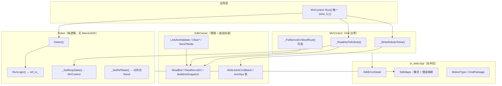

# mv_control 硬件 I/O 边界重构方案

> **状态**：已实施（2026-06-14）  
> **动机**：硬件读写散落在 `mv_control.cpp`、`robot.cpp`、`sdk_classic.cpp` 多处；`SdkErrorDetail` 与 map 文件碎片化；`Robot` 私有方法过多且存在未实现声明；`_WriteRobotsToHw` 已声明但未落地。  
> **关联**：[DESIGN.md](./DESIGN.md)、[1KHZ_SDK_SPEC.md](./1KHZ_SDK_SPEC.md)、[API_SDK_ALIGNMENT.md](./API_SDK_ALIGNMENT.md)、[CLASSIC_API_MIGRATION.md](./CLASSIC_API_MIGRATION.md)

---

## 1. 需求摘要

| # | 需求 | 意图 |
|---|------|------|
| R1 | **所有硬件读写** 收敛到 `_ReadHwToRobots` / `_WriteRobotsToHw` 及 `sdk_classic.hpp/.cpp` | 明确 HW 边界；`Robot` 不再直接调用 `OnGetBuf` / `OnSetJointCmdPos_*` / `OnGetServoErr_*` |
| R2 | **合并所有 map** | `sdk_mode_map` + `error_map` 合并为单一模块，消除重复 include 与分散映射逻辑 |
| R3 | **删除 `sdk_detail.hpp`**，内容并入 `in_data.hpp` | 内部数据结构集中；`SdkErrorDetail` 与周期常量同文件维护 |
| R4 | **实现 `_SetRefState`** | 与 `_SetRespState` 对称，作为 `ref_rs_` 唯一写入口（含 FK 更新） |
| R5 | **精简 `Robot` 私有函数** | 能删则删；逻辑过短（约 ≤5 行且无复用）的函数内联到调用点，不单独成函数 |
| R6 | **`MVControl::Run` 热路径固定为四步** | 读 HW → Detect → RunLogic → 写 HW（SIM 跳过读写） |
| R7 | **删除 `_ZeroRespAtInit` / `_SyncRefFromResp`** | SIM 零位与 Init ref 对齐改由 `MVControl::Init` + `_SetRespState` / `_SetRefState` 完成 |
| R8 | **`_Apply*Config` ×4 合并为 `_ApplyConfig`** | Init 配置注入单次调用，按臂传入 `ArmConfig` + 共享 `Servo/Connect/Imp` |

---

## 2. 现状问题

### 2.1 硬件读路径分散

| 位置 | SDK 调用 | 问题 |
|------|----------|------|
| `mv_control.cpp::_ReadHwToRobots` | `OnGetBuf` | ✅ 主读路径 |
| `mv_control.cpp::Run`（内联） | `OnGetServoErr_A/B` | ❌ 应在读边界或 `SdkClassic` 慢速轮询 |
| `robot.cpp::_RefreshSdkDetailFromHw` | `OnGetBuf` | ❌ Robot 越界读 HW |
| `robot.cpp::ClearError` | `OnGetBuf` + `OnGetServoErr_*` | ❌ 清错后刷新应经 `SdkClassic` + `_ReadHwToRobots` |
| `robot.cpp::EStop` | 经 `_RefreshSdkDetailFromHw` | ❌ 同上 |
| `sdk_classic.cpp` | `OnGetBuf`（模式切换前置校验等） | ✅ 管理路径，保留 |

### 2.2 硬件写路径分散

| 位置 | SDK 调用 | 问题 |
|------|----------|------|
| `mv_control.cpp::Run`（内联 ~L154–178） | `OnClearSet` → `OnSetJointCmdPos_A/B` → `OnSetSend` | ❌ 应迁入 `_WriteRobotsToHw` |
| `mv_control.hpp` | 声明 `_WriteRobotsToHw` | ❌ **无实现** |
| `sdk_classic.cpp` | `OnClearSet` / `OnSetSend` / 模式批发送 | ✅ 非 1kHz 关节流，保留 |

### 2.3 数据与 map 碎片化

```
in_data.hpp          → MotionType, CmdPackage, 周期常量
sdk_detail.hpp       → SdkErrorDetail（待删除）
sdk_mode_map.hpp/cpp → ControlMode 映射、Init 校验、模式不一致检测
error_map.hpp/cpp    → ErrorCode 映射、过渡态、优先级
```

- `error_map.hpp` 与 `robot_impl.hpp` 均依赖 `sdk_detail.hpp`
- `IsModeTransitionState` 在 `error_map`，`MapSdkToControlMode` 在 `sdk_mode_map`，语义相关却分文件

### 2.4 Robot 私有 API 膨胀

`robot.hpp` 当前 **27 个** private 方法（含未实现的 `_SetRefState`）。以下属于「短函数 / 薄包装」候选：

| 函数 | 行数级 | 建议 |
|------|--------|------|
| `_SyncStateFromSdkDetail` | ~3 | 内联到 `Detect` / `RunLogic` 入口 |
| `_UpdateControlModeFromSdk` | ~6 | 内联到上者 |
| `_CanAcceptCmd` | ~5 | 内联或保留（调用点 ≥6，可保留） |
| `_ResetStreamSession` | ~4 | 内联到 `_ClearMotionCmds` / `_EnterStop*` |
| `_SyncRefFromResp` | ~3 | **删除**；Init 末尾改 `arm._SetRefState(arm.GetRespState())` |
| `_ZeroRespAtInit` | ~12 | **删除**；SIM Init 改 `_SetRespState(零状态)`，见 §5.9 |
| `_Apply*Config` ×4 | 各 ~5–12 | **合并**为 `_ApplyConfig`，见 §5.10 |
| `_RefreshSdkDetailFromHw` | — | **删除**（职责迁入 `_ReadHwToRobots`） |
| `_PushPointCmd` | ~6 | 内联到 `GoWork`/`GoHome`/`MovJ`/`MovL` |

### 2.5 未实现符号

- `Robot::_SetRefState`：已在 `robot.hpp:57` 声明，**`robot.cpp` 无定义**，链接期风险（若被调用）

---

## 3. 目标架构



### 3.1 职责边界（重构后）

| 模块 | 可做 | 不可做 |
|------|------|--------|
| `MVControl` | 每周期一次读/写；慢速 `servo_err` 轮询；Init 时 `_ReadHwToRobots` | 运动规划、指令队列 |
| `SdkClassic` | 连接/使能/模式/清错/急停；**封装** `OnGetBuf`、`OnGetServoErr_*`、批写关节指令 | 读 `Robot` 状态；错误语义映射 |
| `Robot` | 状态机、Motion、`ref_rs_` 规划、`Detect` | **任何** `#include "MarvinSDK.h"` / 直接 SDK 调用 |
| `in_data.hpp` | 内部类型 + 常量 + `SdkErrorDetail` | 无 `.cpp` 依赖 |

---

## 4. 安全审计

| 维度 | 现状风险 | 重构对策 |
|------|----------|----------|
| **状态一致性** | `ClearError` / `EStop` 单独 `OnGetBuf`，与 `Run` 读路径竞态 | 清错后统一 `_ReadHwToRobots()`；禁止 Robot 内二次读 |
| **封装破坏** | `MVControl` 大量 `arms[i]->impl_->*` 直接访问 | 读写完通过 `_SetRespState` / 写侧读 `GetRefState()`；`sdk_detail_` 更新收拢到 `_ReadHwToRobots` |
| **热路径滥用** | `Run` 内联写逻辑，门控条件散落 | `_WriteRobotsToHw` 单一门控函数，条件集中文档化 |
| **慢速 API 误用** | `servo_err` 轮询写在 `Run` 主体 | 抽 `_PollServoErrSlowIfDue`，仅末尾调用；`servo_err_fresh` 门禁保留 |
| **模式切换安全** | `sdk_classic` 内 `IsStationary` 前置 | 保持不变；Robot 侧 `_CallSdkControlMode` 仅调 `SdkClassic` |
| **敏感数据** | 无密钥；IP 来自 YAML | 无变更；`ConnectConfig` 不写入日志 |
| **急停** | `EStop` 后 `_RefreshSdkDetailFromHw` | 改为 `SdkClassic::EStopArm` + 下一拍 `Run` 自然 `_ReadHwToRobots`；或 Init 级同步读一次经 MVC |

**结论**：重构降低「多入口读 HW」导致的状态撕裂风险；需同步消除 `friend` 对 `impl_` 的裸访问，否则安全收益不完整。

---

## 5. 详细更改方案

### 5.1 合并 `sdk_detail.hpp` → `in_data.hpp`

**删除**：`mv_control/src/internal/sdk_detail.hpp`

**在 `in_data.hpp` 追加**：

```cpp
#include <array>

// SDK 原始状态，仅供 Detect / 清错 / 慢速轮询
struct SdkErrorDetail {
    int arm_state = 0;
    int arm_err_code = 0;
    int imp_type = 0;
    std::array<long, 7> servo_err{};
    int frame_stale_cycles = 0;
    bool servo_err_fresh = false;
};
```

**批量替换 include**：

- `robot_impl.hpp`：`#include "in_data.hpp"`（已含则去掉 `sdk_detail.hpp`）
- `error_map.hpp`：改为 `#include "in_data.hpp"`

---

### 5.2 合并 map → `sdk_map.hpp` / `sdk_map.cpp`

**删除**：

- `sdk_mode_map.hpp` / `sdk_mode_map.cpp`
- `error_map.hpp` / `error_map.cpp`

**新建** `mv_control/src/internal/sdk_map.hpp`：

```cpp
#pragma once
#include "common.hpp"
#include "in_data.hpp"

// --- 模式映射 ---
ControlMode MapSdkToControlMode(int cur_state, int imp_type);
bool IsInitArmStateAllowed(int cur_state, bool strict_init_state);
bool IsModeTransitionState(int arm_state);
bool ShouldReportSdkModeMismatch(int cur_state, int imp_type,
                                 EnableMode enable_mode,
                                 ControlMode control_mode_target);

// --- 错误映射 ---
bool HasServoErr(const SdkErrorDetail& sdk);
int ErrorPriority(ErrorCode code);
ErrorCode PickHigherPriorityError(ErrorCode a, ErrorCode b);
ErrorCode MapSdkToError(const SdkErrorDetail& sdk,
                        ErrorCode internal_hint = ErrorCode::Normal);
```

**实现**：原 `sdk_mode_map.cpp` + `error_map.cpp` 原样合并，无行为变更。

**`CMakeLists.txt`**：源文件列表 `error_map.cpp` + `sdk_mode_map.cpp` → `sdk_map.cpp`。

---

### 5.3 扩展 `SdkClassic`（HW 读写底层）

在 `sdk_classic.hpp` 增加（命名可微调，职责不变）：

```cpp
// 单次 OnGetBuf
bool ReadBuf(DCSS& dcss);

// 慢速路径：按臂读伺服错误码
bool ReadServoErr(int arm_serial, long err[DOF]);

// 1kHz 关节位置批写（双臂合并一次 OnSetSend）
bool WriteJointCmdPos(int arm_serial, const double joints_deg[DOF]);
void BeginWriteBatch();   // OnClearSet
bool CommitWriteBatch();  // OnSetSend

// RT_OUT → RobotState 关节部分（不含 FK）
RobotState BuildRespJointState(const RT_OUT& rt_out);
```

**迁移规则**：

| 原调用点 | 迁入 |
|----------|------|
| `mv_control.cpp` 匿名 `BuildRespState` | `SdkClassic::BuildRespJointState` |
| `Run` 内 `OnGetServoErr_A/B` | `SdkClassic::ReadServoErr` + `_PollServoErrSlowIfDue` |
| `Run` 内 `OnClearSet/OnSetJointCmdPos/OnSetSend` | `BeginWriteBatch` + `WriteJointCmdPos` × N + `CommitWriteBatch` |
| `robot.cpp::ClearError` 内 `OnGetBuf` / `OnGetServoErr` | `SdkClassic::Clear*` 后由 `MVControl` 调 `_ReadHwToRobots` |
| `sdk_classic.cpp` 内部 `ReadBuf` | 提升为命名空间公开或保持 internal 别名 |

---

### 5.4 实现 `_ReadHwToRobots`（增强）

**文件**：`mv_control.cpp`

**逻辑（保持语义，整理结构）**：

```
ok = SdkClassic::ReadBuf(dcss)
for each arm i in {left, right}:
    impl.read_buf_ok = ok
    if ok:
        _SetRespState(BuildRespJointState(dcss.m_Out[i]))
        sdk_detail.arm_state   = dcss.m_State[i].m_CurState
        sdk_detail.arm_err_code = dcss.m_State[i].m_ERRCode
        sdk_detail.imp_type    = dcss.m_In[i].m_ImpType
        更新 frame_stale_cycles（m_OutFrameSerial）
return ok
```

**新增辅助**（`mv_control.cpp` 匿名命名空间，避免 Robot 方法）：

```cpp
void ApplySdkDetailFromDcss(Robot& arm, const DCSS& dcss, int idx, bool track_frame_serial);
```

**禁止**：在 `robot.cpp` 再出现 `OnGetBuf`。

---

### 5.5 实现 `_WriteRobotsToHw`（新建）

**文件**：`mv_control.cpp`

**从 `Run()` L154–178 原样迁入**，门控条件不变：

```cpp
bool MVControl::_WriteRobotsToHw() {
    bool has_cmd = false;
    SdkClassic::BeginWriteBatch();
    for each arm:
        if (enable_state == Enabled
            && control_mode_actual == Position
            && error_code == Normal
            && status in {Running, Stopping}):
            SdkClassic::WriteJointCmdPos(arm_serial, ref_q_deg)
            has_cmd = true
    if (has_cmd) return SdkClassic::CommitWriteBatch();
    return true;  // 无指令不算失败
}
```

**`Run()` 收敛为**：

```cpp
void MVControl::Run() {
    if (!connected_) return;

    if (is_sim_) {
        left_._SetRespState(left_.GetRefState());   // 或 GetRefState 镜像
        right_._SetRespState(right_.GetRefState());
    } else {
        _ReadHwToRobots();
    }

    left_.Detect();
    right_.Detect();
    left_.RunLogic();
    right_.RunLogic();

    if (!is_sim_) {
        _WriteRobotsToHw();
        _PollServoErrSlowIfDue();  // 从 Run 主体抽出
    }
}
```

---

### 5.6 实现 `_SetRefState`；删除 `_SyncRefFromResp`

**文件**：`robot.cpp`

```cpp
void Robot::_SetRefState(const RobotState& rs) {
    impl_->ref_rs_.joint_state = rs.joint_state;
    UpdateCartFromJoint(impl_->arm_serial_, impl_->ref_rs_);
}

bool Robot::_SetRespState(const RobotState& rs) {
    impl_->resp_rs_.joint_state = rs.joint_state;
    if (IkSolver::IsReady() && !UpdateCartFromJoint(impl_->arm_serial_, impl_->resp_rs_)) {
        impl_->error_code_ = ErrorCode::InitError;
        return false;
    }
    if (impl_->work_q_.isZero(1e-9)) {
        impl_->work_q_ = rs.joint_state.q;
    }
    return true;
}
```

**`MVControl::Init` 末尾（HW / SIM 共用）**：

```cpp
left_._SetRefState(left_.GetRespState());
right_._SetRefState(right_.GetRespState());
```

**删除** `Robot::_SyncRefFromResp` 声明与实现。

---

### 5.9 删除 `_ZeroRespAtInit`

#### 现作用（仅 SIM Init）

```
MVControl::Init(is_sim=true)
  → left/right._SetRespState(零 RobotState)   // 替代 _ZeroRespAtInit
  → sdk_detail 置 0 + _SyncStateFromSdkDetail
  → left/right._SetRefState(GetRespState())   // 替代 _SyncRefFromResp；HW 分支同样在末尾执行
```

真机 Init **从不调用**；真机走 `_ReadHwToRobots()`。

#### 删除理由

- 仅单点调用（`mv_control.cpp::Init` SIM 分支），不构成独立抽象
- 与 `_SetRespState` 职责重叠：都是写 `resp_rs_` 并做 FK
- 零位构造属于 **MVControl Init 编排**，不应占 Robot private API

#### 替代方案

在 `MVControl::Init` SIM 分支内联：

```cpp
RobotState zero;  // 默认构造，关节量已为 0
resp_ok = left_._SetRespState(zero) && right_._SetRespState(zero);
```

为此 **`_SetRespState` 改为返回 `bool`**：FK 失败时设 `error_code = InitError` 并返回 `false`（承接原 `_ZeroRespAtInit` 错误语义）。`work_q_` 懒初始化逻辑保持不变。

后续 sdk_detail 伪造与 `_SyncStateFromSdkDetail` 内联逻辑不变。

---

### 5.10 合并 `_Apply*Config` → `_ApplyConfig`

#### 现状（Init 调用 8 次）

```cpp
left_._ApplyArmConfig(cfg->left);
right_._ApplyArmConfig(cfg->right);
left_._ApplyServoConfig(cfg->servo);
right_._ApplyServoConfig(cfg->servo);
left_._ApplyConnectConfig(cfg->connect);
right_._ApplyConnectConfig(cfg->connect);
left_._ApplyImpConfig(cfg->imp);
right_._ApplyImpConfig(cfg->imp);
servo_err_poll_cycles_ = cfg->connect.servo_err_poll_cycles;  // 留在 MVControl
```

#### 合并后 API

```cpp
// robot.hpp（friend MVControl）
bool _ApplyConfig(const ArmConfig& arm,
                  const ServoConfig& servo,
                  const ConnectConfig& connect,
                  const ImpConfig& imp);
```

**实现**：原 `_ApplyArmConfig` + `_ApplyServoConfig` + `_ApplyConnectConfig` + `_ApplyImpConfig` 顺序合并，无行为变更。

**Init 调用**：

```cpp
left_._ApplyConfig(cfg->left, cfg->servo, cfg->connect, cfg->imp);
right_._ApplyConfig(cfg->right, cfg->servo, cfg->connect, cfg->imp);
servo_err_poll_cycles_ = cfg->connect.servo_err_poll_cycles;
```

**删除**：`_ApplyArmConfig`、`_ApplyServoConfig`、`_ApplyConnectConfig`、`_ApplyImpConfig` 四个函数及声明。

---

### 5.7 精简 `Robot` 私有函数

#### 5.7.1 删除清单

| 删除 | 替代 |
|------|------|
| `_RefreshSdkDetailFromHw` | `EStop` 不再同步读；依赖下一拍 `_ReadHwToRobots`；若需即时 `sdk_detail`，`MVControl::Run` 在 `EStop` 后由应用再调一次 `Run` 或提供 `MVControl::SyncHwOnce()`（可选，默认不暴露） |
| `_UpdateControlModeFromSdk` | 内联至 `Detect`/`RunLogic` 开头 |
| `_SyncStateFromSdkDetail` | 内联：`UpdateControlMode` + `_UpdateEnableState()` |
| `_ResetStreamSession` | 内联至 `_ClearMotionCmds`、`_EnterStop`、`_EnterStopOnFault` |
| `_PushPointCmd` | 内联至四个 public Mov API |
| `_ZeroRespAtInit` | SIM Init 改用 `_SetRespState(零状态)`，见 §5.9 |
| `_SyncRefFromResp` | Init 改用 `_SetRefState(GetRespState())`，见 §5.6 |
| `_ApplyArmConfig` 等 ×4 | 合并为 `_ApplyConfig`，见 §5.10 |

#### 5.7.2 保留清单（逻辑块足够大或调用点多）

| 保留 | 理由 |
|------|------|
| `Detect` / `RunLogic` | 核心状态机 |
| `_SetRespState` / `_SetRefState` | HW/逻辑边界写入口；Init 编排也经此二者 |
| `_Init` | 运行时状态复位（与配置注入分离） |
| `_ApplyConfig` | Init 配置一次性注入（替代 ×4） |
| `_ClearMotionCmds` | 多入口复用 |
| `_UpdateEnableState` | 状态机核心 (~60 行) |
| `_TickTransitionTimeouts` | 超时检测 |
| `_CallSdkControlMode` | SDK 模式发送（无直接 MarvinSDK） |
| `_EnterStop` / `_EnterStopOnFault` | 急停语义不同，保留 |
| `_SubmitStream` / `_ApplyStreamCmd` / `_ProcessCmdQueue` | 运动调度 |
| `_RunActiveMotion` / `_RunActiveMotionIfStopping` | 规划执行 |
| `_UpdateStatus` / `_MotionDoneForSwitch` | 状态推导 |
| `_CanAcceptCmd` | 6+ 调用点，保留合理 |

#### 5.7.3 重构后 `robot.hpp` private 目标（≤14）

```cpp
bool Detect();
void RunLogic();

bool _SetRespState(const RobotState& rs);  // 返回 bool：FK 失败 → InitError
void _SetRefState(const RobotState& rs);

bool _Init(bool is_sim);
void _ApplyConfig(const ArmConfig& arm, const ServoConfig& servo,
                  const ConnectConfig& connect, const ImpConfig& imp);

void _ClearMotionCmds();
void _UpdateEnableState();
void _TickTransitionTimeouts();
bool _CallSdkControlMode(ControlMode mode);
void _EnterStop();
void _EnterStopOnFault();

void _SubmitStream(MotionType type, const CmdPackage& pkg);
void _ApplyStreamCmd();
void _ProcessCmdQueue();
void _RunActiveMotion();
void _RunActiveMotionIfStopping();
void _UpdateStatus();
bool _MotionDoneForSwitch();
```

**同时**：`robot.cpp` **移除** `#include "MarvinSDK.h"`。

---

### 5.8 `ClearError` / `EStop` 调整

**`ClearError`（HW 分支）**：

```
_ClearMotionCmds()
SdkClassic::ClearArmError + ClearServoError
// 删除 OnGetBuf / OnGetServoErr 块
// 由调用方在 ClearError 后执行 ctrl.Run() 或 MVC 提供：
bool MVControl::FlushReadAfterManageOp(); // 内部 _ReadHwToRobots + _SyncState on both arms
```

**推荐**：`ClearError` 末尾不调 HW；文档约定应用层紧接 `Run()`。或在 `ClearError` 内通过 `friend` 回调 `MVControl::_ReadHwToRobots()`（需传入 `MVControl*`，**不推荐**）。**最小改动**：保留 `ClearError` 同步语义时，新增 `SdkClassic::RefreshSdkDetail(int arm, SdkErrorDetail&)` 专供清错，仍不经 Robot 直接 `OnGetBuf`。

**`EStop`**：

```
_ClearMotionCmds 语义由 _EnterStopOnFault 覆盖
SdkClassic::EStopArm(arm_serial)
// 删除 _RefreshSdkDetailFromHw + _SyncStateFromSdkDetail
error_code = HardwareError
_EnterStopOnFault()
// sdk_detail 下一拍 Run 自动刷新
```

---

## 6. 文件变更清单

| 操作 | 路径 |
|------|------|
| 修改 | `mv_control/include/mv_control.hpp`（可选声明 `_PollServoErrSlowIfDue`） |
| 修改 | `mv_control/include/robot.hpp`（删减 private 声明） |
| 修改 | `mv_control/src/mv_control.cpp` |
| 修改 | `mv_control/src/robot.cpp` |
| 修改 | `mv_control/src/internal/in_data.hpp` |
| 修改 | `mv_control/src/internal/sdk_classic.hpp` |
| 修改 | `mv_control/src/internal/sdk_classic.cpp` |
| 修改 | `mv_control/src/internal/robot_impl.hpp` |
| 修改 | `mv_control/CMakeLists.txt` |
| 新建 | `mv_control/src/internal/sdk_map.hpp` |
| 新建 | `mv_control/src/internal/sdk_map.cpp` |
| 删除 | `mv_control/src/internal/sdk_detail.hpp` |
| 删除 | `mv_control/src/internal/sdk_mode_map.hpp` |
| 删除 | `mv_control/src/internal/sdk_mode_map.cpp` |
| 删除 | `mv_control/src/internal/error_map.hpp` |
| 删除 | `mv_control/src/internal/error_map.cpp` |

---

## 7. 实施步骤（建议顺序）


| 阶段 | 内容 | 验收 |
|------|------|------|
| P0 | 数据结构 + map 合并 | `build_sim` / `build_hw` 编译通过；无 `sdk_detail` / 旧 map 引用 |
| P1 | HW 边界落地 | `grep OnGetBuf robot.cpp` 为空；`_WriteRobotsToHw` 有定义；`Run` 无内联 SDK 写 |
| P2 | Robot 精简 | `robot.hpp` private ≤14；无 `_ZeroRespAtInit`/`_SyncRefFromResp`/`_Apply*Config`；`robot.cpp` 无 `MarvinSDK.h` |
| P3 | 回归 | `test_enable` SIM/HW 与重构前 `ErrorCode` / 轨迹 CSV 一致 |

---

## 8. 验收标准（DoD）

- [ ] 全仓库仅 `mv_control.cpp`、`sdk_classic.cpp`（及 Init 中 `SdkClassic::LinkAndValidate`）直接包含 `MarvinSDK.h` 并调用经典 API
- [ ] `Robot` 源文件零 SDK 头文件
- [ ] `_ReadHwToRobots` / `_WriteRobotsToHw` 为唯一 1kHz 读写入口（慢速 `servo_err` 可独立函数但仍在 `mv_control.cpp`）
- [ ] `sdk_detail.hpp`、`sdk_mode_map.*`、`error_map.*` 已删除
- [ ] `SdkErrorDetail` 定义仅存在于 `in_data.hpp`
- [ ] `_SetRefState` 已实现；Init 末尾经 `_SetRefState(GetRespState())` 对齐，**无** `_SyncRefFromResp`
- [ ] **无** `_ZeroRespAtInit`；SIM Init 零位经 `_SetRespState` 完成
- [ ] **无** `_Apply*Config` ×4；仅保留 `_ApplyConfig`
- [ ] `robot.hpp` private 方法数 ≤14，无仅 1–3 行且单点调用的私有函数
- [ ] `CMakeLists.txt` 已更新
- [ ] [1KHZ_SDK_SPEC.md](./1KHZ_SDK_SPEC.md) 与 [API_SDK_ALIGNMENT.md](./API_SDK_ALIGNMENT.md) 交叉引用本节

---

## 9. 风险与回退

| 风险 | 缓解 |
|------|------|
| `EStop`/`ClearError` 后 `sdk_detail` 滞后一拍 | 文档约定立即 `Run()`；或 P1 增加 `SdkClassic::ReadSdkDetailSnapshot` 仅供管理路径 |
| `impl_` 友元裸访问未一次清完 | P2 逐步改为 `_SetRespState` / `GetRefState()`；本方案不阻塞 P0/P1 |
| 双臂写合并行为变化 | `WriteJointCmdPos` 保持「单次 `BeginWriteBatch` + 最多两次 set + 一次 `Commit`」与现逻辑一致 |

**回退**：按 Git 阶段提交（P0/P1/P2 独立 commit），便于二分定位。

---

## 10. 附录：重构前后 `Run()` 对比

**重构前**（HW）：

```
_ReadHwToRobots (部分)
Detect ×2 → RunLogic ×2
[内联] OnClearSet → OnSetJointCmdPos_A/B → OnSetSend
[内联] OnGetServoErr 慢速轮询
```

**重构后**（HW）：

```
_ReadHwToRobots
Detect ×2 → RunLogic ×2
_WriteRobotsToHw
_PollServoErrSlowIfDue
```

与 [CLASSIC_API_MIGRATION.md](./CLASSIC_API_MIGRATION.md) §热路径表一致。
