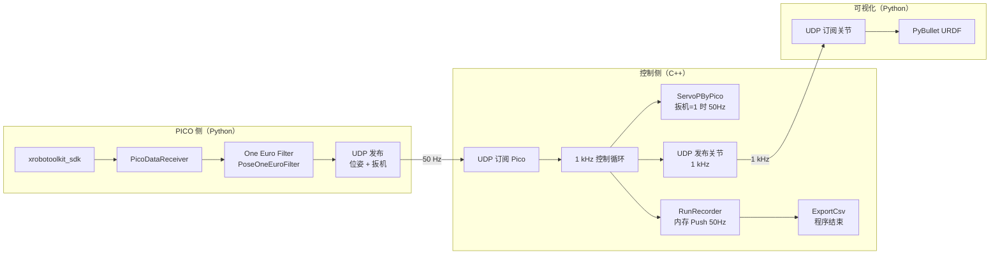

# 实时遥操作（RT Teleop）方案设计

> 状态：**已实现**（见下方文件列表）  
> 涉及：`pico_data_receiver.py` → UDP 发布方；`tj_test/test_rt_teleop.cpp`；`python/vis/`

---

## 1. 需求摘要

| 模块 | 职责 | 频率 |
|------|------|------|
| **Pico UDP 发布方** | 从 PICO SDK 读扳机 + 位姿，One Euro 滤波后 UDP 发布 | 50 Hz |
| **test_rt_teleop** | 初始化机器人（**可选硬件/仿真**）；可选进入 1 kHz 循环；订阅 Pico；扳机=1 时 `ServoPByPico`；**UDP 发布关节角**；**内存记录** | 控制 1 kHz；Servo / **记录** 50 Hz；**关节 UDP** 1 kHz |
| **PyBullet 可视化** | 订阅 `test_rt_teleop` 关节 UDP，实时显示双臂 | 1 kHz 收包 / 刷新 |

**记录与发布分离（test_rt_teleop）**：

- **对外 UDP 发布关节**：每 1 kHz 周期 `sendto` 一次（112 B `<14d>`），供 PyBullet 实时可视化。
- **数据记录**：每 **50 Hz**（每 20 个 1 kHz 周期）向 `RunRecorder` **内存** `Push` 一条 `CycleSample`；循环内**不写盘**。
- **落盘时机**：程序结束（正常退出 / Ctrl+C / 异常后 `catch`）统一调用 `ExportSessionCsv`，输出格式与 `test_enable` / `test_servo` **完全一致**（8 个 joint/cart CSV + `timing.csv`）。

约束与约定（沿用现有代码）：

- Pico 位姿：`[x,y,z, qx,qy,qz,qw]`，**位置单位 m**；`ServoPByPico` 入参 `Pose.pos` 为 **mm**，四元数 **wxyz**（见 `test_servo.cpp::MakePoseFromCsvM`）。
- 控制周期：`kControlDt = 1 ms`（`common.hpp`）；外部 Servo 调用建议 **50 Hz**（每 20 个 1 kHz 周期一次，与 `test_servo` 一致）。
- 扳机：float `[0,1]`；**扳机为 1** 指数值 `>= 1.0` 或阈值 `>= 0.99`（与 `pico_data_receiver.py` 录制逻辑对齐，实现时二选一并写死）。

---

## 2. 系统架构



数据流时序：

```
Pico SDK (~50Hz 有效更新)
    → Python 定时 50Hz 采样 + One Euro 滤波
    → UDP 发往 test_rt_teleop（非阻塞 recv，保留最新帧）

test_rt_teleop @ 1kHz:
    每周期: ctrl.Run() + 非阻塞收 Pico 包 + UDP 发 14 关节 [rad]（1 kHz）
    每 20 周期:
        - 若左/右扳机→对应臂 ServoPByPico(pose, true)
        - RunRecorder.Push(CycleSample)（50 Hz，仅内存）
    扳机松开: 对应臂 ServoPByPico(pose, false) 结束 session（边沿触发）

程序结束（try 块外 / catch 后统一路径）:
    teardown → ExportSessionCsv(out_dir) → 写 left/right_ref/resp_joint/cart + timing.csv

PyBullet @ 1kHz:
    非阻塞收关节包，resetJointState 刷新
```

---

## 3. One Euro Filter（OSVR-Core）

### 3.1 来源

- 核心实现：`OSVR-Core-master/inc/osvr/Util/EigenFilters.h`
- 参考默认参数：`plugins/oneeurofilter/org_osvr_filter_oneeuro.cpp`

### 3.2 算法要点

- `Params`：`minCutoff`（Hz）、`beta`、`derivativeCutoff`（Hz）
- 对位置 `Eigen::Vector3d`、姿态 `Eigen::Quaterniond` 各建一个 `OneEuroFilter`
- 姿态导数用四元数对数映射（`quat_ln(curr * prev.conjugate()) / dt`），非简单四元数差分
- 组合类：`PoseOneEuroFilter` = 位置滤波 + 姿态滤波

### 3.3 在 Python 发布方的落地方式（推荐）

| 方案 | 说明 |
|------|------|
| **A. 纯 Python 移植（推荐）** | 新建 `python/teleop/one_euro_filter.py`，按 `EigenFilters.h` 逐行等价实现；无 OSVR 头文件依赖 |
| B.  vendoring C++ 头文件 | 将 `EigenFilters.h` 及依赖拷入 `mv_control`，仅 C++ 侧使用；Python 仍需自实现 |
| C. pybind11 扩展 | 过重，首版不推荐 |

**首版默认参数**（与 OSVR 插件一致，可 CLI 覆盖）：

| 通道 | minCutoff | beta | derivativeCutoff |
|------|-----------|------|------------------|
| 位置 [m] | 1.15 | 0.5 | 1.2 |
| 姿态 [quat] | 1.5 | 0.5 | 1.2 |

滤波对象：**左右手柄**各一套 `PoseOneEuroFilter`；头显位姿可选发布但不参与 `ServoPByPico`（除非后续扩展）。

`dt` 使用固定 `1/50` s（与发布频率一致），与 OSVR `filter(dt, x)` 接口一致。

---

## 4. UDP 协议设计

### 4.1 Pico 遥操作包（Python → C++）

- **端口**：`30101`（默认，可配置）
- **目标**：`127.0.0.1`（同机）或局域网 IP
- **字节序**：小端
- **频率**：50 Hz

```
偏移  类型              字段
----  ----------------  ---------------------------
0     uint32            magic = 0x5049434F  ("PICO")
4     uint32            seq
8     uint64            timestamp_ns（设备时间戳）
16    7×float64         right: x,y,z, qx,qy,qz,qw（滤波后，m + xyzw）
72    7×float64         left:  x,y,z, qx,qy,qz,qw
128   float32           right_trigger
132   float32           left_trigger
136   uint8             flags（bit0=右扳机有效, bit1=左扳机有效，可选）
```

总长度 **137 B**（或 flags 省略时为 **136 B**）。

C++ 侧：1 kHz 循环内 **非阻塞 `recvfrom`**，仅保留最新有效包；按 `seq` 去重，避免同一 50 Hz 帧重复触发 Servo。

### 4.2 关节状态包（C++ → PyBullet）

- **端口**：`30100`（与现有 `urdf_pybullet_vis.py` 默认一致）
- **频率**：**1 kHz**（每 `RunSession` 周期发一包）
- **格式**（沿用现有，扩展可选头部）：

```
必选载荷（与现有一致）：
  <14d>  左臂 q0..q6 [rad] + 右臂 q0..q6 [rad]   → 112 B

可选扩展（首版可不加，减少改动）：
  uint32 seq + uint32 cycle + uint64 host_time_ns
```

关节来源：`ctrl.Left().GetRefState().joint_state.q` 与 `ctrl.Right().GetRefState().joint_state.q`（与 recorder 一致）。

---

## 5. 模块设计

### 5.1 `pico_data_receiver.py` → UDP 发布方

**重构方向**（保持 `PicoDataReceiver` 类可复用）：

```
pico_data_receiver.py          # 保留 SDK 薄封装
python/teleop/
  one_euro_filter.py           # One Euro 移植
  pico_udp_publisher.py        # 新入口：50Hz 循环 + 滤波 + sendto
```

CLI 示例（规划）：

```bash
python -m python.teleop.pico_udp_publisher \
  --rate 50 --host 127.0.0.1 --port 30101 \
  --pos-min-cutoff 1.15 --pos-beta 0.5
```

主循环逻辑：

1. `PicoDataReceiver.read_all()` 或按需 `get_pose` / `get_value`
2. 对每个手柄位姿调用 `PoseOneEuroFilter.filter(dt, pos, quat)`
3. `struct.pack` 打 UDP 包并 `sendto`
4. 固定 50 Hz 睡眠对齐（`perf_counter` + 周期补偿，与现有 `_record` 相同模式）

### 5.2 `tj_test/test_rt_teleop.cpp`

**交互流程**（对齐 `test_enable.cpp` / `test_servo.cpp`）：

```
1. 解析参数：out_dir、pico_udp_host/port、joint_udp_host/port
2. 选择 0=硬件 / 1=仿真
3. MVControl::Init → PrintInitJointStates（+ 可选 PrintArmDiag）
4. 选择 0=退出 / 1=进入 1kHz 循环
5. 若进入：
   - SIGINT 处理
   - PeriodicLoop(1ms) + RunRecorder
   - ReserveRecorder(kCycleMax / kRecordPeriodCycles)   // 50Hz 采样容量
   - cycle==10：双臂 SetEnable
   - 等待使能成功 → GoWork（双臂，与 test_servo 一致）
   - try { 主循环直至 Ctrl+C 或错误：
       * tick.WaitCycleStart() → ctrl.Run()
       * 非阻塞收 Pico UDP
       * TickServoTeleop（50Hz 分频 + 扳机门控）
       * UDP 发布 14 关节（每周期，1 kHz）
       * if (cycle % kRecordPeriodCycles == 0) Push CycleSample（50 Hz）
     } catch (std::exception&) { loop_error=true }
       catch (...) { loop_error=true }
   - teardown：ServoPByPico(false) → GoHome → Disable
   - ExportSessionCsv(out_dir)   // 无论正常/中断/异常，有样本即写盘
```

#### 5.2.1 记录策略（50 Hz，格式不变）

与 `test_servo` / `test_enable` 共用 `CycleSample` + `ExportSessionCsv`（`recorder.hpp` / `recorder.cpp`），**字段与 CSV 列名不变**：

| 文件 | 内容 |
|------|------|
| `left/right_ref_joint.csv` | `cycle, q0..q6` [rad] |
| `left/right_resp_joint.csv` | 同上 |
| `left/right_ref_cart.csv` | `cycle, px,py,pz, qw,qx,qy,qz` |
| `left/right_resp_cart.csv` | 同上 |
| `timing.csv` | `cycle, phase_packed, period_us, overrun_us` |

实现要点：

```cpp
constexpr int kRecordHz = 50;
constexpr int kRecordPeriodCycles = 1000 / kRecordHz;  // 20

// 容量按 50Hz 估算，非 1kHz 全量
session.ReserveRecorder(kCycleMax / kRecordPeriodCycles);

// 1 kHz 热路径
ctrl.Run();
PublishJointsUdp(ctrl);                    // 每周期

if (cycle % kRecordPeriodCycles == 0) {    // 50 Hz
    CycleSample s = MakeSample(ctrl, cycle, phase, timing, stats);
    if (!recorder.Push(s)) { loop_error = true; break; }
}
```

- **不**在循环内 `fopen` / `fprintf`；与现有 test 一致，热路径仅 `Push`。
- `cycle` 字段仍写**真实 1 kHz 周期号**（如 20、40、60…），便于与 Servo 调用对齐。
- `period_us` / `overrun_us` 取**该记录时刻**当周期的定时统计（与 `RunSession::Step` 语义一致）。
- 若需复用 `FillSampleFromControl`，可将 `run_session.cpp` 中填充逻辑抽为 `recorder.hpp` 内联函数，或给 `RunSession` 增加 `Step(..., bool record_this_cycle)`；**不改变 `CycleSample` 布局**。

#### 5.2.2 try-catch 与结束保存

结构对齐 `test_servo.cpp`：

```cpp
bool loop_error = false;
bool interrupted = false;
try {
    while (!g_stop_requested && !loop_error) {
        // 1 kHz 体 + 50 Hz Push + 1 kHz UDP
        if (++cycle > kCycleMax) { loop_error = true; break; }
    }
} catch (const std::exception& e) {
    std::fprintf(stderr, "[exception] %s\n", e.what());
    loop_error = true;
} catch (...) {
    std::fprintf(stderr, "[exception] unknown\n");
    loop_error = true;
}

interrupted = g_stop_requested.load();
TeardownArms(ctrl);  // Servo stop → GoHome → Disable（可再包一层 try）

if (!ExportSessionCsv(recorder, out_dir, /*timing_with_phase=*/true)) {
    std::fprintf(stderr, "[FAIL] export csv to %s\n", out_dir);
    return 1;
}
```

- **保存发生在循环结束之后**，不在 `catch` 里写盘，而是 `catch` 仅置 `loop_error`；`ExportSessionCsv` 在 teardown 之后**统一执行**。
- Ctrl+C：`SIGINT` → `g_stop_requested` → 跳出 `while` → 同样走 teardown + ExportCsv。
- `recorder.Size()==0` 时 `ExportSessionCsv` 返回 `false`（与现实现一致）；异常过早退出时需打日志。

#### 5.2.3 硬件 / 仿真模式（必选）

与 `test_enable.cpp`、`test_servo.cpp` **完全一致**：启动后、`Init` 之前由用户选择运行后端；经 `MVControl::Init(..., is_sim)` 在**运行时**切换，无需编译 `build_sim` / `build_hw` 两套产物。

**交互（默认）**：

```
0=硬件  1=仿真:
```

- 输入 `0` → `is_sim = false`，走 Marvin SDK / `hw_interface` 真机路径
- 输入 `1` → `is_sim = true`，走仿真积分路径（无控制器 IP 连接）
- 非法输入重复提示，与现有 test 相同

**命令行（可选，跳过交互）**：

| 参数 | 含义 |
|------|------|
| `--sim` | 强制仿真，`is_sim=true` |
| `--hw` | 强制硬件，`is_sim=false` |
| 二者同时出现 | 报错退出 |

无 `--sim` / `--hw` 时回退到 `scanf` 交互。实现可复用小型 `ParseSimMode(argc, argv, int& sim)` 工具函数（放 `tj_test/tool/` 或 `test_rt_teleop.cpp` 匿名命名空间）。

**Init 与日志**：

```cpp
const bool is_sim = (sim == 1);
std::printf("[start] %s  out=%s  pico_udp=%s:%d  joint_udp=%s:%d\n",
            is_sim ? "仿真" : "硬件", out_dir, ...);

MVControl ctrl;
if (!ctrl.Init(MV_CONTROL_CONFIG_DEFAULT, is_sim)) {
    std::fprintf(stderr, "[FAIL] Init (%s)\n", is_sim ? "sim" : "hw");
    return 2;
}
PrintInitJointStates(ctrl);
```

**模式差异对 RT teleop 的影响**：

| 项 | 硬件 (`is_sim=false`) | 仿真 (`is_sim=true`) |
|----|------------------------|----------------------|
| 控制器连接 | 需要 `config.yaml` 中 IP 可达 | 不需要 |
| `ctrl.Run()` | SDK 收发 + 状态同步 | 内部积分 ref/resp |
| 关节 UDP 发布 | 1 kHz，来源 `GetRefState().q` | 同上，可用于 PyBullet 联调 |
| Pico UDP 订阅 | 同仿真；遥操作逻辑与后端无关 | 同左 |
| CSV 导出 | 含真实 `resp`（若 SDK 有反馈） | `resp` 为仿真响应 |
| RT 线程 / FIFO | 真机建议 `MakeHardRtSessionOptions` | 可用 `MakeDefaultSessionOptions` |

**推荐联调组合**：

- **无真机**：`test_rt_teleop --sim` + `urdf_pybullet_vis.py` + `pico_udp_publisher`
- **真机遥操作**：`test_rt_teleop --hw`（或交互选 `0`）+ Pico 发布方；可视化可选

**扳机门控逻辑**（建议）：

| 条件 | 动作 |
|------|------|
| `right_trigger >= threshold` 且距上次 Servo 已满 20 周期 | `Right.ServoPByPico(pose, true)` |
| 右扳机从按下→松开 | `Right.ServoPByPico({}, false)` 一次 |
| 左臂同理 | `Left.ServoPByPico` |
| 扳机未按下 | 不调用 `ServoPByPico(..., true)` |

位姿映射：`right_controller` → 右臂，`left_controller` → 左臂（与 `test_servo` CSV 列顺序一致）。

**CMake**：`tj_test/CMakeLists.txt` 增加 `test_rt_teleop` 目标，链 `tj_test_support`。

**UDP 实现**：首版用 BSD socket（`socket/sendto/recvfrom`），不引入新第三方库；可抽 `tj_test/tool/udp_socket.hpp` 小工具。

### 5.3 `python/vis` 可视化

**改动 `urdf_pybullet_vis.py`**：

| 项 | 现况 | 目标 |
|----|------|------|
| 刷新率 | 50 Hz | **1 kHz**（`DT = 0.001`） |
| 收包 | 非阻塞，保留最新 | 不变 |
| 端口 | 30100 | 默认保持 |

可选新脚本 `rt_teleop_vis.py`：对 `urdf_pybullet_vis.py` 薄封装，默认参数指向 RT teleop。

**启动顺序**：

```bash
# 终端 1：可视化（先 bind 端口）
python python/vis/urdf_pybullet_vis.py --udp-port 30100

# 终端 2：机器人实时控制
./build/tj_test/test_rt_teleop

# 终端 3：Pico 发布
python -m python.teleop.pico_udp_publisher --port 30101
```

---

## 6. 与现有代码的对照

| 现有 | 新方案关系 |
|------|------------|
| `pico_data_receiver.py` | SDK 封装保留；新增 UDP 发布入口 |
| `test_servo.cpp` | 离线 CSV + 完整状态机；`test_rt_teleop` 简化为实时 UDP + 扳机门控；**记录频率** 1 kHz vs **50 Hz** |
| `test_enable.cpp` | 交互模板：Init → 打印 → 是否进入循环；`RunSession::Step` 每周期 Push |
| `recorder.cpp` | `ExportSessionCsv` 输出格式；`test_rt_teleop` 原样复用，仅 Push 频率降为 50 Hz |
| `urdf_pybullet_vis.py` | 关节 UDP 协议复用，频率改为 1 kHz |
| `play_servoPByPico_joints.py` | 离线回放；RT 场景由 `test_rt_teleop` 直接发 1 kHz |

---

## 7. 安全审计

| 风险 | 等级 | 缓解措施 |
|------|------|----------|
| **扳机误触发机器人运动** | 高 | 进入循环前打印确认；Servo 仅在 `GoWork` 完成且已使能后开启；松开扳机立即 `is_run=false` |
| **UDP 无鉴权，局域网可注入伪造位姿** | 高 | 默认 `127.0.0.1`；真机部署时防火墙仅放行本机；可选 magic+seq 校验 |
| **位姿跳变导致机械臂急动** | 高 | One Euro 滤波在发布侧；`ServoPByPico` 内部仍有 40 周期样条 + 滑动平均 |
| **1 kHz 循环抖动导致周期漂移** | 中 | 沿用 `RunSession` + `PeriodicLoop`；UDP 非阻塞，禁止在循环内阻塞 recv |
| **Pico 断连后沿用旧包** | 中 | 包内 `timestamp_ns` + 超时（如 >200 ms）丢弃；停止发送 Servo |
| **仿真/硬件模式选错** | 中 | 启动时交互或 `--sim`/`--hw` 显式选择；日志打印 `[start] 仿真/硬件`；Init 失败时区分后端 |
| **Ctrl+C 未下使能** | 中 | SIGINT 走统一 teardown：停 Servo → GoHome → Disable |
| **PyBullet 仅可视化无安全联锁** | 低 | 可视化不影响真机；真机测试与 vis 分机或确认仿真模式 |

---

## 8. 实现清单（后续 PR 拆分建议）

### PR-1：滤波 + Pico UDP 发布（Python）

- [x] `python/teleop/one_euro_filter.py`
- [x] `python/teleop/pico_udp_publisher.py`

### PR-2：`test_rt_teleop`（C++）

- [x] `tj_test/tool/udp_io.hpp`
- [x] `tj_test/test_rt_teleop.cpp`
- [x] `tj_test/CMakeLists.txt` 注册目标；`TJ_DATA_DEFAULT=data/test_rt_teleop`
- [x] `FillCycleSampleFromControl` 抽取至 `recorder.hpp/cpp`

### PR-3：可视化 1 kHz

- [x] 更新 `urdf_pybullet_vis.py` 至 1 kHz
- [x] `python/vis/rt_teleop_vis.py` 薄封装

### PR-4：联调与文档

- [ ] `data/test_rt_teleop/` 录制目录约定
- [ ] 本文件补充实测参数与端口表

---

## 9. 待确认项

1. **扳机语义**：左右扳机分别控制左右臂（推荐），还是任一扳机控制双臂？
2. **阈值**：`trigger == 1.0` 严格等于，还是 `>= 0.99`？
3. **GoWork**：进入循环后是否自动 `GoWork`（`test_servo` 同），还是假定已在工作位？
4. **头显位姿**：是否打入 UDP 包供调试显示，暂不参与控制？
5. **关节 UDP 载荷**：首版保持 112 B 纯关节，还是加 seq/cycle 头方便调试？

---

## 10. 核心代码索引

| 路径 | 用途 |
|------|------|
| `pico_data_receiver.py` | Pico SDK 轮询封装 |
| `inc/osvr/Util/EigenFilters.h`（OSVR） | One Euro 参考实现 |
| `tj_test/test_enable.cpp` | Init + 交互 + 1 kHz 模板 |
| `tj_test/test_servo.cpp` | ServoPByPico 50Hz 分频、位姿单位转换 |
| `mv_control/include/common.hpp` | `Pose`、`kControlDt`、`kStreamServoCycles` |
| `mv_control/src/robot.cpp::ServoPByPico` | 流式伺服 API |
| `python/vis/urdf_pybullet_vis.py` | 关节 UDP 可视化基线 |
