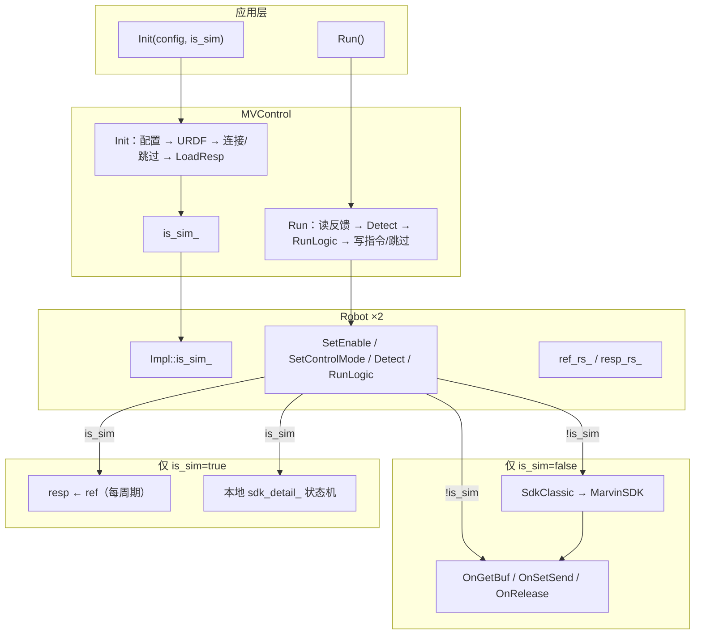

# SIM 模式运行时化重构方案（评估稿）

> **状态**：**已实施**  
> **动机**：当前通过 CMake `MV_CONTROL_SIM` 在编译期分叉，导致需维护 `build_sim` / `build_hw` 两套产物、大量 `#ifdef` 重复桩代码；改为 `Init(..., bool is_sim)` 运行时选择，单一二进制、逻辑集中、可删除 `_InitSimResp` 等仅 SIM 编译单元可见的符号。  
> **关联**：`DESIGN.md`、`API_SURFACE_REFACTOR.md`、`1KHZ_SDK_SPEC.md`

---

## 1. 需求摘要

| # | 需求 | 说明 |
|---|------|------|
| R1 | 删除 CMake `MV_CONTROL_SIM` 选项与 `MV_CONTROL_SIM` 宏 | 构建不再分叉；始终编译并链接 MarvinSDK |
| R2 | `MVControl::Init` 增加 `bool is_sim` | 运行时决定仿真/真机路径；建议默认 `false`（真机安全） |
| R3 | 内部用 `is_sim` 替代所有 `#ifdef MV_CONTROL_SIM` | 同一翻译单元内 `if (is_sim_)` / `if (!is_sim_)` |
| R4 | 删除仅 SIM 存在的私有方法 | 如 `Robot::_InitSimResp()`，逻辑并入 Init 加载 resp 流程 |
| R5 | 精简 `SdkClassic` | 删除各函数顶部 SIM 空桩；仿真路径不上调 SDK |
| R6 | 调用方显式传参 | `test_enable` → `Init(path, true)`；真机测试 → `Init(path, false)` |

**目标 API（草案）**

```cpp
bool Init(const char* config_path = MV_CONTROL_CONFIG_DEFAULT, bool is_sim = false);
```

---

## 2. 架构图（重构后）



**数据流对比（`Run()` 每周期）**

| 阶段 | `is_sim = true` | `is_sim = false` |
|------|-----------------|------------------|
| 读反馈 | `resp = ref`（理想跟踪） | `OnGetBuf` → `resp` + `sdk_detail_` |
| Detect | 仅运动学/关节限速 | + 连接帧陈旧、SDK 错码、模式不一致 |
| RunLogic | 同（规划在 ref） | 同 |
| 写指令 | 跳过 | 条件满足时 `OnSetJointCmdPos_*` + `OnSetSend` |
| 慢轮询 | 跳过 | `OnGetServoErr_*`（约 1 Hz） |

---

## 3. 安全审计

| 风险 | 等级 | 说明 | 缓解 |
|------|------|------|------|
| 误用 `is_sim=true` 接真机 | **高** | 不写 SDK 指令，机械臂不受控或状态与反馈脱节，掩盖联调问题 | 默认 `is_sim=false`；仿真测试显式 `true`；日志 Init 打印模式 |
| 误用 `is_sim=false` 无硬件 | 中 | `LinkAndValidate` 失败，Init 返回 false | 与现 HW 构建行为一致 |
| MarvinSDK 始终链接 | 低 | 不减少二进制依赖，但无新增网络端口 | 保持 IP 校验、`OnRelease` 析构清理 |
| `is_sim` 运行中不可变 | 低 | 若允许重复 Init 切换模式易出状态残留 | Init 幂等：已 `connected_` 时若 `is_sim` 不一致应失败或忽略重 Init |
| 敏感配置路径 | 低 | `config_path` 任意路径读 YAML | 沿用现有 `LoadMvConfig`；不扩大攻击面 |

**结论**：重构本身不引入新外部接口；**最大操作风险是仿真标志传错**。API 设计与文档应强调默认值与 Init 日志。

---

## 4. 现状：`MV_CONTROL_SIM` 分布

| 文件 | `#ifdef` 块数（约） | 作用 |
|------|---------------------|------|
| `mv_control/CMakeLists.txt` | 2 | option、条件 link MarvinSDK、宏定义 |
| `mv_control/include/mv_control.hpp` | 1 | 条件声明 `_ReadHwToRobots` 等 |
| `mv_control/src/mv_control.cpp` | 8 | Init/Run/析构/LoadResp/ReadResp |
| `mv_control/include/robot.hpp` | — | 声明 `_InitSimResp` |
| `mv_control/src/robot.cpp` | 11 | Enable/EStop/模式/Detect/ClearError 等 |
| `mv_control/src/internal/sdk_classic.cpp` | 15+ | 每个 SDK 封装函数 SIM 空桩 + 整块 HW 辅助函数 |

**构建后果**：仓库存在 `build_sim`（`MV_CONTROL_SIM=ON`）与 `build_hw`（`OFF`）两套缓存；切换模式需重新配置 CMake。

---

## 5. 内部需区分 SIM / HW 的逻辑清单

### 5.1 `MVControl`（`mv_control.cpp` / `mv_control.hpp`）

| 位置 | SIM 行为 | HW 行为 | 重构方式 |
|------|----------|---------|----------|
| 析构 | 不调 `OnRelease` | `connected_` 时 `OnRelease` | `if (!is_sim_ && connected_)` |
| `Init` 连接段 | `connected_=true`，跳过 SDK | `SdkClassic::LinkAndValidate` | `if (!is_sim_) { ... }` |
| `Init` 失败清理 | 不调 `OnRelease` | `OnRelease` | 同上 |
| `Run` 读 | `_ReadRespToRobots` | `_ReadHwToRobots` | 统一入口内分支 |
| `Run` 写/轮询 | 跳过 | `_WriteRobotsToHw`、`_PollServoErrSlowIfDue` | `if (!is_sim_)` |
| `_LoadRespAtInit` | 零位 resp + FK；`sdk_detail` 置 0 | 读 HW + `_ValidateInitSdkState` | 分支；**吸收 `_InitSimResp` 逻辑** |
| `_ReadRespToRobots` | `resp = ref` | 委托 `_ReadHwToRobots` | 保留函数，`if (is_sim_)` |
| `_ReadHwToRobots` 等 | 不存在（宏裁剪） | 完整实现 | **始终编译**；仅 HW 路径调用 |
| `BuildRespState` 辅助 | 宏内 | 从 `RT_OUT` 构造 | 始终存在 |

**可删除/合并**

- `_InitSimResp` 调用链 → 并入 `_LoadRespAtInit` 的 `is_sim` 分支（约 15 行零位 + FK）。
- `#ifndef MV_CONTROL_SIM` 包裹的私有方法声明 → 改为始终声明（实现仍在 .cpp）。

### 5.2 `Robot`（`robot.cpp` / `robot.hpp`）

| 方法 | SIM | HW | 备注 |
|------|-----|-----|------|
| `_InitSimResp` | 零位 resp + FK | **不编译** | **整函数删除** |
| `SetEnable` | 直接改 `sdk_detail_` + `_SyncStateFromSdkDetail` | `SdkClassic::SendPositionMode` / `SendDisable` | 大分支，保留 `if (is_sim_)` |
| `EStop` | 仅本地 `_EnterStopOnFault` | + `SdkClassic::EStopArm`、刷新 SDK | |
| `_UpdateEnableState` | 基于 `arm_state` 的简化规则 | 含 `st==100`、位置模式等 HW 规则 | **两套逻辑**，不宜强行合并为一公式 |
| `_RefreshSdkDetailFromHw` | 返回 true | `OnGetBuf` | `if (is_sim_) return true` |
| `_CallSdkControlMode` | `(void)mode; return true` | 调 `SdkClassic` 各模式 | SIM 不调 SDK；可 `if (is_sim_) return true` |
| `SetControlMode` | HW 校验跳过；成功后本地设 `sdk_detail_` | SDK 发送 + 无本地伪造 | SIM 分支保留本地状态更新 |
| `GetControlModeStatus` | `target != actual` → Translating | `IsModeTransitionState` + target 不一致 | 分支 |
| `_TickTransitionTimeouts` | `target != actual` | SDK 过渡态 + target | 分支 |
| `Detect` | 跳过连接/SDK/模式检测 | 完整 `MapSdkToError` 等 | `if (!is_sim_) { ... }` |
| `ClearError` | `error_code_ = Normal` | SDK 清错 + 刷新 | 分支 |

**运动规划路径（MovJ/Servo*/RunLogic）**：**不区分** SIM/HW；差异仅在反馈来源与是否写 SDK。

### 5.3 `SdkClassic`（`sdk_classic.cpp`）

| 函数 | 当前 SIM 桩 | 重构后 |
|------|-------------|--------|
| `LinkAndValidate` | `return true` | 删除桩；**仅 HW Init 调用** |
| `ClearArmError` / `ClearServoError` | `return true` | 删除桩；仅 `ClearError` HW 路径调用 |
| `ReadLowSpdFlags` | 恒为 1 | 删除桩；仅 HW `Send*Mode` 内使用 |
| `SendPositionMode` / `SendDisable` / `Send*ImpMode` | `return true` | 删除桩 |
| `EStopArm` / `EStopBoth` | 空操作 | 删除桩；SIM 的 `EStop` 不调此类函数 |

**预计删除**：`sdk_classic.cpp` 中约 **120–150 行** `#ifdef MV_CONTROL_SIM` 桩代码；匿名命名空间内 `#ifndef MV_CONTROL_SIM` 包裹的 HW 辅助函数改为**始终编译**。

### 5.4 不需改动的模块

- `config.cpp` / YAML：无需 `sim` 字段（由 `Init` 参数承担）。
- `motion.cpp`、`ik.cpp`、`error_map.cpp`、`sdk_mode_map.cpp`：无 SIM 宏。
- `MarvinSDK.h` 包含：`mv_control.cpp`、`robot.cpp` 改为始终包含（与始终 link 一致）。

---

## 6. 状态存储与传递

```text
MVControl::is_sim_                    // Init 写入，Run/析构使用
Robot::Impl::is_sim_                  // Init 时由 MVControl 下发（推荐 _Init(bool)）
```

**下发时机（建议）**

```cpp
// MVControl::Init 内，加载配置后、_Init 前或同时：
is_sim_ = is_sim;
left_.impl_->is_sim_ = is_sim;
right_.impl_->is_sim_ = is_sim;
// 或：left_._Init(is_sim); right_._Init(is_sim);
```

**`Robot::Impl` 新增字段**

```cpp
bool is_sim_ = false;
```

**不建议**：全局/线程局部 `g_is_sim`（难测、易串态）。

---

## 7. 可删除的符号与冗余代码

| 删除项 | 原因 |
|--------|------|
| `Robot::_InitSimResp()` 声明与实现 | 逻辑并入 `MVControl::_LoadRespAtInit` 的 sim 分支 |
| CMake `option(MV_CONTROL_SIM)` 与宏 | 运行时化 |
| `sdk_classic.cpp` 全部 SIM 桩 | 上层不再在 sim 时调用 |
| `mv_control.hpp` 条件编译私有方法 | 改为无条件声明 |
| 双构建目录惯例 `build_sim` / `build_hw` | 文档说明统一 `build` 即可 |

**不宜删除（仅简化分支）**

- `_UpdateEnableState` 的双套逻辑：语义不同，用 `if (impl_->is_sim_)` 保留两段更清晰。
- `_ReadHwToRobots` / `_WriteRobotsToHw`：HW 专用但应保留为独立函数，由 `Run` 在 `!is_sim_` 时调用。

**可选进一步简化（P2，非必须）**

- SIM 的 `SetEnable` / `SetControlMode` 本地改 `sdk_detail_` 可抽为 `_ApplySimSdkState(int arm_state, int imp_type)`，减少重复赋值。
- `GetControlModeStatus` / `_TickTransitionTimeouts` 的 sim 分支若仅看 `target vs actual`，可与部分 HW 逻辑共用 predicate。

---

## 8. 重构步骤（实施顺序）

| 步骤 | 内容 | 风险 |
|------|------|------|
| P0-1 | `Impl` + `MVControl` 增加 `is_sim_`；`Init(path, is_sim)` | API 变更 |
| P0-2 | `mv_control.cpp` 宏改为 `is_sim_` 分支；合并 `_InitSimResp` | 中 |
| P0-3 | `robot.cpp` 宏改为 `impl_->is_sim_`；删 `_InitSimResp` | 中 |
| P0-4 | `sdk_classic.cpp` 去掉 SIM 桩；始终包含 HW 头文件 | 低 |
| P0-5 | CMake 始终 `find_library` + `link MarvinSDK`；删 option/宏 | 无 SDK 时 configure 失败（与现 HW 相同） |
| P1 | 更新 `tj_test`、`examples` 的 `Init` 调用 | 低 |
| P1 | Init 成功时 `fprintf` 一行 `[mv_control] mode=SIM|HW` | 低 |
| P2 | 评估 `is_sim` 是否写入 `run_meta.txt` 测试元数据 | 低 |

---

## 9. 调用方变更示例

```cpp
// 仿真（原 build_sim / MV_CONTROL_SIM=ON）
if (!ctrl.Init(config_path, true)) { ... }

// 真机（原 build_hw）
if (!ctrl.Init(config_path, false)) { ... }

// 默认真机
if (!ctrl.Init()) { ... }  // is_sim 默认 false
```

| 文件 | 建议 |
|------|------|
| `tj_test/test_enable.cpp` | `Init(path, true)` |
| `tj_test/test_connect.cpp` | `Init(path, false)` |
| `examples/test_SetvoPByPico.cpp` | 按场景传参或默认 false |

---

## 10. 测试与验收

| 项 | 验收标准 |
|----|----------|
| 单一构建 | 一次 `cmake && make` 产出同时可跑 sim/hw 测试的可执行文件 |
| SIM 回归 | `test_enable` + `is_sim=true`：ref/resp 一致、使能/切模式状态机与原 SIM 构建一致 |
| HW 回归 | `test_connect` + `is_sim=false`：连接、读反馈、写指令与原 HW 构建一致 |
| 无宏残留 | `mv_control/` 下 `grep MV_CONTROL_SIM` 为空（文档除外） |
| 析构 | HW 路径 `OnRelease`；SIM 路径不调用 |

---

## 11. 与现有文档的关系

- `API_SURFACE_REFACTOR.md` P0 `Init(config_path)` 已实施；本方案在其上 **追加第二参数 `is_sim`**，不恢复 IP 版 Init。
- `1KHZ_SDK_SPEC.md` 中「`#ifndef MV_CONTROL_SIM` 新增 HW 函数」的描述在实施本方案后应改为「`if (!is_sim_)` 路径」。
- `CLASSIC_API_MIGRATION.md`「`MV_CONTROL_SIM` 块除外」条款可删除。

---

## 12. 小结

| 维度 | 结论 |
|------|------|
| 核心变更 | 编译期 `MV_CONTROL_SIM` → 运行时 `Init(..., is_sim)` |
| 状态落点 | `MVControl::is_sim_` + `Robot::Impl::is_sim_` |
| 必删符号 | `_InitSimResp`、`SdkClassic` SIM 桩、CMake option |
| SIM 本质 | 反馈镜像 ref + 本地伪造 `sdk_detail_`；不调 MarvinSDK |
| HW 本质 | 现有 `OnGetBuf`/`OnSetSend`/SdkClassic 全路径 |
| 代码量 | 净减少约 **150–250 行**（主要为桩与重复 `#ifdef`） |
| 安全 | 默认 `is_sim=false`；Init 日志标明模式 |
