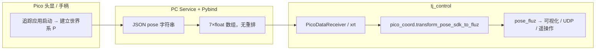

# Pico 位姿：SDK 左手系 → FLUZ 右手系

本文档说明如何将 XRoboToolkit / Pico SDK 输出的位姿，转换到本项目使用的 **FLUZ 右手系**，并输出统一的 **Pose** 表示。

实现代码：[`pico_coord.py`](pico_coord.py)  
可视化验证：[`python/vis/pico_pose_vis.py`](../vis/pico_pose_vis.py)（`--frame fluz`）

---

## 1. 坐标系定义

### 1.1 Pico SDK 世界系 `{P}`（源）

依据 [XRoboToolkit-PC-Service README-CN](https://github.com/XR-Robotics/XRoboToolkit-PC-Service)：

| 项目 | 说明 |
|------|------|
| 手性 | **左手系** |
| X | 右 |
| Y | 上 |
| Z | **里**（朝佩戴者身体 / 屏幕内侧，与 Unity 示意图 Z 前相反） |
| 原点 | **追踪应用启动时**头显 Head 的位置 |
| 参考 | 头显、双手柄、手势、全身动捕共用同一世界系 |

> PC Service / Pybind **只做 JSON 透传**，不在 PC 端重定义坐标系。  
> `get_*_controller_pose()` / `get_headset_pose()` 返回 7 元数组，顺序与文档一致。

### 1.2 FLUZ 世界系 `{T}`（目标）

| 项目 | 说明 |
|------|------|
| 手性 | **右手系** |
| X | **前**（佩戴者面对方向，Pico 中 ≈ `-Z_P`） |
| Y | **左** |
| Z | **上**（Pico 中 ≈ `+Y_P`） |
| 原点 | 与 Pico 会话原点相同（仅轴向重标定，平移原点不变） |

右手定则：四指从 **X（前）** 弯向 **Y（左）**，拇指指向 **Z（上）**。

---

## 2. SDK 原始 Pose 格式

```
pose_sdk = [x, y, z, qx, qy, qz, qw]   # 单位：m；四元数 Hamilton，w 在最后
```

| 下标 | 字段 |
|------|------|
| 0–2 | 位置 `x, y, z` [m] |
| 3–6 | 四元数 `qx, qy, qz, qw` |

- 四元数表示设备坐标系相对 **Pico 世界系 `{P}`** 的旋转：`R_P^body`（列向量约定 `v_P = R_P^body @ v_body`）。
- 录制 CSV（`pico_record_*.csv`）中四元数列为 **`qw,qx,qy,qz`**，读回时需转回 SDK 顺序，见 `pico_csv_source.py`。

---

## 3. 输出 Pose 格式（FLUZ）

转换后与 SDK **保持相同的 7 维布局**，仅坐标系变为 FLUZ：

```
pose_fluz = [x', y', z', qx', qy', qz', qw']   # [m], xyzw
```

| 字段 | 含义 |
|------|------|
| `(x', y', z')` | 设备原点在 FLUZ 世界系下的位置 [m] |
| `(qx', qy', qz', qw')` | 设备姿态在 FLUZ 世界系下的四元数 [xyzw] |

对接 C++ / 机器人时如需 **wxyz**，在下游再重排（如 `test_rt_teleop.cpp::MakePoseFromPicoM` 使用 `Quat(w,x,y,z)`）。

---

## 4. 固定轴映射矩阵

Pico 基轴在 FLUZ 下的方向：

| Pico `{P}` | → FLUZ `{T}` |
|------------|--------------|
| X（右） | **−Y**（右 = 左的反方向） |
| Y（上） | **+Z** |
| Z（里） | **−X**（里 = 前的反方向） |

向量变换（列向量）：

```
v_T = R · v_P
```

```
R = R_PICO_SDK_TO_FLUZ =
    ⎡  0   0  −1 ⎤
    ⎢ −1   0   0 ⎥
    ⎣  0   1   0 ⎦
```

性质：`det(R) = +1`（纯旋转，非反射）。

---

## 5. 完整 Pose 转换公式（已验证）

设 SDK 输入 `pose_sdk = [p_P; q_P]`，`R_P^body = quat_to_mat(q_P)`。

### 5.1 位置

```
p_T = R · p_P
```

展开：

```
x' = −z
y' = −x
z' =  y
```

### 5.2 姿态（相似变换）

```
R_T^body = R · R_P^body · Rᵀ
q_T      = mat_to_quat(R_T^body)    # 归一化，qw ≥ 0
```

**不要用**下列仅适用于 identity 附近、会破坏旋转方向的写法：

| 写法 | 问题 |
|------|------|
| `R_T = R · R_P^body`（左乘） | 启动时 `q=I` 输出为固定旋转 `R`，初始姿态错 |
| 四元数分量 remap `[qz,-qx,qy,qw]` | identity 正确，但绕 Pico Z 等复合旋转 **方向反** |
| 仅 remap 位置、不相似变换姿态 | 位置与姿态语义不一致 |

**相似变换**同时满足：

- `q_P = I` → `q_T = I`（初始姿态正确）
- 旋转轴随坐标系正确映射（如 Pico 绕 Y 转 → FLUZ 绕 Z 同向转）
- 与位置 remap `p_T = R·p_P` 在轴向上自洽

### 5.3 单轴旋转映射（便于调试）

| Pico 旋转 | FLUZ 等价 |
|-----------|-----------|
| 绕 Y（上）转 θ | 绕 Z（上）转 θ |
| 绕 X（右）转 θ | 绕 Y（左）转 **−θ** |
| 绕 Z（里）转 θ | 绕 X（前）转 θ |

---

## 6. Python 用法

```python
from python.teleop.pico_coord import transform_pose_sdk_to_fluz

pose_sdk = xrt.get_right_controller_pose()   # [x,y,z,qx,qy,qz,qw]
pose_fluz = transform_pose_sdk_to_fluz(pose_sdk)

x, y, z = pose_fluz[0:3]
qx, qy, qz, qw = pose_fluz[3:7]
```

可视化：

```bash
cd /home/yxc/tj_control
python3 -m python.vis.pico_pose_vis --frame fluz --no-filter
```

UDP 发布等链路在滤波后、打包前调用同一函数即可。

---

## 7. 数据流



---

## 8. 实测校验清单

| 操作 | FLUZ 下预期 |
|------|-------------|
| 追踪刚启动、设备未动 | `pose ≈ [0,0,0, 0,0,0,1]` |
| 向前探身 | `x` 增大 |
| 向左移 | `y` 增大 |
| 向上移 | `z` 增大 |
| 绕垂直轴转动手柄 | RGB 设备轴同向跟随，不反拧 |
| 绕 Pico Z（里）旋转 | 旋转方向与手一致（相似变换修复点） |

---

## 9. 与其他格式的关系

| 格式 | 四元数顺序 | 说明 |
|------|------------|------|
| SDK / UDP / `pose_fluz` | `qx,qy,qz,qw` | 本文输出 |
| `pico_record_*.csv` | 列名 `qw,qx,qy,qz` | 存盘格式，读写需转换 |
| C++ `Pose` / 机器人 | `w,x,y,z` | `MakePoseFromPicoM` 等下游转换 |
| 相对机器人基座 | — | 需额外 anchor 标定（`PicoToAbsTarget`），非本文范围 |

---

## 10. 参考

- XRoboToolkit-PC-Service `README-CN.md`：位姿 7 float、`x,y,z` + 四元数 `x,y,z,w`、左手系说明
- XRoboToolkit-PC-Service-Pybind `py_bindings.cpp`：`stringToPoseArray` 按序填入 index 0–6
- 本项目：[`pico_coord.py`](pico_coord.py)、[`RT_TELEOP_DESIGN.md`](../../mv_control/RT_TELEOP_DESIGN.md)
